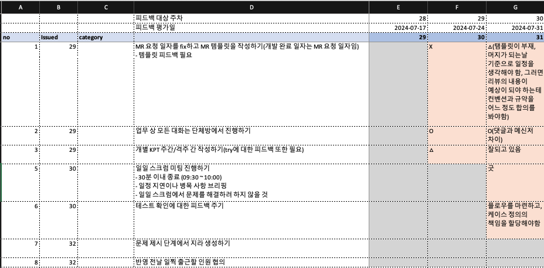
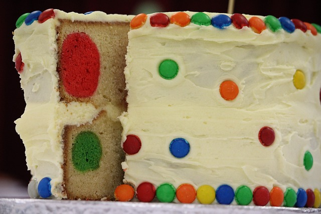

## 개발자인데 개발보다 관리 업무 비중이 높다
- 근 2주 정도는 개발에 한 20%, 서비스 백로그 정리에 80% 정도의 시간을 쓰고 있는 것 같다. 팀원으로서 내가 할 일의 백로그를 정리하는 것 뿐만 아니라, 나와 같은 서비스를 개발하는 인원 전체가 어떤 개발을 왜 해야하는 지 정리하고 있다. 참고로 나는 대리 직급의 일반 팀원이고, 백엔드 개발자의 스택이라고 봐야하는 개발자 잡부에 가깝다.
- 어떤 의미에서 개발 팀장이나 PM/PO의 역할을 일부 하는 셈인데, 책임은 가지되 권한은 별로 없는 그런 반쪽 자리의 리더 역할이다. 이런 자리를 반기며 일할 사람은 그리 많지 않다고 본다.
- 글또 대나무 숲에도 일의 의미를 찾는 고민, 코드 컨벤션과 같은 것들을 도입하기 위해 어떻게 해야하는가 하는 고민들이 종종 올라온다. 어찌보면 나와 비슷한 고민이 글또 뿐만 아니고 세상에 더 있을 것 같아, 이 고민들에 조금이나마 도움이 될 수 있는 글을 써 보려고 한다.

## 관료주의 조직에서 개발자로 살아남기
- 여느 조직 못지 않게 관료주의적인 조직에서 개발을 하고 있다고 생각한다. 고객에게 제공할 가치 보다는 각 부서의 책임 경계가 어디인지에 더 민감하게 반응하고, 그것을 침범하지 않기 위해 노력한다. (개발 조직에서는 엄청나게 일정에 대한 압박 속에 일하고 있지는 않다고 생각하는데, 조직의 업무 문화가 한 몫하는 것일 수도 있다.)
  - 삼성전자의 최근 부진에 있어 기술조직 보다 행정부서 위주로 조직이 굴러갈 때 문제가 생겼다는 평가가 있다. 삼성전자 반도체는 하드웨어지만, 소프트웨어도 그 논리에서 크게 다르지는 않을 것 같다. 기술조직에 힘을 실어야 한다는 의미가 아니라, 비즈니스 가치를 생산하는 핵심이 되는 부서의 문제해결 관점에 align 되어 일해야 하지 않느냐 하는 것이다.
  - 지금의 회사에서 내가 담당한 쇼핑몰에서는 그 비즈니스 가치를 고민하는 지점이 조금 부족하다고 느껴왔다. B2B를 주로 해온 사업에서 하고 있는 B2C 사업이기도 하고, 통신사와 카드사라는 거대 인프라 밖에서 커가야 하는 유일한 서비스 이기도 하기에 느끼는 부족함일 수도 있다.
- 이런 환경 속에서 여느 개발자가 그렇듯이 나도 커리어의 미래에 대한 고민이 많았고 지금도 많다. 절이 싫으면 중이 떠나야 할까? 떠나서 새로 맞이하는 절은 맘에 쏙 들까? 내가 맘에 쏙 드는 절이되려면 어떤 조건들이 필요할까?
  - 확실한 것은 나는 문제 해결의 관점에서 일하고 싶었다. '어디에 어떤 문제가 있다고 생각해서 어떤 기능을 개발했고 그로 인해 개선을 이루었습니다. 이로 인해 어떠 어떠한 비즈니스 가치를 만들어 내는데에 일조 했습니다.' 하는 등의 그런 관점 말이다. 그냥 위에서 높으신 분이 시키니까 개발하고, 높으신 분이 하지 말라니까 안하고 이런 것은 적성에 안맞았다. 커리어의 시작을 험난한 스타트업 생태계에서 해서였을까? 그 당시의 어려움들도 기억에 남지만, 직접 리드를 끌어와 돈을 번다는 그 짜릿함도 기억 속에 남아 있었다. 이곳에서 더 풍족한 자원 아래서 그런 성과를 내지 못할 이유가 없었다.
  - 또 매번 이직으로 문제를 해결하고 싶지 않았다. 이직한다고 해서 문제가 해결되지도 않고, 스스로 조직 문제를 개선 해보려고 시도한 경험도 없이 조직 문제의 중대차함을 논하고 싶지 않았다.
  - 물론 이런 의견(이라 쓰고 징징거림)을 들어주고 힘을 실어주는 소중한 동료들이 있었기에 도전은 가능했다.
- 무엇보다 연초에 큰 담판?으로 인해 나를 도와주는 차장님이 생겼다. 정리되지 않고 뭉텅이로만 들어오는 요구사항에 지쳐갈 때 쯤 이를 앞에서 한 번 정제해주시기로 한 것이다. 나는 이제 개발만 잘하면 되겠다고 생각했다.
- 가장 먼저 문제 해결의 관점을 다시 떠올렸다. 내가 막연히 느끼던 문제는 뭐고 해결책은 무엇이 있을까?
  - 사업 부서와 개발 부서 모두가 쇼핑몰과 이커머스가 처음이다. 사용자로서의 경험만 있기 때문에 사전에 어떤 식으로 흘러가야하는지 디테일하게 알 수가 없었다.
  - 관련하여 업무를 진행하는 부서도 모두 각각이다. 파트너사와 계약하고 물건을 판매하는 부서, 특정 고객에게 쿠폰을 제공해야하는 부서, 파트너사에게 정산을 해주어여 하는 부서가 모두 각각이기 때문에 이해 관계가 모두 다르고 취합되지 않는다.
  - 여기에 정책에 대한 구체적인 명세를 만들거나 UX에 대해 고민하는 것을 자기 일이라고 여기는 팀이나 구성원이 없다. PO도 PM도 없는 셈이었다.
  - 여기까지만 들어봐도 변경사항이 얼마나 다양한 경로와 방식을 통해 올 수 있는지 가늠이 될 것이다.
  - 이에 반해 개발자로서 나는 잘 정리된 상태에서 나도 일하고 싶고, 우리 팀원들도 잘 정리된 상태로 업무를 배분해주고 싶었다.
- 변경이 잦은 상태에 적절히 대응하기 위한 개발 방법론은 무엇이 있을까? 애자일 말고는 딱히 떠오르는 것이 없었기에 애자일을 도입하기로 했다.

## 1단계 : 스크럼과 회고
- 애자일을 도입해본 적이 없기에 여기저기에서 많이 찾아본 결과, 애자일은 워터폴을 짧게 반복적으로 하는 것이 아니라는 이야기가 더러 나왔다. 원래 그 정도 수준의 이해밖에 없던 내게 애자일과 워터폴에서 특별히 구분되어 보이는 지점은 스크럼과 회고 였다. 따라서 우리는 스크럼과 회고에서 부터 프로세스를 바꾸기 시작했다.
- 2024년도 29주차 부터였다. 벌써 다음주가 46주차 이니 대략 4개월을(17주차) 휴가를 제외하고는 매일 같이 스크럼을 했다. 오전 30분 간은 돌아가면서 각자 어제, 오늘 그리고 방해요소에 대해 이야기를 했다.
  - 처음에는 회의가 분간이 안되서 1시간이 넘고 2시간이 다 되버리는 스크럼도 있었다. 이런 부분들은 회고(KPT)에서 다시 언급하면서 조정을 해나갔다. 긴 회의가 필요한 건은 다시 회의를 잡기로만 언급하고 넘어갔다.
  - 모두가 누가 무슨 일을 하는지 대략은 이해하도록 했고, 사소한 어려움이라도 모두가 있는 자리에서 공유하도록 했다. 시간이 지날수록 구성원들이 조금씩 주체적으로 변한다고 느꼈다. 문제를 직접 제기하기 시작했고, 무엇을 해야할지 제안하기 시작했다. 이것만으로도 큰 변화였다.
  - 현재는 지라에서 테이블 형태로 아래와 같이 작성하고 있다.
    ```markdown title="최종 일일 스크럼 양식"
    [//]: # (이 내용을 스프린트 지라에 각자 댓글로 달고 매일 수정한다.)
    |항목 | 월 | 화 | 수 | 목 | 금 |
    |---|---|---|---|---|---|
    |어제 한 것| | | | | |
    |오늘 할 것| | | | | |
    |방해요소| | | | | |
    ```
- 회고는 KPT 형식으로 진행했다.
  - KPT는 Keep, Problem, Try의 약자로, 이전 스프린트에서 Keep은 잘한 것, Problem은 문제점, Try는 개선 방안을 의미한다. 1주, 2주, 4주 단위로 각각 시도해보았고 최종적으로는 2주 단위로 하기로 했다. 스프린트가 2주로 정해졌기 때문이기도 하고, 1주일은 시행착오를 느끼기에는 변수가 많았다. 4주는 이미 어떤 시도들은 흐지부지 되고 잊혀지는 경우가 있었다.
  - 대신 Try에 대해 잘 지켜졌는지는 매주 피드백을 하고 있다. 아래는 초창기 피드백 해온 내용을 가져와 보았다.
    - 
  - Problem 은 잘 작성되고 Try 도 어느 정도 잘 추출되는데, 문제는 Keep 이 잘 작성되지 않는다는 것이었다. 이 부분은 아직도 완전히 잘 진행되는 편은 아니다. '전체적으로 좋았다' 등의 형식적인 내용이 많아져서, 차라리 누가 무엇을 해주었다는 사소한 사건(누가 어떤날 단걸 가져다 줘서 좋았다 등)이라도 구체적인 내용을 기록하도록 가이드 했다. 이 부분은 이제 Try에 대한 피드백과 연결지어 작성하는 방법도 소개를 한 상태이다. 향후에는 Keep에 대한 그룹핑을 통해 자주 등장하는 내용을 개발팀 혹은 조직 내에 긍정 사례로 소개해 볼 생각도 있다.

## 2단계 : 유저 스토리와 수직 슬라이스
- 스크럼과 회고를 통해 커뮤니케이션이 많아지면서 정리된 것들도 꽤 되지만, 동시에 또 정리되지 않은 영역이 적지 않음을 확인할 수 있었다.
- 특히 개발팀 주도로 이루어지는 서비스 개선 계획은 근본적인 목표 부재에 따라 선택을 하기 어려운 상황에 놓인다는 것을 느꼈다.
  - 이를 테면 향후의 정산 집계를 위해 테이블 구조를 변경해야 하는 것과, 배송/주문 상태 관리 개선을 위해 테이블 구조 변경을 해야하는 것 중에 무엇을 우선 작업할 것인가?
  - 각각은 이미 너무 큰 작업이기도 하고, 우리 내부의 인원 상 동시에 진행하기도 어렵다. 또 무엇 하나를 선택했다고 해도 그것을 어떤 식으로 바꾸어야 하는가에 대한 다양한 의견들이 제시된다. 대강 아래와 같은 회의를 몇번 하다보면 머리가 하얘진다.
    ```markdown title="흔한 도메인 모델 개선 관련 회의 내용"
    - 나 : 배송/주문 상태 관련 문제가 자주 발생하는 것 같으니 이걸 먼저 수정해보죠. 일단 해당 컬럼을 사용하는 전체 영향도가 조사가 되어야 할 것 같아요. A님이 조사해 주시고..
    - A : 그런데 배송/주문 상태를 어떻게 관리할 건가요? 그러니까 주문이 현재 마스터 - 슬레이브 구조인데, 배송 상태를 어디까지 가져갈 건가요?
    - B : 보니까 만약에 그거 바꾸면 기존 데이터 마이그레이션도 필요할 것 같은데요.
    - 나 : 음.. (일이 너무 커지는데.. 어떻게 나누어야 하지)
    ```
- 이런 식의 대화를 하며 내가 느낀 것은 우리가 답을 쉽게 정하지 못하는 것은 why가 없기 때이라는 것이었다. 왜 정산 집계를 해야하는가? 왜 배송/주문 상태 개선을 해야하는가?
  - 개발팀의 입장에서는 두 개념이 상충하는 덕에 데이터를 관리하기가 어려워진다. 그러나 최종 고객의 관점에서 지금의 구조로 충분하다면 어떤가? 또 데이터 관리가 어렵다는 것이 발생시키는 업무 비효율이 이를테면 두 달에 한 건 정도의 엑셀 데이터를 만들어주어야 하는 것이라면? 이를 위해 지금 당장 테이블 구조를 바꾸는 것이 맞을까?
  - 누군가는 why를 만들어야 했고, 내가 이를 해결하기 위해 선택한 것은 `유저스토리`였다. 어쨌든 사용자에게 가치를 부여할 수 있는 일을 한다는 것이 중요함을 가장 중요한 why로 보자는 생각이었다.
  - 백로그에서 처리하기로 한 개발 건에 대해 최종 사용자 관점에서 다시 재작성 해보았다. 이를 테면 아래와 같이 변화 시키는 것이다.
    - 원래 개발 명세 : 주문 상세별 배송 상태 생성 > 유저 스토리 형태 : 사용자는 개별 주문 상품 별로 배송 상태를 확인할 수 있다.
    - 원래 개발 명세 : 주문 및 주문 상세별 주문 상태 생성 > 유저 스토리 형태 : 사용자는 개별 주문 상품 별로 주문/결제 상태를 확인할 수 있다.

- 이런 접근에서 견지해야 하는 또 다른 관점은 수직 슬라이스 기준으로 작업한다는 것이다. 수직 슬라이스를 알려면 수평 슬라이스를 알아야 한다.
  - 
  - 어떤 케익이 있다고 해보자. 우리는 케익을 (보통은) 가로로 자르지 않고 수직으로 자른다. 수직으로 자른 조각 케익이 하나의 온전한 조각으로서의 가치를 지닌다. 가로로 상단의 크림만 잘라준다고 하면 이상한 사람 취급을 받을 것이다.
  - 이제 케익의 가로 층을 소프트웨어의 계층으로 생각해보자. UI - 서버 - DB - 인프라 등이 될 것이다. UI만 바꾼다고 사용자에게 가치를 전달할 수 없고, DB 컬럼만 생성한다고 사용자에게 가치를 전달할 수는 없다. UI - 서버 - DB - 인프라가 모두 충족된 하나의 온전한 기능이라야 사용자에게 가치를 전달할 수 있다.
  - 따라서 수평 슬라이스가 아닌 수직 슬라이스 기준으로 업무를 정리해야 하는 것이다.
  - 배송/주문 상태를 가지고 생각해보면 DB 컬럼 생성과 같은 작업으로 접근 하는 것이 아니고, 사용자의 주문 상세별 상태 조회가 가능하도록 일련의 서버 API와 화면 UI, DB 스키마가 모두 변하는 것을 하나의 스토리로 잡고 개발을 진행해야 한다는 것이다.
  - 이러다 보면 기존에 분류해 놓았던 작업이 수평 슬라이스에 해당하는 경우도 더러 있었다. 특히 코드 컨벤션 적용, DB 모델링 표준화 적용, 문서 작성 등 계층별로 품질 개선을 이루려는 목표들이 이에 해당했다. 이런 것들은 수직 슬라이스를 마지막으로 확인하는 경우에 계층별 체크 리스트로 변경했다. 이렇게 하면 결국 최소 어떤 기능을 개발할 때는 코드 컨벤션이나, API 명세와 같은 최소한의 문서화는 되어 있어야 완료된 스토리로 보겠다는 것이 된다. 이 부분은 아직 적용을 해가는 과정이기 때문에 이 후에 어떤 식으로 조직에 녹아들었는지 다시 정리해보겠다.

## 현재 마주하고 있는 한계
- 스토리와 백로그를 정제하는 것이 정말 어렵다.
  - 에픽, 스토리, 테마, 이니셔티브 등 새로운 용어가 아직 낯설다. 제대로 된 스토리를 만들고 조직 성과와 연결하려면 이니셔티브가 정해져야 하는데, 구체적인 수치로 표현된 목표를 아직 본적이 없기 때문에 이 또한 만들고 제시해야 하는 입장이다. 이니셔티브나 테마를 스스로 만들려는 것은 어쩌면 나의 욕심일지도 모르겠다. 그러나 우리 서비스가 앞으로 나아가기 위해서는 반드시 수치로 표현된 비즈니스 목표가 있어야 한다고 생각한다.
    - 구체적으로 말하자면 1억이니 10억이니 100이니 하는 숫자 말고, 이 숫자에 다가기 위해 우리가 바라봐야 하는 지표가 무엇인지 설정해야 한다는 것이다.
    - 이를테면 전체 방문자 중 상품 페이지에 방문한 사람의 비율, 이 중에 결제한 사람의 비율 등을 측정한다. 이에 따라 상품 페이지 방문율이 5%, 결제 페이지 방문율이 1% 라면, 전체 방문자 수를 늘려서 매출을 달성할 것인지, 전환율을 늘려서 매출을 달성할 것인지 등을 결정했으면 하는 것이다.(물론 다 해야하는 것이지만) 또 각각의 수치에 대해 개선하기 위한 어떠한 시도를 해볼 수 있는지 단계적으로 고민해야 한다.
  - 관련해서는 애자일 조직은 이렇게 일합니다, 사용자 스토리 와 같은 책도 읽고 있고 유튜브의 PM/PO 영상도 보고 있다. 무엇보다 클로드와 같은 것들의 도움을 받아 계속해서 정리를 해나가고 있다. 원래는 참 재미없을 내용들인데, 내가 직면한 문제가 되니 이런 책들도 재미있다.
- 한편으로 내가 하려는 것이 엄밀하게는 애자일이 아니라는 생각도 든다. 애자일이 탄생된 것은 문서나 결재 라인 등의 형식에 매몰되기 보다 고객에게 제공할 수 있는 가치에 집중하자는 것으로 알고 있다. 이에 비해 내가 이 방법론을 도입하고자 하는 이유는 오로지 구두로 진행되는 개발 사항이나, 거의 없다시피 하는 테스트 단계 등을 문서화 하고 프로세스를 만들려는 것이라서 그 가치가 충돌하고 있는 실정이다.
  - 스스로 생각하기에 애자일을 한다는 것 자체는 별로 중요한 것이 아니고, 내가 처한 조직만의 특별한 문제 상황에 대한 해결책을 마련하는 것이 중요하기에 방법론의 형태에 얼마나 부합하는지는 중요하지 않다고 생각한다.
  - 다만 내가 불필요한 확인과 검증의 프로세스를 만들어가고 있는 것은 아닌가 하는 의심은 드는 것 같다.

## 마치며
- 누군가 나를 PO나 기획자로 임명한 적은 없다. TF가 생긴것도 아니다. 그냥 내가 이렇게 일하는 것이 맞다고 생각해서 해보고 있는 것이다.
- 넥스트 스텝의 박재성(포비)님의 이직 고민에 대한 주된 레퍼토리?가 있다. 될 때까지 해보라는 것. 무엇인가 문제를 맞이했을 때, 피하지 말고 나름의 방식으로 해결해보라는 의미로 이해했다. 그런 관점에서 프로덕트를 제대로 만들 수 있는 조직이 될 때까지는 이 노력을 해보고 싶다.
- 그럼 나의 백엔드 개발자로의 커리어는 어떻게 할까? 나도 걱정이 없는 것은 아니지만 걱정만 한다고 바뀌는 것은 없다.
  - 일단은 테스트 코드라는 가장 가까운 과제가 있다. 넥스트 스텝의 ATDD 나 다른 인프런의 테스트 코드 강의, 테스트 관련 도서 등을 통해 학습하며 assertJ와 cucumber 기반의 테스트 코드를 적용해보고 있다.
  - 커버리지 목표는 100%가 아니면 굳이 만들지는 않을 것 같다. 100%를 만들수만 있으면, 이후 테스트 자동화 등을 조직에 건의해볼 것 같다.
- 10월 중순에 팀원이 한 분 더 들어왔다. 내가 이끌어 가는 이 프로세스에 금방 따라오고 있고, 능력도 출중한 분이다. 이런 것을 보면 더디지만 어쨌든 1.01배라도 나아지는 방향으로 나아가고 있는 것 같다. 이 회사에도 거의 2년이 되는 시간을 보내고 있는데, 언젠가 나의 이런 시도들이 결실을 맺을 때가 올거라 믿으며, 앞으로도 하루하루를 충실히 보내보려 한다.
