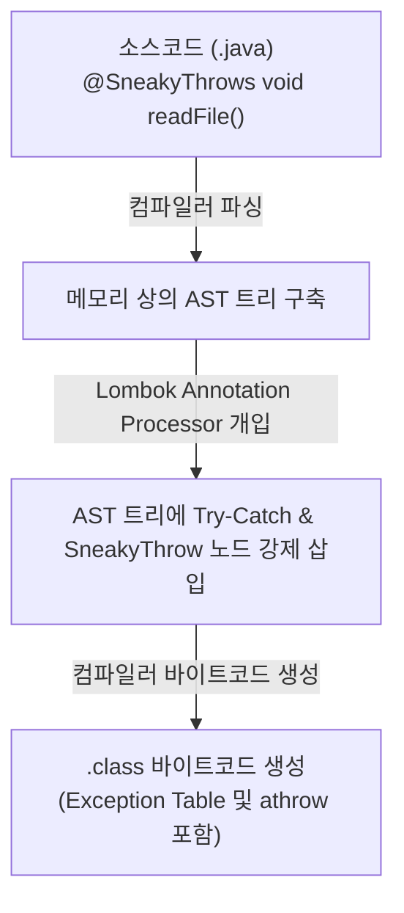

## 들어가며: 체크 예외의 불편함과 마법 같은 어노테이션

자바를 다루다 보면 누구나 한 번쯤 체크 예외(Checked Exception) 때문에 골머리를 앓게 된다.

특히 자바 8에 도입된 람다식(Stream API)을 쓰거나 `Runnable` 같은 표준 함수형 인터페이스를 구현할 때, 메서드 내부에서 체크 예외가 발생하는 라이브러리(예: `FileReader`, `ObjectMapper` 등)를 호출하려면 코드가 급격하게 지저분해진다.

```java
// Runnable.run()은 throws를 지원하지 않기 때문에 매번 try-catch 보일러플레이트가 강제된다
Runnable task = () -> {
    try {
        FileReader reader = new FileReader("config.json");
    } catch (IOException e) {
        throw new RuntimeException(e);
    }
};
```

이때 Lombok이 제공하는 `@SneakyThrows`를 붙이면 마법 같은 일이 일어난다.

```java
@SneakyThrows
public void readFile(String path) {
    FileReader reader = new FileReader(path); // throws IOException 선언도, try-catch도 없다!
}
```

분명 자바 컴파일러는 체크 예외 처리를 엄격하게 검사하는데, **어떻게 `@SneakyThrows`는 컴파일 에러 없이 체크 예외를 언체크 예외처럼 그대로 밖으로 던져버릴 수 있는 걸까?**

이 어노테이션이 작동하는 이면에는 **컴파일러의 AST 조작**과 **자바 제네릭의 타입 소거(Type Erasure) 꼼수**가 숨어 있다.

---

## 1. 근본 원리: JVM은 체크 예외를 모른다

가장 먼저 알아야 할 자바의 비밀은, **체크 예외와 언체크 예외의 구분은 오직 자바 컴파일러(`javac`)의 소스코드 검사 규칙일 뿐, JVM 런타임에는 그런 구분이 전혀 없다**는 점이다.

JVM 바이트코드 명세에는 `try`나 `catch` 명령어가 없으며, 예외를 발생시키는 명령어는 오직 **`athrow`** 하나뿐이다. JVM은 `athrow`를 만났을 때 던져지는 객체가 `IOException`이든 `RuntimeException`이든 상관없이 똑같이 상위 스택 프레임으로 던져버린다.

> 즉, **"컴파일러의 눈만 완벽하게 속여서 바이트코드로 컴파일되게 만들면"** 런타임에는 아무런 문제 없이 체크 예외를 던질 수 있다.

---

## 2. 순수 자바로 재현하는 컴파일러 속이기 (제네릭 트릭)

Lombok을 전혀 쓰지 않고, 순수 자바 코드로 컴파일러의 검사를 무력화하는 코드를 작성해 보자.

```java
public class SneakyExample {

    // 메서드 시그니처에 throws 선언이 없다!
    public void readFile(String path) {
        try {
            FileReader reader = new FileReader(path); // 체크 예외(IOException) 발생
        } catch (Throwable t) {
            // 원본 예외를 래핑하지 않고 그대로 던짐
            throw sneakyThrow(t);
        }
    }

    // ─── [컴파일러를 속이는 핵심 헬퍼 메서드] ───
    public static RuntimeException sneakyThrow(Throwable t) {
        if (t == null) throw new NullPointerException("t");
        return SneakyExample.<RuntimeException>sneakyThrow0(t);
    }

    @SuppressWarnings("unchecked")
    private static <T extends Throwable> T sneakyThrow0(Throwable t) throws T {
        throw (T) t; // 제네릭 타입 캐스팅
    }
}
```

### 🔍 컴파일러는 왜 이 코드를 통과시킬까?

1. **컴파일 타임 (`javac`)**:
   * `sneakyThrow0` 메서드는 `throws T`를 선언하고 있다.
   * 호출부에서 `<RuntimeException>`을 명시했으므로, 컴파일러는 이 메서드가 `throws RuntimeException`을 던진다고 추론한다.
   * `RuntimeException`은 언체크 예외이므로 컴파일러는 `readFile()` 메서드에 `throws`나 `try-catch`가 없어도 **완벽하게 합법적인 코드라고 판단하고 빌드를 통과**시킨다.

2. **런타임 시점 (JVM)**:
   * 자바는 런타임에 제네릭 타입 정보를 지워버리는 **타입 소거(Type Erasure)**를 수행한다.
   * 바이트코드 레벨에서는 `(T)` 캐스팅 코드가 사라지고 그냥 `throw t;`(`athrow`)만 남는다.
   * 따라서 원본 예외인 `IOException`이 `RuntimeException`으로 포장(Wrapping)되지 않고 **있는 그대로의 원형으로 상위 호출자에게 날아간다.**

---

## 3. 그렇다면 Lombok은 이 코드를 어떻게 끼워 넣는가? (AST 조작)

자바 표준 어노테이션 프로세서(JSR-269)는 원래 새로운 소스 파일을 생성하는 것만 허용하고 기존 코드를 수정하는 것은 금지되어 있다.

하지만 Lombok은 컴파일 도중 `javac`의 내부 API(`com.sun.tools.javac.*`)를 리플렉션으로 열어 메모리 상에 생성된 **AST(추상 구문 트리)**를 직접 변조한다.



개발자가 `@SneakyThrows`를 메서드에 붙이면, 롬복은 AST의 메서드 바디를 가로채 `try-catch (Throwable t)` 노드로 감싼 뒤 `throw Lombok.sneakyThrow(t);`를 호출하도록 트리를 개조한다. 

결과적으로 컴파일러는 롬복이 개조한 AST를 기반으로 최종 바이트코드를 만들어내게 된다.

---

## 4. 디컴파일하여 바이트코드 확인하기

실제로 `@SneakyThrows`가 붙은 클래스를 컴파일한 후 `javap -c`로 디스어셈블해 보면 다음과 같이 명확한 구조가 나타난다.

```bytecode
public void readFile(java.lang.String);
  Code:
   0: new           #2    // class java/io/FileReader
   3: dup
   4: aload_1
   5: invokespecial #3    // Method java/io/FileReader."<init>":(Ljava/lang/String;)V
   8: astore_2
   9: return              // 정상 실행 시 리턴
  10: astore_2            // 예외 발생 시 점프 대상 (Throwable t)
  11: aload_2
  12: invokestatic  #4    // Method lombok/Lombok.sneakyThrow:(Throwable)RuntimeException
  15: athrow              // 원본 예외 투척

  Exception table:
     from    to  target type
        0     9    10   Class java/lang/Throwable
```

`0~9`번 사이에서 예외가 터지면 Exception Table에 의해 `10`번으로 점프하고, `Lombok.sneakyThrow`를 거쳐 `15: athrow`로 던져진다.

---

## 5. 실무에서의 활용처와 주의할 점

### 언제 유용한가?
* **람다식 및 스트림 내부**: `Stream.map()`이나 `forEach()` 안에서 체크 예외를 던지는 I/O 유틸리티를 호출할 때 코드가 극도로 간결해진다.
* **불필요한 Exception Wrapping 방지**: `new RuntimeException(e)`로 한 겹 더 감싸서 스택 트레이스 깊이를 늘리거나 `e.getCause()`를 매번 꺼내야 하는 번거로움을 피하고 싶을 때 유용하다.

### ⚠️ 주의할 점 (Trade-off)
1. **호출하는 쪽의 `catch` 블록 컴파일 에러**:
   * 호출하는 쪽에서 `catch (IOException e)`로 잡으려고 하면, 컴파일러는 *"이 메서드는 IOException을 던지지 않는데 왜 잡으려 하는가?"*라며 컴파일 에러를 낸다. (`catch (Exception e)`나 `catch (Throwable e)`로 잡아야 함)
2. **시그니처 투명성 저하**:
   * 메서드 선언부만 보고는 어떤 체크 예외가 날아올지 동료 개발자가 예상하기 어렵다.

---

## 마치며

`@SneakyThrows`는 단순한 문법 설탕(Syntactic Sugar)을 넘어, **자바 컴파일러의 정적 타입 검사 규칙, 제네릭의 타입 소거, 컴파일러 AST 파이프라인, 그리고 JVM 바이트코드의 Exception Table 동작 원리**가 절묘하게 결합된 엔지니어링의 정수다.

도구가 제공하는 마법의 이면을 이해하고 나면, 람다식의 예외 처리를 어떻게 설계할 것인지, 그리고 왜 현대 언어들이 체크 예외를 버리고 언체크 예외로 통일했는지에 대한 깊은 맥락을 이해할 수 있게 된다.

---

## 관련 위키 문서

- [[java-exception-hierarchy-and-mechanism|자바 예외 처리 메커니즘과 Throwable 계층 구조]]
- [[jvm-bytecode-exception-table-mechanism|JVM 바이트코드 레벨의 예외 처리와 Exception Table]]
- [[abstract-syntax-tree|추상 구문 트리 (AST)]]
