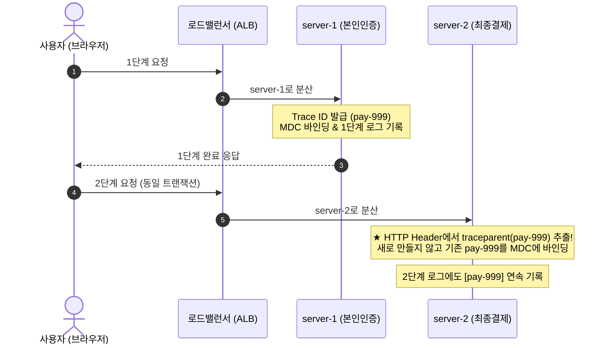

로컬 개발 환경에서는 로깅 때문에 골머리를 앓을 일이 거의 없다. 내가 브라우저에서 버튼을 누르면 콘솔 창에 요청 인입부터 DB 쿼리, 응답 반환까지 시간 순서대로 얌전하게 출력되기 때문이다.

하지만 이 애플리케이션을 빌드하여 **서버가 2대 이상으로 다중화된 실제 운영 환경**에 배포하는 순간, 로그는 순식간에 혼돈의 카오스로 변한다.

> *"어제 오후 5시 결제 오류 난 주문 건 로그 좀 확인해 주세요."*

로드밸런서 뒤에 `server-1`과 `server-2`가 떠 있고, 결제 1단계(본인인증)는 1번 서버가, 2단계(카드 승인)는 2번 서버가 번갈아 가며 처리했다면 도대체 어디서부터 어떻게 로그를 찾아야 할까?

단일 서버의 [[mapped-diagnostic-context|MDC]]에서 출발하여 프로세스 경계를 넘는 **[[distributed-tracing-context-propagation|분산 추적]]**, 그리고 이를 한눈에 모아보는 **[[centralized-logging-architecture|중앙 집중식 로깅 인프라]]**까지의 퍼즐을 맞춰보았다.

---

## 1. 1단계: 단일 서버에서의 번호표 달기 (MDC)

동시에 수백 명의 손님이 주문을 쏟아내면, 한 서버 안에서도 스레드 수십 개가 로그 파일 하나에 번갈아 글자를 써내려간다.

이때 로그를 살려내는 유일한 구원투수가 바로 **Trace ID(추적 번호표)**다.
요청이 들어오는 관문(Filter)에서 고유한 식별자를 발급해 [[mapped-diagnostic-context|MDC]]에 꽂아두면, 비즈니스 로직이 찍는 모든 로그 앞에 동일한 번호표가 박힌다.

```log
17:00:01.100 [http-nio-1] [pay-999] INFO  OrderService - 결제 1단계 접수
17:00:01.105 [http-nio-2] [pay-888] INFO  OrderService - 다른 고객 주문 접수
17:00:01.120 [http-nio-1] [pay-999] ERROR PaymentService - 잔액 부족으로 결제 실패!
```

로그가 아무리 뒤섞여도 `grep "pay-999"` 딱 한 줄만 치면, 수천만 줄의 로그 속에서 그 손님의 요청 시작부터 에러 발생까지의 스토리만 1초 만에 깔끔하게 발라낼 수 있다.

---

## 2. 2단계: 네트워크 벽을 넘는 번호표 (컨텍스트 전파)

그런데 만약 결제 단계마다 서버를 넘나들거나, 주문 서버 ➔ 결제 서버 ➔ 배송 서버로 분리된 마이크로서비스(MSA) 환경이라면 어떨까?

서로 다른 서버(프로세스)는 OS 레벨에서 메모리를 공유할 수 없다. `server-1`의 `ThreadLocal`에 아무리 예쁘게 `pay-999`를 넣어두었어도, 네트워크를 건너 `server-2`로 가면 그 값은 완전히 증발한다.

이 문제를 해결하는 열쇠가 바로 **컨텍스트 전파(Context Propagation)**다.



서버 간 HTTP 통신이나 메시지 큐(Kafka)로 데이터를 주고받을 때, **네트워크 프로토콜의 헤더(Header)**에 몰래 Trace ID를 실어서 보내는 것이다.

과거에는 트위터의 **Zipkin B3 규격**(`X-B3-TraceId`)이 널리 쓰였지만, 오늘날에는 전 세계 공식 웹 표준인 **W3C Trace Context**(`traceparent`)로 대동단결되었다. 

더 반가운 소식은, Spring Boot 3부터 지원하는 **[[distributed-tracing-context-propagation|Micrometer Tracing]]**을 쓰면 개발자가 헤더 세팅 코드를 한 줄도 짤 필요 없이 프레임워크가 알아서 HTTP 요청을 가로채 헤더를 심고 꺼내준다는 점이다.

---

## 3. 3단계: 흩어진 로그를 한곳에 모으기 (중앙 집중식 로깅)

이제 `server-1`의 로그 파일에도 `[pay-999]`가 찍히고, `server-2`의 로그 파일에도 `[pay-999]`가 찍힌다. 

하지만 여전히 문제가 남는다. **로그 파일이 물리적으로 서로 다른 머신의 디스크에 쪼개져 저장**되어 있다는 점이다. 장애가 났을 때 터미널 2개를 띄우고 두 서버에 각각 SSH로 붙어서 `grep`을 돌릴 수는 없는 노릇이다.

각 서버의 디스크에 쓰여진 로그를 실시간으로 빨아들여 한 화면에서 검색하게 해주는 **[[centralized-logging-architecture|중앙 집중식 로깅 인프라]]**가 완성되어야 비로소 퍼즐이 맞춰진다.

```
[server-1 머신] ──(Filebeat / Promtail 수집)──┐
                                             ▼
                                    [중앙 로그 저장소] ──► [웹 검색 화면]
                                             ▲
[server-2 머신] ──(Filebeat / Promtail 수집)──┘
```

실무에서는 이 중앙 인프라를 구축할 때 보통 세 가지 선택지 중 하나를 고르게 된다:

1. **ELK 스택 (Elasticsearch + Kibana)**:
   - 로그의 모든 텍스트를 전문(Full-text) 색인하므로 검색 속도가 타의 추종을 불허한다.
   - 단점: Elasticsearch가 메모리(RAM)를 무지막지하게 집어삼켜 인프라 유지비가 매우 비싸다.
2. **PLG 스택 (Promtail + Loki + Grafana)**:
   - 요즘 가장 인기 있는 가성비 조합이다.
   - 로그 본문 전체를 색인하지 않고 날짜와 서버명(라벨)만 색인한 뒤 압축 저장하므로, ELK 대비 서버 비용을 최대 70~80% 절감할 수 있다. Grafana 하나로 메트릭과 로그를 동시에 볼 수 있는 것도 큰 장점이다.
3. **Datadog (상용 SaaS 올인원)**:
   - "서버 구축과 관리에 시간 쓸 여유가 없다"면 돈으로 해결하는 끝판왕이다.
   - 에이전트 하나만 설치하면 로그 수집, APM 트레이싱, 메트릭 모니터링이 원클릭으로 통합된다. 단, 트래픽이 많아지면 청구서의 '0' 개수에 경악하게 된다.

---

## 4. 완성된 그림: 검색창에 'pay-999'를 쳤을 때

모든 인프라와 로깅 체계가 연결되고 나면, 개발자는 더 이상 서버에 SSH 접속을 하지 않는다.

Grafana나 Kibana 검색창에 `traceId: pay-999` 딱 하나만 입력하면 다음과 같은 화면이 펼쳐진다:

```log
시간            서버 인스턴스   Trace ID   로그 내용
17:00:01.100  [server-1]    [pay-999]  주문 생성 및 본인인증 요청 접수
17:00:01.350  [server-1]    [pay-999]  본인인증 성공 (다음 단계 안내)
17:00:02.010  [server-2]    [pay-999]  카드사 승인 요청 인입 (server-2 분산 수신)
17:00:02.450  [server-2]    [pay-999]  카드사 승인 완료, 결제 최종 성공!
```

물리적으로 완전히 다른 두 대의 컴퓨터에서 각자 따로 찍어낸 로그 조각들이, **`Trace ID`라는 보이지 않는 실로 꿰어져 하나의 완벽한 스토리로 복원**되는 순간이다.

---

## 마치며

단순히 파일에 글자를 남기던 시대의 로깅은 끝났다.

1. **MDC**로 스레드 단위의 고유 번호표를 새기고,
2. **W3C Trace Context**로 네트워크 경계를 넘어 그 번호표를 전파하며,
3. **Loki / ELK** 같은 중앙 저장소로 모아 한 화면에서 조회하는 것.

이 3단계의 흐름을 이해하고 나면, 분산 시스템이나 MSA라는 거대한 미로 속에서도 길을 잃지 않고 언제든 시스템의 이상 징후를 명확하게 추적해 낼 수 있다.
