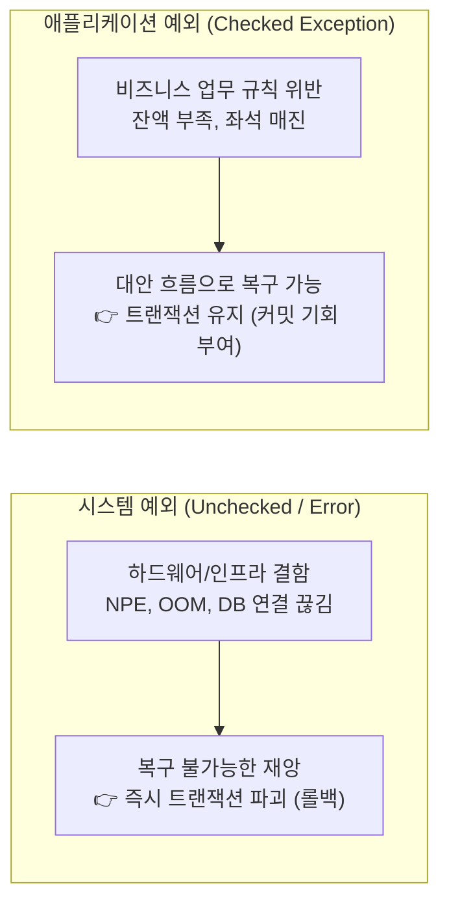

## 들어가며: 예외가 터졌는데 왜 DB에 데이터가 들어갔을까?

실무에서 트랜잭션을 다루다 보면 등골이 서늘해지는 버그를 한 번쯤 마주치게 된다.

비즈니스 로직 도중 분명 에러가 발생해서 클라이언트에게는 500 에러나 실패 응답이 내려갔는데, **데이터베이스를 열어보니 앞서 실행된 INSERT나 UPDATE가 롤백되지 않고 버젓이 커밋되어 있는 현상**이다.

```java
@Transactional
public void processOrder(OrderRequest request) throws IOException {
    orderRepository.save(new Order(request)); // 1. DB 주문 저장
    
    sendNotificationReceipt(request);         // 2. 파일/네트워크 I/O 중 IOException (체크 예외) 발생!
}
```

개발자는 당연히 생각한다:  
> *"메서드에 `@Transactional`을 붙였고 예외가 밖으로 던져졌으니, 스프링이 당연히 트랜잭션을 롤백해 주었겠지?"*

하지만 데이터베이스에는 주문 데이터가 그대로 남아 있다. 비즈니스는 실패했는데 결제 내역이나 주문만 저장되는 **부분 커밋(Partial Commit)**으로 인한 데이터 불일치 사고다.

왜 스프링은 `RuntimeException`은 묻지도 따지지도 않고 롤백해 주면서, **`Exception`을 상속한 체크 예외(Checked Exception)는 롤백하지 않고 뻔뻔하게 커밋해 버리는 걸까?**

스프링 소스코드를 열어보고, 이 선택 뒤에 숨겨진 20년 전 언어 설계자들의 거대한 이상과 실패의 역사를 따라가 보았다.

---

## 1. 코드 속에 박혀 있는 결정적인 한 줄

스프링 프레임워크의 트랜잭션 롤백 판단 코드는 `DefaultTransactionAttribute` 클래스에 있다.

```java
// org.springframework.transaction.interceptor.DefaultTransactionAttribute.java
@Override
public boolean rollbackOn(Throwable ex) {
    return (ex instanceof RuntimeException || ex instanceof Error);
}
```

코드는 너무나 명료해서 허탈할 정도다.
* 발생한 예외가 `RuntimeException`이거나 `Error`인가? ➜ **`true` (롤백!)**
* 그 외의 모든 `Exception`(즉, 체크 예외)인가? ➜ **`false` (커밋!)**

이 간단한 boolean 반환값 때문에 `TransactionAspectSupport`는 체크 예외를 만나면 아무렇지도 않게 `commit()`을 호출한다. 스프링은 대체 왜 이런 기본값을 선택했을까?

---

## 2. 2000년대 초반, 언어 설계자들의 유토피아

이 규칙은 스프링이 독단적으로 만든 것이 아니다. 1990년대 후반부터 2000년대 초반을 지배했던 엔터프라이즈 자바 표준인 **EJB(Enterprise JavaBeans) CMT 규약**에서 그대로 물려받은 유산이다.

당시 자바 설계자들은 예외를 아주 엄격한 철학으로 두 가지로 나누었다.



### "체크 예외는 실패가 아니라 '대안 흐름'이다"
설계자들의 머릿속에 있던 시나리오는 이런 것이었다:

1. 어떤 고객이 계좌 이체를 시도하다가 잔액이 부족해 `InsufficientBalanceException`(체크 예외)이 발생했다.
2. 시스템(DB나 서버)이 고장 난 게 아니다. 비즈니스 업무 조건 하나가 맞지 않았을 뿐이다.
3. 그렇다면 호출자(`try-catch`)가 이 예외를 잡아서:
   * *"잔액이 부족하시네요. 신용카드로 결제하시겠습니까?"*
   * *"보유하신 마일리지로 차감하시겠습니까?"*
   와 같이 **대안 로직(Alternative Flow)을 수행하여 트랜잭션을 정상적으로 완수(커밋)할 수 있어야 한다.**
4. 그런데 프레임워크가 체크 예외를 보자마자 트랜잭션을 강제로 롤백(SetRollbackOnly)시켜 버리면, 개발자가 기껏 복구 로직을 짜도 이미 트랜잭션이 사망해 아무것도 할 수 없게 된다!

따라서 **"비즈니스 복구 기회를 보장하기 위해 프레임워크는 개입하지 않고 트랜잭션을 열어둔다(커밋을 기본으로 한다)"**는 것이 당시 설계자들의 원대한 설계 철학이었다.

---

## 3. 이상주의의 몰락: "실패한 언어 실험"

그러나 현실의 소프트웨어 개발은 설계자들의 아름다운 이상대로 흘러가지 않았다.

### 현실 1: 복구할 수 있는 체크 예외란 거의 없다
실무 웹 애플리케이션에서 `IOException`이나 `SQLException`, 심지어 비즈니스 체크 예외가 발생했을 때, 컨트롤러나 서비스 계층에서 실질적인 '대체 결제'를 코드로 자동 복구하는 경우는 극히 드물다. 99%는 에러 로그를 남기고 사용자에게 실패 메시지를 띄우는 것이 전부다.

### 현실 2: 지옥의 throws 전파와 무책임한 침묵
자바의 창시자 제임스 고슬링은 컴파일러가 예외 처리를 강제하면 프로그램이 더 안전해질 것이라 믿었다. 하지만 현실에서는 수많은 계층의 메서드마다 `throws Exception1, Exception2...`가 줄줄이 붙었고, 지친 개발자들은 컴파일 에러를 끄기 위해 최악의 코드를 양산하기 시작했다:

```java
try {
    doSomething();
} catch (Exception e) {
    // 아무것도 하지 않음 (예외 증발)
}
```

이 현상을 지켜본 거장들은 체크 예외에 대한 냉혹한 사망 선고를 내렸다.

* **브루스 에켈 (『Thinking in Java』 저자, 2001)**:
  > *"Checked exceptions were an experiment. **The experiment failed.**"*  
  > (체크 예외는 하나의 실험이었다. 그리고 그 실험은 실패했다.)
* **앤더스 헤일스버그 (C# / TypeScript 창시자, 2003)**:
  > *"자바의 체크 예외는 멋진 아이디어처럼 보이지만 실제로는 재앙(disaster)에 가깝다. 대규모 시스템에서 확장성을 심각하게 해치기 때문에 C#에서는 완전히 배제했다."*
* **로드 존슨 (스프링 창시자, 2002)**:
  > *"JDBC의 `SQLException`은 체크 예외지만 개발자가 복구할 수 있는 방법이 없다."*  
  > ➜ 로드 존슨은 스프링을 만들며 모든 SQL 체크 예외를 `DataAccessException`(**언체크 예외**)으로 갈아엎어 버렸다.
* **코틀린(Kotlin)**:
  > 아예 언어 스펙에서 체크 예외를 완전히 삭제해 버렸다.

---

## 4. 남겨진 20년의 유산과 우리의 실무 원칙

그렇다면 스프링은 왜 20년이 지난 지금까지도 `@Transactional`의 기본 롤백 규칙을 바꾸지 못했을까?

이유는 단 하나, **하위 호환성(Backward Compatibility)** 때문이다. 이미 전 세계 수많은 엔터프라이즈 시스템들이 *"체크 예외는 커밋된다"*는 전제하에 레거시 코드를 돌리고 있기 때문에, 프레임워크가 독단적으로 이 기본값을 바꿨다가는 천문학적인 장애가 발생할 수밖에 없다.

결국 이 역사적 간극을 메우는 것은 현대 개발자들의 몫이다.

### 🛡️ 실무에서 데이터 정합성을 지키는 2가지 원칙

#### 원칙 1: 모든 커스텀 비즈니스 예외는 `RuntimeException`을 상속한다
과거의 EJB식 `extends Exception`은 잊어야 한다. 비즈니스 예외(잔액 부족, 중복 주문 등) 역시 `RuntimeException`을 상속하여 언체크 예외로 만드는 것이 현대 자바/스프링 진영의 표준이다. 이렇게 하면 스프링의 기본 롤백 규칙과 완벽히 부합한다.

```java
public class BusinessRuleException extends RuntimeException {
    public BusinessRuleException(String message) {
        super(message);
    }
}
```

#### 원칙 2: 트랜잭션 선언 시 `rollbackFor = Exception.class`를 습관화한다
외부 서드파티 라이브러리나 자바 표준 API(`java.io`, `java.net` 등)는 여전히 체크 예외를 던진다. 예기치 않은 체크 예외로 인해 부분 커밋이 일어나는 참사를 막으려면, 트랜잭션 경계에서 명시적으로 모든 `Exception`에 대해 롤백하도록 선언해야 한다.

```java
@Transactional(rollbackFor = Exception.class)
public void executeCriticalBusiness() {
    // 어떤 예외가 터져도 트랜잭션의 ACID를 안전하게 보장
}
```

---

## 마치며

"체크 예외 시 롤백되지 않는다"는 스프링의 규칙은, 언뜻 보면 불합리한 버그처럼 보이지만 **소프트웨어 역사에서 '컴파일 타임 안전성'을 지나치게 맹신했던 이상주의가 남긴 흥미로운 화석**이다.

우리가 매일 쓰는 프레임워크의 코드 한 줄 뒤에 어떤 역사가 숨어 있는지 이해할 때, 비로소 비즈니스의 데이터 정합성을 온전히 지켜낼 수 있는 견고한 코드를 작성할 수 있게 된다.

---

## 참고 문헌 및 링크

- [[spring-aop-proxy-creation-lifecycle|스프링 AOP 프록시 생성 시점과 판단 메커니즘]]
- [[transaction-rollback-checked-exception-history|스프링 트랜잭션의 체크 예외 롤백 정책과 언어 설계자들의 역사적 배경]]
- [[deep-dive-into-lombok-sneaky-throws|Lombok @SneakyThrows의 원리: AST 조작부터 제네릭 타입 소거 트릭까지]]
- Bill Venners, *The Trouble with Checked Exceptions: A Conversation with Anders Hejlsberg*, Artima, 2003.
- Bruce Eckel, *Does Java need Checked Exceptions?*, 2001.
- Rod Johnson, *Expert One-on-One J2EE Design and Development*, Wrox, 2002.
