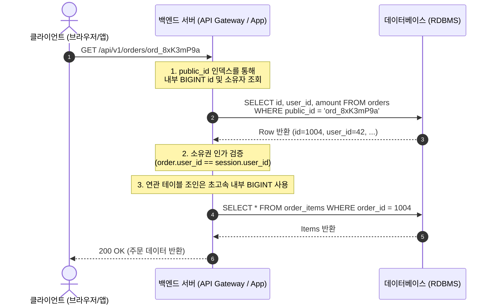

# Public ID 패턴 (식별과 인가의 분리)

**Public ID 패턴**은 데이터베이스 내부의 물리적 조인 및 인덱싱을 위한 **내부 기본키(Internal PK)**와, API 및 웹 URL 등 외부에 공개되는 **외부 식별자(Public ID)**를 물리적으로 분리하여 이원화하는 엔지니어링 패턴이다.

이 패턴은 RDBMS의 최고 쓰기 성능(B-Tree 순차 정렬)을 유지하면서도, 시퀀셜 키 노출로 인한 보안 취약점(IDOR)과 비즈니스 기밀 유출을 원천 차단하기 위해 널리 사용된다.

---

## 1. 배경: 시퀀셜 키(Auto-Increment) 노출의 3대 위협

DB의 `BIGINT AUTO_INCREMENT` 키를 REST API의 엔드포인트(`GET /api/v1/orders/{id}`)에 그대로 바인딩할 때 다음과 같은 중대한 보안 위협이 발생한다.

### ① IDOR (Insecure Direct Object Reference)
클라이언트가 파라미터 값만 1씩 증감(`1004` $\rightarrow$ `1003`)시켜 요청을 보냈을 때, 백엔드 로직에서 **"해당 리소스가 현재 세션 유저의 소유인가?"**를 검증(인가)하지 않으면 타인의 민감한 개인정보나 주문 내역이 그대로 노출된다[^owasp-idor].

### ② 비즈니스 기밀 유출 (독일 탱크 문제, German Tank Problem)
공격자가 악의적인 침투를 하지 않더라도, 순차 번호의 간격만으로 기업의 핵심 영업 지표를 정확하게 역추산할 수 있다.
* $T_1$ 시점(1일) 가입 시 사용자 ID: `12,000`
* $T_2$ 시점(30일) 가입 시 사용자 ID: `13,500`
* $\rightarrow$ 경쟁사나 투자자가 한 달간의 순증 회원 수($1,500$명) 및 일일 거래량 추이를 100% 투명하게 파악 가능[^german-tank].

### ③ 무차별 대량 스크래핑 (Data Enumeration)
`1`번부터 `N`번까지 단순 반복문(Loop)을 실행하여 서비스의 공개 상품이나 프로필 데이터를 누락 없이 100% 긁어갈 수 있다.

---

## 2. 아키텍처 설계: 내부 PK와 외부 식별자의 이원화



### 테이블 스키마 DDL 예시

```sql
CREATE TABLE orders (
    -- 1. 내부용 클러스터드 PK: B-Tree 순차 정렬 쓰기 성능 극대화
    id          BIGINT AUTO_INCREMENT PRIMARY KEY,
    
    -- 2. 외부용 Public ID: 유추 불가능한 난수 기반 유니크 키
    public_id   VARCHAR(32) NOT NULL UNIQUE,
    
    user_id     BIGINT NOT NULL,
    total_price INT NOT NULL,
    created_at  DATETIME NOT NULL DEFAULT CURRENT_TIMESTAMP,
    
    -- 외래키(FK) 조인 인덱스
    INDEX idx_orders_user_id (user_id)
);
```

---

## 3. 외부 식별자(Public ID) 생성 전략 비교

| 종류 | 포맷 예시 | 길이 | 장점 | 단점 |
| :--- | :--- | :---: | :--- | :--- |
| **Prefix + NanoID** | `ord_s9Kd2LmP4q` | ~16자 | URL-safe, Stripe 스타일 가독성, 짧은 길이 | 별도 라이브러리 필요 |
| **UUID v4** | `a8098c1a-f86e-11da...` | 36자 | 글로벌 표준 라이브러리 내장, 충돌 불가 | URL에 쓰기에 다소 길고 투박함 |
| **UUID v7** | `018d3c5e-8b1a-7b32...` | 36자 | 시간순 정렬 가능 (Public ID 인덱스 단편화 억제) | 생성 시점 유닉스 시간 정보가 노출됨 |
| **Sqids / Hashids** | `b9X2yA` | 가변 | 내부 정수 ID를 가역 난독화하여 생성 | 암호화가 아니며 Salt 유출 시 디코딩 위험[^sqids] |

> **권장 컨벤션 (Stripe 스타일)**:  
> 엔티티 타입을 접두사(Prefix)로 붙인 NanoID 또는 UUID를 사용한다.  
> * 유저: `usr_...`
> * 결제: `pay_...`
> * 주문: `ord_...`

---

## 4. Public ID 패턴 vs UUID v7 단일 키 비교

신규 시스템 설계 시 Public ID 패턴을 도입할지, 혹은 테이블 PK 자체를 [[database-primary-key-strategies|UUID v7]]로 단일화할지 고민하게 된다.

| 비교 관점 | Public ID 패턴 (BIGINT + Public ID) | UUID v7 단일 PK |
| :--- | :--- | :--- |
| **테이블 구조** | 컬럼 2개 (`id`, `public_id`) 필요 | 컬럼 1개 (`id UUIDv7`)로 단순화 |
| **내부 조인(FK) 성능** | **최상** (8바이트 정수 비교 및 인덱스 초경량) | 우수 (16바이트 비교 연산) |
| **인덱스 저장 비용** | 세컨더리 유니크 인덱스(`public_id`) 추가 오버헤드 | 단일 인덱스로 깔끔함 |
| **외부 노출 편의성** | 내부 ID 완전 은닉, 접두어 커스텀 용이 | 외부 노출 시 타임스탬프 유출 고려 필요 |
| **적합한 환경** | 기존 모놀리스 RDB 확장, 엄격한 스토리지 최적화 | **신규 마이크로서비스(MSA)**, 글로벌 분산 환경 |

---

## 5. 핵심 구현 원칙 (Best Practice)

1. **식별자 은닉이 인가(Authorization)를 대체할 수 없다**:
   * Public ID가 아무리 무작위 난수라도, 공격자가 우연히 유출된 링크를 얻었을 때 소유자 검증이 없으면 뚫린다.
   * 비즈니스 로직 계층에서 `WHERE public_id = :publicId AND user_id = :currentUserId` 소유권 검증은 여전히 필수이다.
2. **내부 조인에 절대 Public ID를 쓰지 않는다**:
   * 테이블 간의 관계(Foreign Key)는 무조건 8바이트 정수형 `id`를 참조해야 한다. 문자열 비교 조인은 인덱스 캐시 효율을 떨어뜨린다.

---

## 6. 참고 문헌
[^owasp-idor]: OWASP Foundation, *Broken Access Control (IDOR)*, https://owasp.org/Top10/A01_2021-Broken_Access_Control/
[^german-tank]: Wikipedia, *German tank problem*, https://en.wikipedia.org/wiki/German_tank_problem
[^sqids]: Sqids Official Documentation, *Sqids is an open-source library that generates short unique IDs from numbers*, https://sqids.org/
