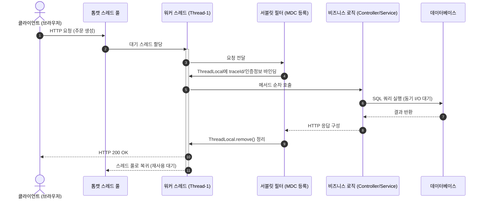
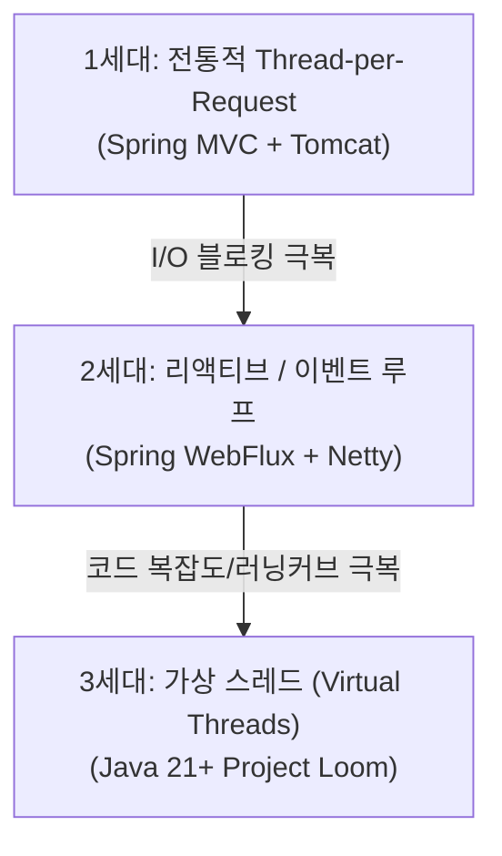

# Thread-per-Request 모델

`Thread-per-Request` 모델은 웹 애플리케이션 서버(WAS)가 클라이언트로부터 들어오는 **HTTP 요청 1건마다 전용 스레드 1개를 배정하여 요청 수신부터 응답 반환까지 전 과정을 동기식(Synchronous)으로 전담 처리**하는 동시성 아키텍처이다. 

전통적인 Java 서블릿(Servlet) 사양, Apache Tomcat, Spring MVC가 채택해 온 사실상의 표준 모델이다.

---

## 1. 동작 메커니즘

* 요청이 인입되면 톰캣의 커넥터(Connector)가 작업자 풀(`Executor`)에서 유휴 스레드를 꺼내 배정한다.
* 해당 스레드는 필터(Filter), 인터셉터(Interceptor), 컨트롤러(Controller), 서비스(Service), 영속성 계층(JPA/JDBC)을 단일 실행 흐름으로 거친다.
* DB I/O나 외부 HTTP 호출이 발생하면 스레드는 응답이 올 때까지 **블로킹(Blocking, 대기 상태)**된다.
* 응답이 클라이언트에 전송 완료되면 스레드는 다음 요청을 처리하기 위해 풀로 복귀한다.

---

## 2. 왜 오랫동안 표준으로 쓰였는가? (장점)

1. **직관적인 순차적(Imperative) 프로그래밍 모델**:
   - 코드가 위에서 아래로 한 줄씩 실행되므로 개발자가 시스템 흐름을 이해하고 디버깅하기 매우 쉽다.
   - 예외 발생 시 호출 스택(Stack Trace)에 전체 에러 경로가 온전히 남는다.
2. **[[threadlocal|ThreadLocal]]과의 완벽한 궁합**:
   - "스레드 1개 = 1개의 요청 생명주기"라는 등식이 성립하므로, `ThreadLocal`에 사용자 정보(`SecurityContextHolder`)나 로깅 추적 번호([[mapped-diagnostic-context|MDC]])를 담아두면 요청이 끝날 때까지 어디서든 안전하게 꺼내 쓸 수 있었다.

---

## 3. 한계점: 대규모 동시성 환경에서의 병목

인터넷 트래픽이 폭증하고 MSA로 인해 네트워크 호출이 늘어나면서 심각한 한계에 부딪혔다.

1. **I/O 블로킹 중 CPU 자원 낭비**:
   - 스레드가 외부 API 응답이나 느린 DB 쿼리를 기다리는 동안(대부분의 시간), 스레드는 아무 일도 하지 않고 1MB의 메모리를 점유한 채 잠든다.
2. **C10K 문제 (동시 연결 수 한계)**:
   - OS 플랫폼 스레드는 무한정 늘릴 수 없다 (통상 서버당 수백 개~수천 개 수준).
   - 동시 요청 수가 톰캣의 `maxThreads`(기본 200개)를 넘어가면 후속 요청들은 큐에서 대기하다가 타임아웃으로 실패한다.

---

## 4. 패러다임의 진화

### 1) 2세대: 논블로킹 & 리액티브 (Spring WebFlux)
* 스레드 수를 CPU 코어 수 수준으로 최소화하고, I/O 대기를 이벤트 기반(Event-driven) 논블로킹으로 처리하여 적은 스레드로 대량의 연결을 수용.
* **단점**: 코드가 함수형/스트림 체이닝(`Mono`, `Flux`)으로 바뀌어 학습 곡선이 높고, `ThreadLocal` 기반의 기존 라이브러리(MDC, Spring Security)와의 호환성이 깨짐.

### 2) 3세대: 가상 스레드 (Virtual Threads, Java 21+)
* OS 스레드 위에 경량의 유저 모드 스레드(Virtual Thread)를 수백만 개 띄우는 방식.
* I/O 블로킹이 발생하면 가상 스레드만 멈추고 실제 캐리어(OS) 스레드는 다른 가상 스레드를 실행하러 감.
* **장점**: **"Thread-per-Request 모델의 작성하기 쉬운 동기식 코드"를 100% 그대로 유지하면서도 수백만 동시성을 처리**할 수 있게 됨.

---

## 관련 문서
* [[threadlocal]]
* [[thread-pool]]
* [[mapped-diagnostic-context]]
