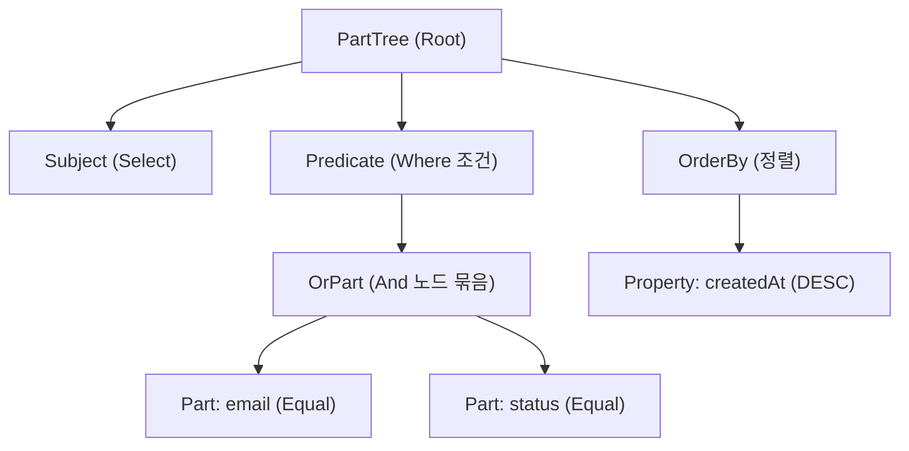

**추상 구문 트리(Abstract Syntax Tree, AST)**는 프로그래밍 언어의 소스 코드나 특정 형식의 문자열 구문(Grammar) 구조를 **컴퓨터가 분석하고 조작하기 쉽도록 트리(Tree) 형태로 추상화하여 표현한 자료구조**이다.

컴파일러, 트랜스파일러(Babel, TypeScript), 정적 분석 도구(ESLint, SonarQube)뿐만 아니라 **Spring Data JPA의 쿼리 메서드 이름 파싱(`PartTree`)** 등 다양한 영역에서 핵심 구문 분석 도구로 활용된다.

---

## 1. 텍스트에서 AST가 만들어지는 과정 (파싱 파이프라인)

문자열이나 소스 코드가 AST로 변환되는 과정은 크게 2단계를 거친다.

```mermaid
flowchart LR
    A["입력 텍스트\n(소스코드 / 메서드명)"] -->|1. Lexer (토큰화)| B["토큰(Token) 스트림\n[findBy, Email, And, Status]"]
    B -->|2. Parser (구문 분석)| C["추상 구문 트리 (AST)\n구조화된 객체 그래프"]
    C -->|3. 코드 생성기 / 실행기| D["JPQL / 바이트코드 / 대상 언어"]
```

1. **어휘 분석 (Lexical Analysis / Tokenizing)**:
   - **렉서(Lexer)**가 문자열을 의미 있는 최소 단위인 **토큰(Token)**들로 쪼갠다.
2. **구문 분석 (Syntax Analysis / Parsing)**:
   - **파서(Parser)**가 문법 규칙(Grammar)에 따라 토큰들의 관계와 위계를 분석하여 **트리 노드(AST)**로 조립한다.
3. **해석 및 코드 생성 (Code Generation / Interpretation)**:
   - 생성된 AST를 순회(Traverse)하면서 타깃 언어(JPQL, 바이트코드 등)로 변환하거나 직접 실행한다.

---

## 2. Parse Tree(구체 구문 트리) vs AST(추상 구문 트리)

| 구분 | 구체 구문 트리 (Parse Tree / CST) | 추상 구문 트리 (AST) |
| :--- | :--- | :--- |
| **특징** | 문법에 나타난 모든 문자(괄호, 세미콜론, 쉼표 등 구두점 포함)를 그대로 트리로 구성 | 의미 분석에 불필요한 구두점이나 괄호 등을 생략하고 **순수한 의미적 관계만 추상화** |
| **목적** | 문법적 완전성 검증 | **코드 변환, 최적화, 쿼리 생성, 정적 분석에 최적화** |

---

## 3. Spring Data JPA에서의 AST 활용: `PartTree`

Spring Data JPA의 **쿼리 메서드(Derived Query Method)**는 메서드 이름 자체가 일종의 작은 도메인 특화 언어(DSL) 역할을 한다. 

`PartTree`는 메서드 이름을 파싱하여 내부적으로 AST를 구축한다.

### 예시: `findByEmailAndStatusOrderByCreatedAtDesc`



1. **토큰 분해**: `findBy` / `Email` / `And` / `Status` / `OrderBy` / `CreatedAt` / `Desc`
2. **AST(`PartTree`) 구성**: 조건절(Predicate), 정렬(OrderBy), 주어(Subject) 트리 노드로 구조화
3. **JPQL 생성**: 트리를 순회하면서 `SELECT u FROM User u WHERE u.email = :email AND u.status = :status ORDER BY u.createdAt DESC`를 조합

---

## 관련 문서

- [[spring-data-jpa-interface-mechanism|Spring Data JPA 인터페이스 동작 원리]]
