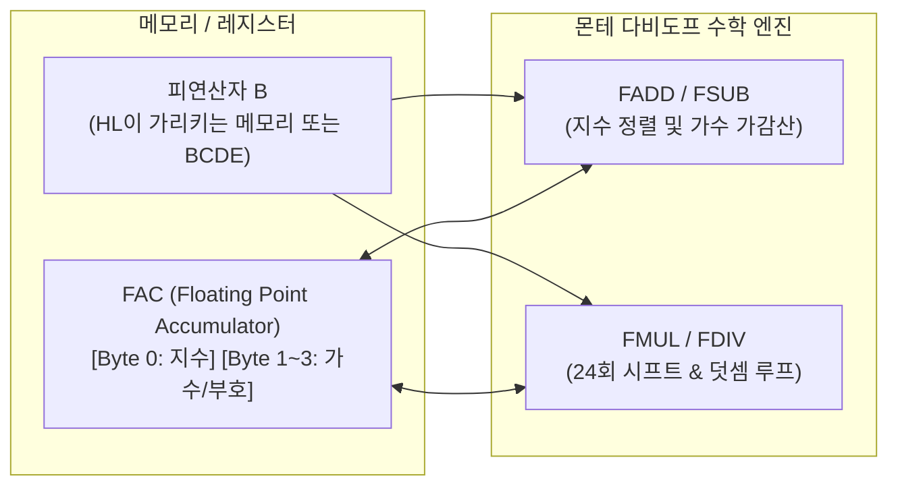

**알테어 베이직 부동소수점 패키지(Altair BASIC Floating-Point Math Package)**는 1975년 하버드 대학교 학생이었던 **몬테 다비도프(Monte Davidoff)**가 빌 게이츠(Bill Gates), 폴 앨런(Paul Allen)의 의뢰를 받아 인텔 8080 프로세서용으로 작성한 32비트(4바이트) 부동소수점 연산 라이브러리이다.

이 패키지는 훗날 IEEE 754 표준(1985년)이 제정되기 전까지 마이크로소프트 BASIC 제품군(Apple II용 Applesoft BASIC, Commodore PET용 Commodore BASIC, MS-DOS의 GW-BASIC 및 QuickBASIC)의 표준 실수 표현 형식인 **MBF(Microsoft Binary Format)**의 기술적 모태가 되었다.

---

## 1. 역사적 배경 및 개발 분담

1975년 MITS사의 Altair 8800은 기본 RAM이 **고작 4KB**에 불과했다. 당시 대부분의 미니 컴퓨터용 BASIC 인터프리터(예: Tiny BASIC)는 메모리 한계로 인해 **정수(Integer) 연산만 지원**했다. 

빌 게이츠와 폴 앨런은 과학·공학 및 비즈니스 계산을 위해 4KB 내에서도 부동소수점(실수) 연산이 반드시 작동해야 한다고 판단하여, 수학과 수치해석에 뛰어났던 몬테 다비도프를 계약자로 영입했다.

```assembly
; *****************************************************************
; *                                                               *
; *   MICRO-SOFT ALTAIR BASIC 3.2 (4K EDITION)                    *
; *   WRITTEN BY BILL GATES, PAUL ALLEN AND MONTE DAVIDOFF        *
; *                                                               *
; *   PAUL ALLEN WROTE THE NON-RUNTIME STUFF.                     *
; *   BILL GATES WROTE THE RUNTIME STUFF.                         *
; *   MONTE DAVIDOFF WROTE THE MATH PACKAGE.                      *
; *                                                               *
; *****************************************************************
```

* **폴 앨런(Paul Allen)**: PDP-10 상의 8080 시뮬레이터 개발, 메모리 로더, 입출력(I/O) 및 비런타임 시스템 구현.
* **빌 게이츠(Bill Gates)**: 구문 분석기(Lexer/Parser), 메모리 관리자, 런타임 제어 인터프리터 구현.
* **몬테 다비도프(Monte Davidoff)**: 4바이트 부동소수점 사칙연산, 수치 변환, 초월함수 수학 패키지(약 1KB 미만) 구현.

---

## 2. 4바이트 MBF (Microsoft Binary Format) 데이터 구조

알테어 베이직의 실수는 메모리와 레지스터에서 **4바이트(32비트)** 단정밀도 형식으로 저장된다.

```text
+----------------+----------------+----------------+----------------+
|     Byte 0     |     Byte 1     |     Byte 2     |     Byte 3     |
+----------------+----------------+----------------+----------------+
| Exponent (지수) | S | Mantissa H |   Mantissa M   |   Mantissa L   |
|   (Bias 128)   |   |  (7 bits)  |    (8 bits)    |    (8 bits)    |
+----------------+----------------+----------------+----------------+
```

1. **지수부 (Exponent, 8비트)**:
   - $2^{e}$의 지수 $e$를 나타내며, **$128 (80_{16})$ 바이어스(Bias)**를 적용한다.
   - 지수 값이 `0`이면 숫자 전체가 $0.0$임을 나타낸다.
2. **부호 비트 (Sign, 1비트)**:
   - Byte 1의 최상위 비트(MSB). `0`이면 양수, `1`이면 음수.
3. **가수부 (Mantissa, 23+1 = 24비트 정규화)**:
   - 정규화된 2진수 표기($1.xxxxx..._2$)를 사용하며, 최상위 비트 $1$은 항상 존재하므로 암묵적(Hidden Bit)으로 간주하고 생략하여 유효숫자 **24비트 정밀도(십진수 약 6~7자리)**를 확보한다.

---

## 3. 핵심 아키텍처: `FAC` (Floating Point Accumulator)

다비도프의 수학 패키지는 CPU 레지스터의 부족을 극복하기 위해 메모리의 특정 4바이트 영역을 **가상 누산기(`FAC`)**로 지정하여 모든 연산의 피연산자 및 반환값으로 사용한다.



* **`FAC` (또는 `FACEXP`, `FACHO`, `FACLO`)**: 제1 피연산자가 보관되고, 최종 계산 결과가 누적되는 4바이트 메모리.
* **`ARG`**: 이항 연산 시 두 번째 피연산자가 임시 저장되는 보조 레지스터 공간.
* **`HL` 레지스터 쌍**: 연산 대상이 위치한 메모리 주소를 가리키는 포인터로 주로 사용.

---

## 4. 8080 어셈블리 핵심 루틴 분석

### 4.1 연산자 디스패치 테이블 (Dispatch Table)
BASIC 인터프리터가 `+`, `-`, `*`, `/` 토큰을 만나면 연산자 우선순위와 함께 다비도프의 해당 함수 주소로 점프한다.

```assembly
.DW    FAdd    ; '+' 연산 -> FAdd 호출
.DB    79h     ; 연산자 우선순위 바이트
.DW    FSub    ; '-' 연산 -> FSub 호출
.DB    79h
.DW    FMul    ; '*' 연산 -> FMul 호출
.DB    7Ch
.DW    FDiv    ; '/' 연산 -> FDiv 호출
.DB    7Ch
```

### 4.2 부동소수점 덧셈/뺄셈 (`FADD`, `FSUB`)
1. **`FSUB`**: 제2 피연산자의 부호 비트(Byte 1의 MSB)를 반전시킨 뒤 `FADD`로 진입.
2. **`FADD`**:
   - 두 수의 지수(`FACEXP` vs `ARGEXP`)를 비교하여 차이($\Delta e$)를 계산.
   - 작은 쪽 숫자의 가수부를 $\Delta e$ 비트만큼 오른쪽으로 시프트하여 자릿수를 정렬(`FADDSHIFT`).
   - 24비트 가수부 덧셈을 수행하고, 자리올림(Carry)이 발생하면 정규화(Normalize) 및 지수 보정을 수행.

### 4.3 24비트 정밀도 곱셈 루틴 (`FMUL`)
인텔 8080에는 하드웨어 곱셈 명령어가 없으므로, 다비도프는 **24비트 루프 카운터(`MVI C, 24`)**를 사용하여 시프트와 덧셈을 반복하는 최적화 알고리즘을 작성했다.

```assembly
FMUL:   CALL    FPCOMP      ; 0인지 확인 및 결과 부호 판별
        JZ      RETZERO     ; 어느 한쪽이 0이면 결과는 0
        ...
        MVI     C, 24       ; 24비트 가수부 계산을 위한 카운터 (24회)
FMULLP: DAD     H           ; FAC 가수를 1비트 왼쪽 시프트 (Carry 발생 확인)
        JNC     NOADD       ; 비트가 0이면 덧셈 생략
        DAD     D           ; 비트가 1이면 승수(Multiplicand)를 누적 가산
NOADD:  DCR     C           ; 루프 카운터 감소
        JNZ     FMULLP      ; 24회 반복
```

### 4.4 주요 수치 변환 루틴
* **`FLOAT`**: 16비트 부호 있는 정수(`HL` 레지스터)를 4바이트 부동소수점 `FAC`로 정규화 변환.
* **`INT` / `FINX`**: `FAC`의 지수부를 확인하여 소수점 이하를 버리고 정수 부분만 추출.
* **`FIN` (Float Input)**: `"3.14159"`와 같은 ASCII 문자열을 한 자씩 읽어 $10$을 곱하며 부동소수점 `FAC` 생성.
* **`FOUT` (Float Output)**: `FAC` 값을 $10$으로 나누며 십진수 자릿수를 추출하여 문자열 버퍼로 출력(`PRINT` 문에서 사용).

---

## 5. 에디션별 부동소수점 기능 비교

| 에디션 | 부동소수점 정밀도 | 지원 수학 함수 | 메모리 크기 |
| :--- | :--- | :--- | :--- |
| **4K BASIC** | 32비트 단정밀도 (유효 6자리) | `+`, `-`, `*`, `/`, `SQR`, `RND`, `SIN` (기본 연산) | 인터프리터 총 ~3.2 KB |
| **8K BASIC** | 32비트 단정밀도 (유효 6자리) | `COS`, `TAN`, `ATN`, `LOG`, `EXP` 등 전체 초월함수 활성화 | 인터프리터 총 ~5.8 KB |
| **Extended BASIC** | **64비트 배정밀도** (유효 16자리) 지원 | 단정밀도 + 배정밀도 전체 연산, `PRINT USING` | 인터프리터 총 ~10 KB 이상 |

---

## 6. 소스 코드 열람 및 아카이브

* **GitHub 리버스 엔지니어링 소스**:
  * [IMSAI-8080/Altair-Basic (GitHub)](https://github.com/IMSAI-8080/Altair-Basic)
  * [pagetable/altair-basic (GitHub)](https://github.com/pagetable/altair-basic)
* **전문 분석 리소스**:
  * [AltairBasic.org - The Math Package](https://altairbasic.org/)

---

## 관련 문서

- [[thread-pool|스레드 풀 동작 원리]]
- [[abstract-syntax-tree|추상 구문 트리 (AST)]]
