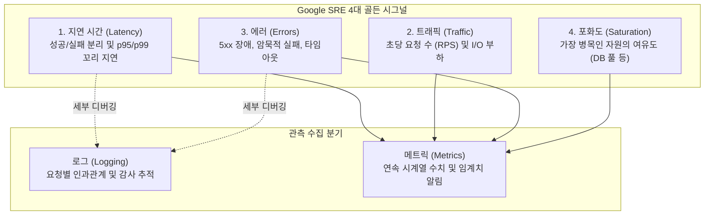

# Google SRE 포 골든 시그널 (Four Golden Signals)

**포 골든 시그널(Four Golden Signals)**은 구글의 사이트 신뢰성 엔지니어링(SRE, Site Reliability Engineering) 팀이 대규모 분산 시스템을 운영하며 정립한 **서비스 모니터링의 4대 핵심 지표**이다.

수많은 서버와 애플리케이션에서 발생하는 수천 가지의 원시 메트릭 중, **"어떤 시스템이든 이 4가지만 올바르게 측정하고 관측하면 서비스의 건강 상태(Health)와 사용자 경험 저하를 99% 감지할 수 있다"**는 철학에 기반한다[^google-sre-ch6].

---

## 1. 4대 골든 시그널의 상세 정의

### 1) 지연 시간 (Latency)
요청을 처리하는 데 걸리는 시간이다. 지연 시간을 모니터링할 때 가장 주의해야 할 실무적 함정은 **평균값(Mean)에 속지 않는 것**이다.

* **꼬리 지연(Tail Latency) 추적**: 1,000건의 요청 중 990건이 10ms에 처리되고 10건이 5,000ms 걸렸다면 평균은 약 60ms로 건전해 보이지만, 실제 핵심 고객 1%는 심각한 서비스 지연을 겪고 있다. 따라서 **상위 95%(p95), 99%(p99)** 백분위수를 측정해야 한다.
* **성공 지연과 실패 지연의 분리**: 에러(HTTP 500)가 즉시 1ms 만에 반환되면 전체 평균 지연 시간이 오히려 급감하는 착시가 발생한다. 지연 시간은 반드시 성공한 요청과 실패한 요청을 분리하여 관측해야 한다.

### 2) 트래픽 (Traffic)
시스템에 가해지는 수요(Demand)의 양을 측정하는 지표이다.
* 웹/API 백엔드에서는 **초당 요청 수(RPS: Requests Per Second)** 또는 초당 트랜잭션(TPS)으로 표현된다.
* 스트리밍 서비스나 네트워크 장비의 경우 대역폭(Throughput)이나 I/O 전송량이 지표가 된다.

### 3) 에러 (Errors)
시스템에 인입된 요청 중 실패한 요청의 비율이다.
* **명시적 실패 (Explicit Errors)**: HTTP 500(Internal Server Error), DB Connection Timeout 등 서버가 명시적으로 에러를 반환한 경우.
* **암묵적 실패 (Implicit Errors)**: HTTP 200 OK를 반환했으나 응답 본문에 빈 데이터가 담겼거나, 내부적으로 에러 메시지가 JSON으로 나간 경우.
* **정책적 실패 (Policy Errors)**: 응답 시간이 SLA(예: 2초)를 초과하여 클라이언트가 끊어버린 타임아웃.

### 4) 포화도 (Saturation)
시스템의 자원이 얼마나 가득 찼는지를 나타내는 비율로, **가장 제약이 심한 병목 자원의 사용 여유도**를 측정한다.
* 100%에 도달하기 전에 시스템 성능 저하가 먼저 시작되므로, 사전 예측 알림(Early Warning)에 가장 중요한 지표이다.
* CPU, 메모리 사용률뿐만 아니라, 백엔드 서비스의 가장 치명적인 병목인 **[[connection-pool-exhaustion|DB 커넥션 풀(HikariCP pool usage)]]** 및 스레드 풀 큐 대기 상태가 핵심 관측 대상이다.

---

## 2. Spring Boot 백엔드 실무 지표 매핑

| 골든 시그널 | 관측 대상 메트릭 (Prometheus / Micrometer) | 목표 기준선 (SLA 예시) |
| :--- | :--- | :--- |
| **Latency** | `http.server.requests.seconds{quantile="0.99"}` | p99 < 100ms 유지 |
| **Traffic** | `rate(http.server.requests.seconds_count[1m])` | 평시 대비 트래픽 스파이크 감지 |
| **Errors** | `rate(http.server.requests.seconds_count{status=~"5.."}[1m])` | 5xx 에러율 < 0.1% (1% 초과 시 On-Call) |
| **Saturation** | `hikaricp.connections.active`, `hikaricp.connections.pending` | 활성 커넥션 80% 초과 및 대기 큐 발생 시 경고 |

---

## 3. 로그(Logging) vs 메트릭(Metrics)의 본질적 차이

많은 개발자가 *"왜 포화도(HikariCP 커넥션 풀 상태)를 매 요청 로그에 찍지 않는가?"*라는 의문을 품는다. 이는 **로그**와 **메트릭**의 수집 목적과 엔지니어링 비용이 근본적으로 다르기 때문이다.

| 구분 | 로그 (Logging) | 메트릭 (Metrics) |
| :--- | :--- | :--- |
| **데이터 형태** | 특정 시점에 발생한 사건(Event)에 대한 텍스트/JSON 기록 | 시간의 흐름에 따른 연속적인 시계열 수치 (Time-series Number) |
| **적합한 용도** | 요청의 상세 인과관계 추적, 예외 스택 트레이스, 감사(Audit) | 시스템의 전체 건강 상태 파악, 집계 통계, 실시간 대시보드 및 알림 |
| **단점 및 비용** | 데이터 크기가 크고 I/O 및 저장 비용이 큼. 텍스트 집계 연산이 무거움 | 사건의 구체적인 세부 컨텍스트(어떤 파라미터로 실패했는지) 파악 불가 |

### 포화도를 로그가 아닌 메트릭으로 수집해야 하는 이유
1. **I/O 낭비 및 로그 폭증 방지**:
   - 초당 1,000건의 요청이 들어올 때마다 `HikariCP active=8, idle=2`를 로그 파일에 찍으면 디스크 I/O와 스토리지 비용이 기하급수적으로 증가한다.
2. **시계열 추세 분석과 실시간 알람**:
   - 포화도는 "지금 이 순간 100%인가?"보다 **"지난 5분간 점진적으로 상승하여 고갈 임계치에 다가가고 있는가?"**를 추적하는 것이 핵심이다.
   - Prometheus는 15초~1분 주기로 가벼운 수치 게이지(Gauge)만 긁어가므로 시스템에 부담을 주지 않고, `hikaricp.connections.pending > 0` 상태가 1분 이상 지속되면 슬랙(Slack) 등으로 즉각적인 On-Call 알림을 보낼 수 있다.

---

## 4. 운영 전 필수 사전 장애 검증 (Chaos & Stress Testing)

모니터링 지표를 대시보드에 띄워두는 것만으로는 부족하다. 실제 장애 상황에서 지표가 경고를 울리고 시스템이 복원력을 발휘하는지 사전에 검증해야 한다.

1. **DB 커넥션 풀 고갈 및 타임아웃 검증**:
   - HikariCP 최대 풀 크기를 제한(`maximum-pool-size: 5`)하고 지연 쿼리(Slow Query)를 유발하여 커넥션을 모두 점유시킨다.
   - 이때 대기 중인 다른 요청들이 무한정 블로킹되지 않고, 설정된 타임아웃(`connection-timeout: 2000ms`) 내에 `503 Service Unavailable` 또는 표준 에러 응답을 반환하는지 검증한다.
2. **비정상 대량 오프셋 부하 검증**:
   - 악의적이거나 비정상적인 심층 페이징 요청(`page=999999, size=100`)이 쏟아질 때 DB CPU와 메모리 사용률이 임계치를 넘는지 확인하고, 애플리케이션 레벨의 방어(최대 페이지 수 제한 등)가 작동하는지 확인한다.

---

## 관련 문서
* [[connection-pool-exhaustion]]
* [[hikaricp-settings]]
* [[centralized-logging-architecture]]
* [[mapped-diagnostic-context]]
* [[application-security-logging-and-actuator-hardening]]
* [[offset-vs-keyset-pagination]]

---

## 참고 자료
[^google-sre-ch6]: [Google SRE Book - Chapter 6: Monitoring Distributed Systems](https://sre.google/sre-book/monitoring-distributed-systems/#xref_monitoring_golden-signals)
