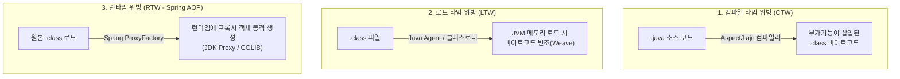

**위빙(Weaving)**이란 관점 지향 프로그래밍(AOP)에서 **핵심 비즈니스 로직(Target)에 부가기능(Aspect / Advice)을 결합하여 하나로 엮어내는 과정**을 의미한다.

부가기능 코드를 언제, 어떤 방식으로 대상 코드와 엮느냐에 따라 크게 3가지 위빙 방식으로 나뉜다.

---

## 1. 3가지 위빙 방식

### A. 컴파일 타임 위빙 (Compile-Time Weaving, CTW)
- **동작 시점**: 자바 소스 코드(`.java`)를 컴파일하여 `.class` 파일을 만드는 시점.
- **방식**: 표준 자바 컴파일러(`javac`) 대신 AspectJ 전용 컴파일러(`ajc`)를 사용하여, 컴파일 과정에서 부가기능 코드를 타깃 클래스의 바이트코드에 직접 삽입한다.
- **장점**: 컴파일 시점에 코드가 결합되므로 런타임 성능 오버헤드가 없고, `private` 메서드, `final` 클래스, 내부 메서드 호출(self-invocation)에도 AOP가 완벽히 적용된다.
- **단점**: 빌드 설정이 복잡하고 별도의 AspectJ 컴파일 과정을 거쳐야 한다.

### B. 로드 타임 위빙 (Load-Time Weaving, LTW)
- **동작 시점**: 컴파일된 `.class` 파일이 JVM 메모리(클래스로더)에 로딩되는 시점.
- **방식**: JVM 기동 시 Java Agent(`-javaagent:aspectjweaver.jar`) 또는 스프링의 `InstrumentationLoadTimeWeaver`를 등록하여, 클래스로더가 바이트코드를 읽어 들일 때 실시간으로 바이트코드를 가로채서(ClassFileTransformer) Aspect 코드를 삽입한다.
- **장점**: 소스 코드를 다시 컴파일하지 않아도 외부 라이브러리 JAR 파일의 클래스에도 AOP를 적용할 수 있다.
- **단점**: 애플리케이션 시작 시 클래스 로딩 시간이 다소 증가하며 Agent 설정이 필요하다.

### C. 런타임 위빙 (Runtime Weaving / Proxy Weaving - Spring AOP)
- **동작 시점**: 애플리케이션이 실행 중인 런타임(초기화 시점).
- **방식**: 원본 클래스 바이트코드를 전혀 건드리지 않고, **[[jdk-dynamic-proxy|JDK Dynamic Proxy]]** 또는 **CGLIB**를 이용해 타깃을 감싸는 **프록시(Proxy) 객체를 동적으로 생성**하여 메서드 호출을 가로챈다.
- **스프링 AOP의 기본 방식**: 스프링의 `@Transactional`, `@Aspect`, Spring Data JPA([[spring-data-jpa-interface-mechanism|Spring Data JPA 인터페이스 메커니즘]]) 등이 모두 이 프록시 기반 런타임 위빙을 사용한다.
- **장점**: 별도의 컴파일러나 JVM Agent 설정 없이 순수 스프링 환경에서 가볍고 간편하게 동작한다.
- **단점**: 프록시를 통해서만 호출을 가로챌 수 있으므로 **내부 메서드 자기 호출(Self-Invocation)**에는 부가기능이 적용되지 않는 한계가 있다.

---

## 2. '바이트코드 변조' vs '프록시 바이트코드 신규 생성'

위빙의 기술적 메커니즘을 볼 때, 바이트코드를 다루는 방식에 중요한 차이가 있다.

| 구분 | 바이트코드 변조 (Modification) | 프록시 바이트코드 신규 생성 (Generation) |
| :--- | :--- | :--- |
| **적용 기술** | AspectJ (CTW, LTW) | [[jdk-dynamic-proxy|JDK Dynamic Proxy]], CGLIB (Spring AOP) |
| **작동 원리** | 이미 존재하는 원본 클래스(`UserService.class`)의 내부 바이트코드를 뜯어 직접 수정·삽입함 | 원본 코드는 그대로 두고, 인터페이스/클래스를 대행하는 **완전히 새로운 `$Proxy0` 바이트코드를 메모리에 조립**함 |
| **원본 객체 관계** | 타깃 클래스 자체가 Aspect를 포함하게 됨 | 원본 객체와 프록시 객체가 분리되어 프록시가 원본을 호출함 |

---

## 3. 위빙 방식 종합 비교

| 비교 항목 | 컴파일 타임 위빙 (CTW) | 로드 타임 위빙 (LTW) | 런타임 프록시 위빙 (RTW - Spring AOP) |
| :--- | :--- | :--- | :--- |
| **주요 구현체** | AspectJ `ajc` | AspectJ LTW / Java Agent | **Spring AOP** (JDK Proxy / CGLIB) |
| **위빙 시점** | 소스 코드 컴파일 시점 | 클래스로더 로딩 시점 | 스프링 빈 생성/초기화 시점 |
| **바이트코드 조작** | 원본 바이트코드 직접 수정 | 원본 바이트코드 직접 수정 | 원본 수정 없음 (프록시 바이트코드 생성) |
| **설정 복잡도** | 높음 (전용 컴파일러 필요) | 보통 (JVM 옵션/Agent 필요) | **매우 낮음 (스프링 기본 내장)** |
| **내부 호출(Self-Invocation) 지원** | 지원 O | 지원 O | **지원 X (프록시 우회 한계)** |
| **적용 가능한 대상** | 모든 메서드, 생성자, 필드 | 모든 메서드, 생성자, 필드 | **스프링 빈의 public 메서드만 가능** |

---

## 4. 스프링이 런타임 프록시 위빙을 기본으로 선택한 이유

스프링 프레임워크는 90% 이상의 엔터프라이즈 환경(트랜잭션 관리, 로깅, 보안 등)에서 프록시 기반 런타임 위빙만으로 충분하다고 판단했기 때문이다. 별도의 ajc 컴파일러나 JVM `-javaagent` 설정 없이도 즉시 개발 환경을 구성할 수 있는 **단순성과 생산성**이 가장 큰 장점이다.

---

## 관련 문서

- [[spring-aop-proxy-creation-lifecycle|스프링 AOP 프록시 생성 시점과 판단 메커니즘]]
- [[jdk-dynamic-proxy|JDK Dynamic Proxy 동작 원리]]
- [[repository-factory-bean-lifecycle|일반 스프링 빈과 JPA 리포지토리 프록시 빈의 등록 메커니즘 비교]]
- [[spring-data-jpa-interface-mechanism|Spring Data JPA 인터페이스 동작 원리]]
