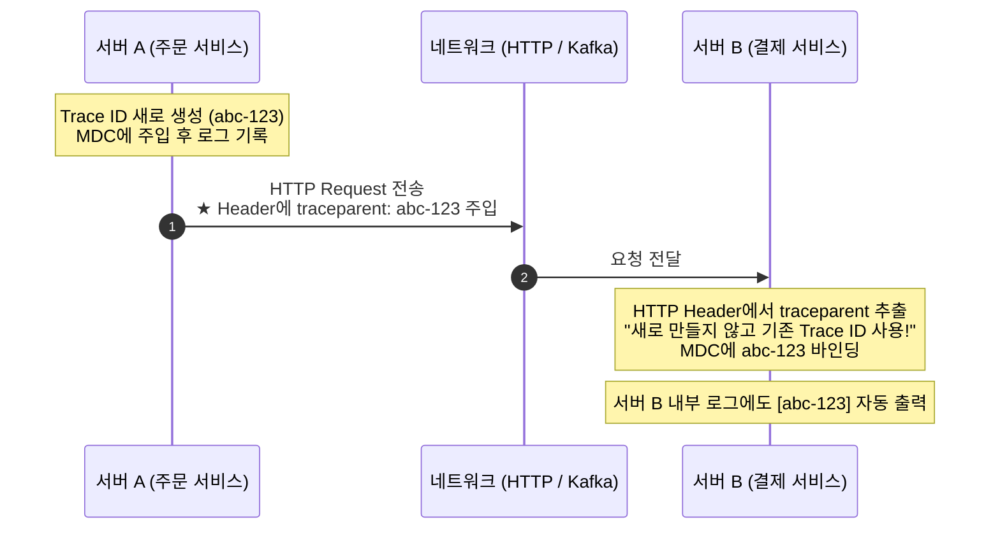

# 분산 추적과 컨텍스트 전파 (Distributed Tracing & Context Propagation)

**분산 추적(Distributed Tracing)**은 마이크로서비스 아키텍처(MSA)나 분산 시스템 환경에서 하나의 클라이언트 요청이 여러 독립된 서버와 네트워크 경계를 거쳐 처리될 때, 그 전체 경로와 지연 시간, 장애 발생 지점을 단일 트랜잭션 단위로 추적·시각화하는 관측성(Observability) 기술이다.

---

## 1. 핵심 개념: Trace와 Span

2010년 구글의 Dapper 논문에서 확립된 개념이다.

* **Trace (트레이스)**: 클라이언트의 최초 요청부터 응답까지 시스템 전체를 통과하는 **단일 트랜잭션의 전체 여정(트리 구조)**.
* **Trace ID**: 이 여정 전체에 부여되는 고유한 번호표. 모든 참여 서버가 동일한 ID를 공유한다.
* **Span (스팬)**: Trace 내에서 각 개별 서비스가 수행하는 **작업의 기본 단위(단일 작업 구간)**.
  - 고유한 `Span ID`와 부모 구간을 가리키는 `Parent Span ID`를 가지며, 시작/종료 시간과 메타데이터(HTTP 상태코드, 에러 메시지 등)를 포함한다.

```mermaid
gantt
    title 분산 추적 Span 타임라인 구조 (Trace ID: abc-123)
    dateFormat X
    axisFormat %s ms

    section API Gateway
    Client Request 인입 & 인증      : 0, 150
    section Order Service
    주문 유효성 검사               : 30, 80
    section Payment Service
    외부 카드사 결제 승인 요청     : 80, 140
    section Delivery Service
    배송 접수 비동기 이벤트 발행    : 140, 150
```



---

## 2. 컨텍스트 전파 (Context Propagation) 메커니즘

서로 다른 서버(프로세스)는 OS 레벨에서 메모리를 공유할 수 없다. 따라서 네트워크 호출 시 **통신 프로토콜의 메타데이터(헤더)**에 Trace ID와 부모 Span ID를 주입하여 전송한다.



1. **인젝션 (Injection)**: 클라이언트 호출 라이브러리(Feign, RestTemplate 등)가 나가는 요청의 HTTP 헤더에 현재 트레이스 컨텍스트를 삽입한다.
2. **익스트랙션 (Extraction)**: 요청을 수신하는 서버의 필터가 인입된 HTTP 헤더를 파싱하여 컨텍스트를 복원하고 로컬 스레드([[mapped-diagnostic-context|MDC]])에 바인딩한다.

---

## 3. 헤더 표준의 역사: B3 규격에서 W3C 표준으로

### 1) Zipkin B3 Propagation (1세대 사실상 표준)
트위터가 오픈소스로 공개한 분산 추적 시스템인 **Zipkin(집킨)**에서 고안한 헤더 규격이다.  
Spring Cloud Sleuth의 기본 규격으로 널리 쓰였다.
* `X-B3-TraceId`: 전체 트랜잭션 ID
* `X-B3-SpanId`: 현재 구간 ID
* `X-B3-Sampled`: 추적 데이터 수집 여부 (1: 수집, 0: 무시)

### 2) W3C Trace Context (현대 국제 웹 표준)
벤더사마다 헤더 이름이 제각각이어서 생기는 호환성 단절을 해결하기 위해 W3C에서 제정한 공식 표준이다.
* **표준 헤더명**: **`traceparent`**
* **포맷**: `version-trace_id-parent_id-trace_flags`
```http
traceparent: 00-4bf92f3577b34da6a3ce929d0e0e4736-00f067aa0ba902b7-01
```
  - `00`: 현재 표준 버전
  - `4bf92f3577b34da6a3ce929d0e0e4736`: 16바이트 16진수 **Trace ID**
  - `00f067aa0ba902b7`: 8바이트 16진수 **Parent Span ID**
  - `01`: 샘플링 플래그 (01은 기록 대상)

---

## 4. Spring 생태계의 진화: Sleuth ➡️ Micrometer Tracing

Spring Boot 3.0부터는 Spring Cloud Sleuth가 종료되고 **Micrometer Tracing**으로 대체되었다.

| 구분 | Spring Cloud Sleuth (Spring Boot 2) | Micrometer Tracing (Spring Boot 3+) |
| :--- | :--- | :--- |
| **의존성 위치** | Spring Cloud 프로젝트에 종속 | Spring 핵심 생태계(Micrometer)로 승격 |
| **기본 프로토콜** | Zipkin B3 헤더 기본 | **W3C Trace Context 기본** |
| **추적 엔진** | Brave 전용 | **OpenTelemetry(OTel)** 및 **Brave** 유연한 선택 가능 |
| **역할** | 수동 MDC 관리 불필요<br>HTTP 통신 및 비동기 전파 자동화 | 동일하게 완전 자동화 지원 + 메트릭(Metrics)과 완벽 통합 |

---

## 관련 문서
* [[mapped-diagnostic-context]]
* [[centralized-logging-architecture]]
* [[thread-per-request-model]]
