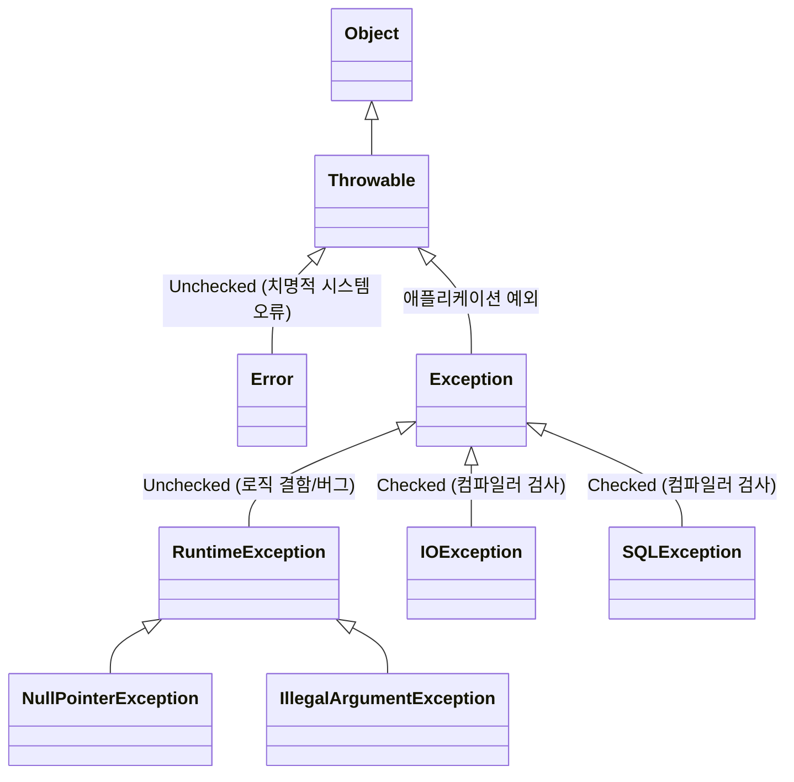

자바의 예외 처리 시스템은 모든 오류 상황을 객체지향적으로 모델링하여 다룰 수 있도록 설계되었다. 모든 예외와 에러는 `java.lang.Throwable`을 정점으로 계층 구조를 형성하고 있으며, 컴파일 타임 검사 여부에 따라 **체크 예외(Checked Exception)**와 **언체크 예외(Unchecked Exception)**로 양분된다.

---

## 1. 전체 계층 구조 (Throwable Hierarchy)



```text
java.lang.Object
 └── java.lang.Throwable
      ├── java.lang.Error (Unchecked)
      │    ├── OutOfMemoryError
      │    └── StackOverflowError
      └── java.lang.Exception
           ├── java.lang.RuntimeException (Unchecked)
           │    ├── NullPointerException
           │    ├── IllegalArgumentException
           │    └── IndexOutOfBoundsException
           └── (그 외 모든 Exception) (Checked)
                ├── IOException
                ├── SQLException
                └── ClassNotFoundException
```

### ① `java.lang.Throwable`의 핵심 역할
`Throwable`은 자바 언어에서 던져질 수 있는 모든 클래스의 최상위 부모이다.
* **`throw` / `catch` 권한 부여**: 자바 문법상 오직 `Throwable` 또는 그 하위 클래스 인스턴스만이 `throw new ...`로 던져지거나 `catch (...)` 구문에 명시될 수 있다.
* **스택 트레이스(Stack Trace) 캡처**: 예외가 인스턴스화되는 시점에 호출 스택 프레임(`fillInStackTrace()`)을 자동으로 수집하여 정확한 파일명과 라인 넘버를 기록한다.
* **원인 체이닝(Cause Chaining)**: 원본 예외(`cause`)를 보관하고 `getCause()`로 추적할 수 있는 메커니즘을 제공한다.

### ② `Exception` vs `Error`
* **`Exception` (예외)**: 개발자가 작성한 프로그램 코드나 실행 환경에서 발생하며, 프로그램이 `catch`하여 **복구하거나 대처할 수 있는 대상**이다.
* **`Error` (에러)**: JVM 메모리 고갈(`OutOfMemoryError`), 스택 오버플로우(`StackOverflowError`) 등 JVM 자체의 치명적인 문제이다. 애플리케이션 레벨에서 복구할 수 없으므로 프로그램을 즉시 종료시키는 것이 안전하다. (`catch (Throwable t)`를 남용하면 이러한 에러까지 삼켜 프로세스가 비정상 좀비 상태가 될 위험이 있다.)

---

## 2. 체크 예외 vs 언체크 예외의 역사와 설계 배경

자바의 체크 예외와 언체크 예외 구분은 **Java 1.0(1996년 출시)**, 그리고 그 전신인 Oak 프로젝트(1991~1995) 설계 당시부터 포함되어 있었다.

* **도입 배경**: 자바의 창시자인 제임스 고슬링(James Gosling)과 설계팀은 C/C++에서 반환 코드(Return code)나 에러를 무시하여 시스템이 다운되는 현상을 방지하고, **컴파일 타임에 예외 처리를 강제하여 신뢰성 높은(Robust) 언어**를 만들고자 했다. (CLU, Modula-3 언어의 아이디어 차용)
* **체크 예외 (Checked Exception)**:
  * `Exception`을 상속하되 `RuntimeException`을 상속하지 않은 클래스들.
  * 파일 I/O, DB 접근, 네트워크 통신 등 프로그램 외부 요인으로 발생하며, 호출자가 복구할 수 있다고 기대되는 예외.
  * 컴파일러가 `try-catch` 또는 `throws` 선언을 강제함.
* **언체크 예외 (Unchecked Exception)**:
  * `RuntimeException` 및 `Error` 계열.
  * 프로그래머의 실수(NPE, 인덱스 초과)나 복구 불가능한 시스템 오류.
  * 프로그램 어디서든 발생할 수 있으므로 매번 `throws`를 강제하면 코드가 지나치게 장황해지기 때문에 컴파일러 검사에서 제외됨.

---

## 3. 체크 예외를 다루는 3대 핵심 전략

체크 예외가 발생했을 때 문법적으로는 `try-catch`(잡기)와 `throws`(던지기) 2가지 선택지가 있지만, 실무 아키텍처 관점에서는 **3가지 핵심 전략**으로 나뉜다.

| 전략 | 메커니즘 | 적용 상황 및 목적 |
| :--- | :--- | :--- |
| **1. 복구 (Recover)** | `try-catch` | 대체값(Fallback) 반환, 일시적 오류 재시도(Retry) 등으로 정상 흐름 복귀 |
| **2. 회피/전파 (Propagate)** | `throws` 선언 | 현재 계층에서 처리할 수 없어 호출자에게 판단/처리 책임 위임 |
| **3. 전환/래핑 (Translate/Wrap)** | `catch` $\rightarrow$ `throw Unchecked` | 상위 계층 시그니처 오염 방지, 계층 간 결합도 제거, Root Cause 보존 |

---

## 4. 예외 래핑(Exception Wrapping / Chaining) 패턴

체크 예외의 가장 큰 문제점인 **"계층 침투(Leaky Abstraction) 및 시그니처 오염"**을 해결하기 위해 실무에서 가장 널리 쓰이는 표준 패턴이다.

```java
public class UserService {
    public User findUser(String id) {
        try {
            return userRepository.findUserById(id); // SQLException(체크 예외) 발생 가능
        } catch (SQLException e) {
            // 체크 예외를 도메인 언체크 예외로 감싸서(Wrapping) 던짐
            throw new UserNotFoundException("사용자 조회 중 DB 오류 발생: " + id, e);
        }
    }
}
```

### 예외 래핑의 핵심 이점
1. **메서드 시그니처 오염 방지**: Service, Controller 레이어까지 `throws SQLException`이 전파되는 현상을 차단한다.
2. **기술 종속성 캡슐화**: 상위 계층이 하위 계층의 구체적인 구현 기술(JDBC, JPA, File I/O 등)에 의존하지 않도록 분리한다.
3. **람다 및 스트림 API 호환**: 표준 함수형 인터페이스(`Function`, `Consumer`) 내부에서 체크 예외를 던질 수 없는 제약을 해결한다.

> [!WARNING]
> **Root Cause 누락 주의**: 래핑 시 원본 예외(`e`)를 생성자의 `cause` 인자로 넘기지 않으면, 최초 발생 지점의 스택 트레이스(`Caused by: ...`)가 증발하여 장애 원인 추적이 불가능해진다.

### 대표 사례: Spring Framework
Spring의 `JdbcTemplate`은 JDBC 표준의 체크 예외인 `SQLException`을 가로채, 스프링 자체의 언체크 예외 계층인 **`DataAccessException` 계열로 자동 래핑/변환**하여 제공한다.

---

## 관련 문서

- [[jvm-bytecode-exception-table-mechanism|JVM 바이트코드 레벨의 예외 처리와 Exception Table]]
- [[abstract-syntax-tree|추상 구문 트리 (AST)]]
