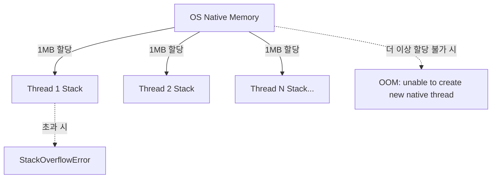

# JVM 메모리 구조 — 스택(Stack)과 힙(Heap)

자바 가상 머신(JVM)은 프로그램의 메모리를 **"실행 속도"**와 **"데이터의 공유 및 수명"**이라는 상반된 목적에 맞춰 크게 **스택(Stack Area)**과 **힙(Heap Area)**으로 분리하여 관리한다.

---

## 1. 스택(Stack)과 힙(Heap)의 본질적 비교

| 구분 | **스택 (Stack Area)** | **힙 (Heap Area)** |
| :--- | :--- | :--- |
| **비유** | **개인 요리사의 도마 (단기 작업대)** | **주방 중앙의 공용 창고 & 냉장고** |
| **소유 및 격리** | **스레드 1개당 1개 전용** (타 스레드 접근 불가) | **JVM 내 모든 스레드가 완전 공유** |
| **저장 대상** | 메서드 호출 정보(스택 프레임), **지역 변수**, 매개변수 | `new` 연산자로 생성된 **모든 객체(인스턴스)** 및 배열 |
| **생명주기** | 메서드 호출 시 생성, 메서드 **종료(`return`) 시 즉시 소멸** | 참조하는 변수가 없을 때까지 유지, **가비지 컬렉터(GC)가 수거** |
| **할당/해제 속도** | **CPU 레지스터 포인터 이동만으로 처리 (비용 0에 수렴)** | 메모리 탐색, 할당, 단편화 관리, GC 오버헤드 발생 |

---

## 2. 스택(Stack)의 물리적 메모리 할당 메커니즘

많은 개발자들이 오해하는 부분은 *"스택도 힙처럼 JVM이 알아서 늘려주는가?"*라는 점이다. 스택은 힙과 완전히 다른 방식으로 OS 레벨에서 할당된다.

### ① 스레드 1개당 1:1 물리적 메모리 할당
* JVM은 새로운 스레드(`new Thread()`)가 생성될 때마다, OS의 네이티브 메모리(C-Heap 영역)로부터 **고정된 크기의 연속된 메모리 블록**을 뚝 떼어 전용 스택으로 배정한다.
* 64비트 리눅스 및 macOS 기준 기본값은 **스레드 1개당 1MB (`-Xss1m`)**이다.
  - 스레드 1개 = 1MB
  - 스레드 200개 = 약 200MB
  - 스레드 5,000개 = 약 5GB의 네이티브 메모리 소모

### ② 톰캣(Tomcat) 스레드 풀(200개)의 존재 이유
웹 요청마다 스레드를 무제한으로 생성하면 트래픽 폭주 시 수천 개의 스레드가 생겨나며 수 GB의 스택 메모리가 순식간에 고갈된다. 
따라서 서블릿 컨테이너는 기본 최대 200개(`server.tomcat.threads.max=200`)로 스레드 풀을 엄격히 제한하여 스택 메모리 사용량을 예측 가능한 범위(약 200MB) 내로 통제한다.

### ③ 스택 관련 장애 유형
* **`StackOverflowError`**: 메서드 재귀 호출이 끝나지 않아 단일 스레드에게 배정된 1MB의 스택 한도를 초과했을 때 발생.
* **`OutOfMemoryError: unable to create new native thread`**: 힙 메모리가 남아있더라도 OS 레벨에서 새로운 스레드를 위한 1MB 네이티브 메모리를 더 이상 할당할 수 없을 때 발생.



---

## 3. 스택 프레임(Stack Frame)과 포인터 이동

스택 내부에서 메모리 할당과 해제는 **스택 포인터(SP 레지스터)의 단순 증감**으로 끝난다.

```
[메서드 진입 시] ─── SP 포인터를 아래로 이동 (Push: 지역 변수 공간 확보)
[메서드 종료 시] ─── SP 포인터를 위로 이동 (Pop: 메모리 회수 완료!)
```

가비지 컬렉터(GC)가 개입할 여지 없이, CPU 명령어 몇 번만으로 스택 프레임이 정리되므로 실행 속도가 극도로 빠르다. 따라서 메서드 내부에서 잠깐 쓰이고 사라질 변수들은 힙이 아닌 스택에 머무는 것이 가장 효율적이다.

---

## 4. 힙(Heap)의 메모리 관리: 공유 저수지

힙은 스레드 개수와 상관없이 JVM 기동 시 `-Xms`(초기 크기)와 `-Xmx`(최대 크기)로 단 하나의 거대한 공간을 미리 예약한다.

* 모든 스레드는 `new` 연산자를 통해 객체를 생성할 때 이 공용 저수지의 빈자리를 찾아 인스턴스를 올린다.
* **스레드 객체 자신(`java.lang.Thread`)도 자바 객체이므로 힙에 존재**한다.
* `Thread` 객체의 멤버 필드로 선언된 `ThreadLocalMap` 역시 **힙 메모리에 상주**한다. (이것이 스레드가 죽지 않는 한 ThreadLocal이 유지되는 물리적 이유이다.)
* 힙 공간이 부족해지면 GC가 동작하며, 회수 후에도 공간이 없으면 **`OutOfMemoryError: Java heap space`**가 발생한다.

---

## 관련 문서
* [[lambda-variable-capture-and-atomic-reference]]
* [[static-vs-singleton]]
* [[threadlocal]]
* [[thread-pool]]
