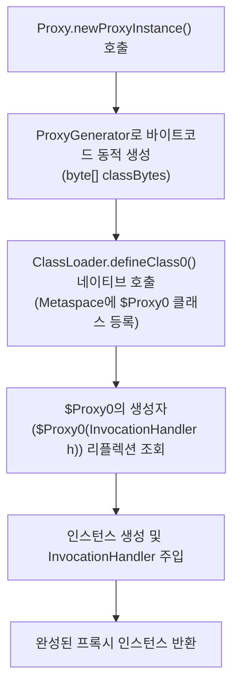
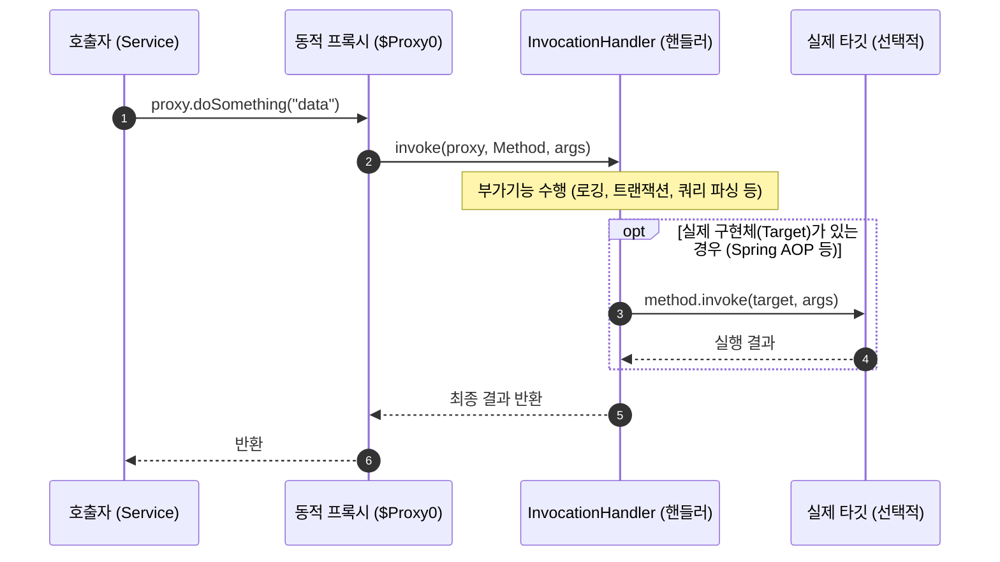

**JDK Dynamic Proxy**는 자바 표준 리플렉션 패키지(`java.lang.reflect.Proxy`)가 제공하는 기능으로, **개발자가 구현 클래스(`.java`)를 작성하지 않아도 런타임에 인터페이스를 구현하는 가상 클래스와 객체를 메모리상에 동적으로 생성**해 주는 기술이다.

Spring Data JPA([[spring-data-jpa-interface-mechanism|Spring Data JPA 인터페이스 동작 원리]]), Spring AOP, Feign Client, Retrofit, MyBatis Mapper 등 다양한 자바/스프링 프레임워크의 인터페이스 기반 자동화 기능들이 이 메커니즘을 토대로 동작한다.

---

## 1. 핵심 API와 3가지 필수 인자

동적 프록시 객체는 `Proxy.newProxyInstance()` 메서드로 생성된다.

```java
public static Object newProxyInstance(
    ClassLoader loader,
    Class<?>[] interfaces,
    InvocationHandler h
)
```

| 파라미터 | 역할 | 설명 |
| :--- | :--- | :--- |
| **`ClassLoader loader`** | 클래스 로더 | 프록시 클래스를 JVM 메모리(Metaspace)에 로드할 클래스 로더 |
| **`Class<?>[] interfaces`** | 구현할 인터페이스 목록 | 프록시 객체가 구현해야 하는 1개 이상의 인터페이스 목록 |
| **`InvocationHandler h`** | 메서드 가로채기 핸들러 | 프록시의 모든 메서드 호출을 받아 실제 로직을 수행할 핸들러 |

---

## 2. 내부 동작 메커니즘 ($Proxy0 생성 과정)

`Proxy.newProxyInstance()`가 호출될 때 JVM 내부에서는 다음과 같은 과정이 진행된다.



### A. 바이트코드 동적 생성 (`ProxyGenerator`)
- JVM 내부의 `ProxyGenerator.generateProxyClass()`가 전달받은 인터페이스들을 분석하여, 메모리상에서 순수 바이트코드(`byte[]`)를 즉석에서 조립한다.
- 이 클래스는 기본적으로 `com.sun.proxy.$Proxy0`과 같은 이름으로 지정된다.

### B. 메모리에 클래스 정의 (`defineClass0`)
- 생성된 바이트코드는 `ClassLoader.defineClass0()` (JNI 네이티브 메서드)를 통해 JVM의 클래스 로더 영역에 로드된다.

### C. 생성된 프록시 클래스($Proxy0)의 실제 구조
디컴파일 관점에서 보면 JVM이 메모리에 만들어낸 프록시 클래스는 대략 아래와 같은 형태를 가진다.

```java
// JVM이 런타임에 메모리에 생성한 가상 클래스
public final class $Proxy0 extends Proxy implements UserRepository {
    private static Method m1; // findByUsername
    private static Method m2; // save

    public $Proxy0(InvocationHandler h) {
        super(h); // 부모 java.lang.reflect.Proxy에 핸들러 저장
    }

    @Override
    public List<User> findByUsername(String username) {
        try {
            // 모든 메서드 호출을 InvocationHandler.invoke() 단일 진입점으로 위임
            return (List<User>) super.h.invoke(this, m1, new Object[]{username});
        } catch (Throwable e) {
            throw new UndeclaredThrowableException(e);
        }
    }
}
```

---

## 3. 런타임 메서드 호출 흐름

프록시 객체의 메서드를 호출하면 모든 제어권이 `InvocationHandler`로 넘어간다.



- **메서드 호출 가로채기**: 클라이언트는 프록시를 호출하지만, 실제로는 프록시가 `super.h.invoke(this, method, args)`를 실행한다.
- **다형적 처리**: 핸들러는 전달된 `Method` 객체 정보(메서드 이름, 리턴 타입, 파라미터 등)를 확인하여 원하는 로직을 분기 실행할 수 있다.

---

## 4. 최소 구현 코드 예제

순수 자바 환경에서 JDK Dynamic Proxy를 사용하는 기본 예제다.

```java
import java.lang.reflect.InvocationHandler;
import java.lang.reflect.Method;
import java.lang.reflect.Proxy;

// 1. 대상 인터페이스
public interface HelloService {
    String sayHello(String name);
}

// 2. InvocationHandler 구현
public class LoggingHandler implements InvocationHandler {
    @Override
    public Object invoke(Object proxy, Method method, Object[] args) throws Throwable {
        System.out.println("[LOG] Calling method: " + method.getName());
        
        // 인터페이스 선언만 있고 타깃이 없어도 임의의 결과를 생성해 반환 가능
        if (method.getName().equals("sayHello")) {
            return "Hello, " + args[0] + "!";
        }
        return null;
    }
}

// 3. 프록시 생성 및 호출
public class Main {
    public static void main(String[] args) {
        HelloService service = (HelloService) Proxy.newProxyInstance(
            HelloService.class.getClassLoader(),
            new Class<?>[]{ HelloService.class },
            new LoggingHandler()
        );

        // 실제 구현 클래스가 없어도 인터페이스 메서드가 정상 동작
        String result = service.sayHello("World");
        System.out.println("Result: " + result);
    }
}
```

---

## 5. JDK Dynamic Proxy의 특징과 한계

| 특징 | 설명 |
| :--- | :--- |
| **인터페이스 필수** | 자바 표준 스펙상 인터페이스(Interface)가 반드시 존재해야 프록시 생성이 가능하다. 클래스만 있는 경우에는 사용할 수 없다. |
| **단일 상속 제약** | 동적으로 생성되는 클래스가 이미 `java.lang.reflect.Proxy`를 상속(`extends`)하고 있으므로, 클래스를 상속하는 프록시는 만들 수 없다. |
| **자바 표준 지원** | CGLIB, ByteBuddy 같은 외부 라이브러리 없이 순수 JDK만으로 동작한다. |

> **CGLIB와의 비교**: 
> 구체 클래스를 상속받아 프록시를 만들어야 하는 경우(예: 일반 `@Service` 클래스 AOP)에는 **CGLIB**를 사용하며, 인터페이스 기반으로 동작하는 경우(예: `JpaRepository`)에는 **JDK Dynamic Proxy**가 기본으로 사용된다.

---

## 관련 문서

- [[spring-data-jpa-interface-mechanism|Spring Data JPA 인터페이스 동작 원리]]
