엔티티 식별자(Primary Key) 매핑 및 생성 전략은 **JPA 표준 스펙(`jakarta.persistence.*`)**에 정의되어 있으며, [[spring-data-jpa-interface-mechanism|Spring Data JPA]]는 이를 기반으로 레포지토리 수준의 저장 로직(`save()`)을 추상화한다.

---

## 1. 계층 구분: JPA 표준 vs Spring Data JPA

식별자를 다룰 때 두 기술의 책임 범위는 명확히 분리된다.

| 구분 | JPA (Jakarta Persistence) | Spring Data JPA |
| :--- | :--- | :--- |
| **역할** | ORM 표준 스펙 (식별자 매핑 및 생성 규칙 정의) | 데이터 접근 추상화 라이브러리 |
| **핵심 컴포넌트** | `@Id`, `@GeneratedValue`, `EntityManager` | `JpaRepository`, `SimpleJpaRepository` |
| **영속화 API** | `em.persist(entity)` | `repository.save(entity)` |
| **신규 엔티티 판별** | 개발자가 직접 `persist()`를 호출하므로 별도 판별 불필요 | `save()` 호출 시 식별자 상태로 신규 여부(`isNew`) 자동 판별 |

---

## 2. Spring Data JPA 신규 엔티티 판별 (`isNew`)과 식별자

Spring Data JPA의 기본 구현체인 [[spring-data-jpa-interface-mechanism#핵심 3요소|SimpleJpaRepository]]의 `save()` 메서드는 식별자 상태를 보고 영속화 방식을 분기한다.

```java
// SimpleJpaRepository.java
@Transactional
public <S extends T> S save(S entity) {
    if (entityInformation.isNew(entity)) {
        em.persist(entity); // 신규 등록 ➔ 1차 캐시 등록 및 영속화
        return entity;
    } else {
        return em.merge(entity); // 기존 데이터 수정 ➔ DB 조회(SELECT) 후 병합
    }
}
```

### A. 참조 타입(`Long`) 사용 원칙
* **원시 타입 (`long id`)**: 기본값이 `0`이므로, 아직 영속화되지 않은 신규 엔티티인지 식별자가 실제 `0`으로 발급된 엔티티인지 구분이 불가능하다.
* **참조 타입 (`Long id`)**: 초기 상태가 `null`이므로, `entityInformation.isNew()`가 `id == null`을 확인하여 정확하게 `em.persist()`로 분기한다.

### B. 직접 할당(UUID, 비즈니스 키) 시 주의점
* `@GeneratedValue` 없이 애플리케이션에서 식별자를 직접 세팅하면, `save()` 호출 시점에 이미 `id != null` 상태가 된다.
* Spring Data JPA는 이를 기존 데이터의 수정으로 오판하여 불필요한 `findById` (SELECT 쿼리)를 먼저 실행한 뒤 `em.merge()`를 수행한다.
* ⚠️ **해결**: 직접 할당 엔티티는 [[spring-data-jpa-persistable|Persistable]] 인터페이스를 구현하거나 `@Version`을 선언하여 신규 여부를 수동 제어해야 한다.

---

## 3. 자동 생성 전략 (`GenerationType`) 비교

데이터베이스에 식별자 생성을 위임할 때 사용하는 JPA 표준 전략이다.

| 구분 | `IDENTITY` | `SEQUENCE` | `TABLE` |
| :--- | :--- | :--- | :--- |
| **주요 대상 DB** | MySQL, MariaDB, SQL Server | PostgreSQL, Oracle, H2 | 모든 DB |
| **허용 PK 타입** | **정수형 숫자만 가능** (`Long`, `Integer`) | **정수형 숫자만 가능** (`Long`, `Integer`) | 정수형 숫자 |
| **PK 채번 시점** | `INSERT` 실행 직후 | `em.persist()` 호출 시 (`nextval`) | 카운터 테이블 조회/갱신 시 |
| **쓰기 지연** | ❌ **불가** (`persist()` 시 즉시 INSERT) | ⭕ **가능** (트랜잭션 커밋 시 INSERT) | ⭕ 가능 |
| **Batch Insert** | ❌ **불가** (JDBC Batching 무효화) | ⭕ **가능** | ⭕ 가능 |
| **운영 평가** | 단일 트랜잭션 웹 API에 적합 | 대량 데이터 등록 최적화에 필수 | **실무 사용 금지** (행 락 병목) |

---

## 4. IDENTITY vs SEQUENCE 핵심 동작 차이

두 전략의 본질적 차이는 **"INSERT 쿼리를 날리기 전에 식별자 값을 알 수 있는가"**이다.

```mermaid
flowchart TD
    subgraph IDENTITY ["GenerationType.IDENTITY (MySQL)"]
        A1["repository.save(entity)"] --> B1["em.persist(entity)"]
        B1 --> C1["PK를 모르므로 즉시 INSERT 실행"]
        C1 --> D1["DB AUTO_INCREMENT 값 수신 후 1차 캐시 등록"]
        D1 --> E1["쓰기 지연 불가 / JDBC Batch 무효화"]
    end

    subgraph SEQUENCE ["GenerationType.SEQUENCE (PostgreSQL/Oracle)"]
        A2["repository.save(entity)"] --> B2["em.persist(entity)"]
        B2 --> C2["DB 시퀀스 조회 (nextval)"]
        C2 --> D2["PK 획득 후 1차 캐시에 엔티티 등록"]
        D2 --> E2["INSERT를 flush 시점까지 지연 (Batch Insert 가능)"]
    end
```



* **`IDENTITY`**: DB의 `AUTO_INCREMENT` 속성을 사용한다. 레코드가 물리적으로 삽입되어야만 키가 생성되므로, 영속성 컨텍스트의 쓰기 지연(Write-Behind)이 동작하지 않는다.
* **`SEQUENCE`**: DB에 레코드를 삽입하기 전 시퀀스에서 번호만 먼저 발급받는다. 영속성 컨텍스트의 쓰기 지연이 온전히 유지되며, JDBC Batch Insert를 통해 10~20배 이상의 대량 삽입 성능을 확보할 수 있다.

---

## 5. RDBMS 시퀀스 오브젝트와 운영 스펙

### A. 시퀀스의 본질
* 시퀀스는 테이블이나 애플리케이션 코드가 아니라, **DB 엔진이 독립적으로 생성·관리하며 메모리/디스크 기반으로 원자적(Atomic) 번호를 발급하는 DB 오브젝트**다.
* `TABLE` 전략은 전용 테이블에 행 락(Row Lock)을 걸어 동시성 병목을 유발하지만, 시퀀스는 락 없이 안전하게 번호를 증가시킨다.

### B. `@SequenceGenerator` 명시적 매핑
기본값(`hibernate_sequence` 등)에 의존하지 않고 실제 DB에 생성된 시퀀스 오브젝트명을 1:1로 매핑한다.

```java
@Id
@SequenceGenerator(
    name = "ORDER_SEQ_GEN",
    sequenceName = "SQ_TB_ORDER",     // 실제 DB 시퀀스 오브젝트명
    initialValue = 1,
    allocationSize = 50               // DB 시퀀스의 INCREMENT BY와 일치 필수
)
@GeneratedValue(strategy = GenerationType.SEQUENCE, generator = "ORDER_SEQ_GEN")
private Long id;
```

### C. DB 계정 권한 스펙
운영 환경에서는 애플리케이션 계정에 DDL 권한을 주지 않으므로, DBA가 시퀀스를 사전 생성하고 애플리케이션 계정에는 조회/사용 권한만 부여한다.

* **로컬/테스트 (`ddl-auto: create`)**: `CREATE SEQUENCE` (DDL 권한)
* **운영 환경 (`ddl-auto: none/validate`)**:
  * DBA 사전 생성:
    ```sql
    CREATE SEQUENCE SQ_TB_ORDER START WITH 1 INCREMENT BY 50;
    ```
  * App 계정 권한 부여 (누락 시 `ORA-01031` 권한 부족 오류 발생):
    * Oracle: `GRANT SELECT ON SQ_TB_ORDER TO app_user;`
    * PostgreSQL: `GRANT USAGE, SELECT ON SEQUENCE SQ_TB_ORDER TO app_user;`

### D. `allocationSize` 정합성
* JPA의 `allocationSize` 기본값은 `50`이다.
* DB 시퀀스의 `INCREMENT BY` 값과 엔티티의 `allocationSize`가 일치하지 않으면 번호 건너뜀이나 PK 중복 충돌이 발생한다.

---

## 관련 문서

* [[spring-data-jpa-interface-mechanism|Spring Data JPA 인터페이스 동작 원리]]
* [[spring-data-jpa-persistable|Spring Data JPA Persistable 최적화]]
