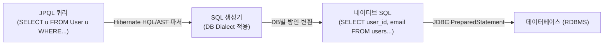

**JPQL(Java Persistence Query Language)**은 JPA 스펙에서 제공하는 **객체지향 쿼리 언어**이다.

일반적인 SQL이 데이터베이스의 **테이블(Table)과 컬럼(Column)**을 대상으로 질의한다면, JPQL은 JPA가 관리하는 **엔티티 객체(Entity)와 필드(Field)**를 대상으로 질의한다.

---

## 1. SQL vs JPQL 핵심 비교

| 비교 항목 | SQL | JPQL |
| :--- | :--- | :--- |
| **조회 대상** | DB 테이블 (`users`) | **JPA 엔티티 객체 (`User`)** |
| **속성 참조** | DB 컬럼명 (`user_email`) | **엔티티 필드명 (`u.email`)** |
| **별칭(Alias)** | 선택 사항 | **필수 (예: `SELECT u FROM User u`)** |
| **대소문자** | DB에 따라 비구분 | 엔티티 및 필드는 **자바 대소문자 엄격 구분** |
| **DB 종속성** | 특정 DB 방언(Dialect)에 종속됨 | **DB 방언에 독립적** (Hibernate가 대상 DB SQL로 자동 번역) |

---

## 2. JPQL 실행 흐름

작성된 JPQL은 JPA 구현체(Hibernate)에 의해 파싱된 후, 설정된 DB Dialect에 맞는 네이티브 SQL로 변환되어 실행된다.



---

## 3. 기본 문법 및 작성 방식

### A. 파라미터 바인딩 (이름 기준)
SQL 인젝션을 방지하고 쿼리 파싱 성능을 위해 반드시 이름 기반 파라미터 바인딩(`:paramName`)을 사용한다.

```java
String jpql = "SELECT u FROM User u WHERE u.email = :email AND u.status = :status";
List<User> users = em.createQuery(jpql, User.class)
    .setParameter("email", "test@example.com")
    .setParameter("status", Status.ACTIVE)
    .getResultList();
```

### B. 페이징 처리
DB 방언(MySQL `LIMIT/OFFSET`, Oracle `ROWNUM` 등)에 상관없이 표준화된 API로 페이징을 처리한다.

```java
List<User> pageUsers = em.createQuery("SELECT u FROM User u ORDER BY u.id DESC", User.class)
    .setFirstResult(10)  // 조회 시작 위치 (Offset, 0부터 시작)
    .setMaxResults(20)   // 조회할 데이터 수 (Limit)
    .getResultList();
```

---

## 4. Spring Data JPA에서의 JPQL 활용

Spring Data JPA([[spring-data-jpa-interface-mechanism|Spring Data JPA 인터페이스 동작 원리]])에서는 JPQL을 두 가지 방식으로 다룬다:

1. **메서드 이름을 통한 자동 JPQL 합성 (`PartTreeJpaQuery`)**:
   - `findByEmailAndStatus(email, status)` 선언 시 내부 [[abstract-syntax-tree|추상 구문 트리(AST)]]가 이를 해석하여 `SELECT u FROM User u WHERE u.email = :email AND u.status = :status` JPQL을 자동 조립한다.
2. **`@Query`를 통한 명시적 JPQL 작성**:
   - 복잡한 조인이나 DTO 조회가 필요한 경우 개발자가 직접 JPQL을 작성한다.
   ```java
   @Query("SELECT u FROM User u JOIN FETCH u.orders WHERE u.status = :status")
   List<User> findActiveUsersWithOrders(@Param("status") Status status);
   ```

---

## 관련 문서

- [[spring-data-jpa-interface-mechanism|Spring Data JPA 인터페이스 동작 원리]]
- [[abstract-syntax-tree|추상 구문 트리 (Abstract Syntax Tree, AST)]]
