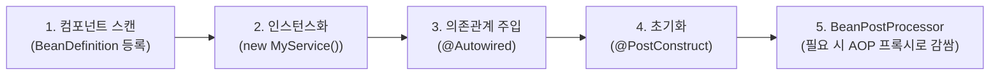
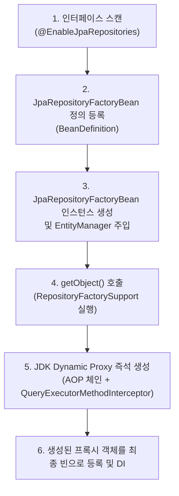

스프링 컨테이너(IoC)는 빈을 등록할 때 대상이 **구체 클래스**인지, 아니면 **Spring Data JPA 인터페이스**인지에 따라 전혀 다른 객체 생성 및 프록시 등록 메커니즘을 사용한다.

---

## 1. 일반 클래스 기반 스프링 빈 (`@Service`, `@Component`)

일반적인 스프링 빈은 컴파일된 구체 클래스 파일(`.class`)이 존재하므로, 표준 스프링 빈 라이프사이클을 따른다.

1. **인스턴스화**: 스프링이 클래스 생성자를 리플렉션으로 직접 호출(`new MyService()`)하여 원본 인스턴스를 먼저 생성한다.
2. **프록시 적용 (후처리)**: 만약 `@Transactional`이나 `@Aspect` 같은 AOP가 적용되어 있다면, 빈 초기화의 마지막 단계인 **`BeanPostProcessor`**(`AnnotationAwareAspectJAutoProxyCreator`)에서 원본 객체를 감싸는 프록시 객체(주로 CGLIB)를 생성하여 최종 빈으로 교체 등록한다.

---

## 2. Spring Data JPA 인터페이스 (`JpaRepository`)

리포지토리는 구현 클래스가 없는 **순수 인터페이스**이므로, 스프링이 생성자를 호출(`new`)하여 인스턴스화할 수 없다. 이를 해결하기 위해 스프링의 **`FactoryBean` 패턴**을 활용한다.

1. **팩토리 빈 등록**: `JpaRepositoriesRegistrar`가 리포지토리 인터페이스를 스캔하여, 인터페이스 대신 **`JpaRepositoryFactoryBean`**을 빈 정의(BeanDefinition)로 등록한다.
2. **프록시 객체 생성 위임 (`getObject()`)**: 스프링이 해당 리포지토리 빈을 컨테이너에서 가져올 때 `JpaRepositoryFactoryBean.getObject()`가 호출된다.
3. **처음부터 프록시 생성**: 팩토리 내부의 `RepositoryFactorySupport`가 `ProxyFactory`를 통해 **JDK Dynamic Proxy 객체를 처음부터 생성**하여 반환한다.
4. **빈 주입**: 이 프록시 인스턴스가 `UserRepository`라는 이름의 싱글톤 빈으로 컨테이너에 보관되고, 서비스 계층에 주입된다.

---

## 3. 핵심 차이점 비교

| 비교 항목 | 일반 클래스 빈 (`@Service`) | JPA 리포지토리 인터페이스 (`JpaRepository`) |
| :--- | :--- | :--- |
| **개발자가 작성하는 코드** | 구체 클래스 (`public class UserService`) | 순수 인터페이스 (`public interface UserRepository`) |
| **객체 생성 주체** | 스프링 컨테이너가 직접 클래스 생성자 호출 | **`JpaRepositoryFactoryBean`**이 생성 위임 |
| **프록시 생성 시점** | 순수 원본 객체 생성 후 **초기화 후처리(PostProcess)** 단계 | **`FactoryBean.getObject()` 호출 시 처음부터 프록시 생성** |
| **프록시 기술 기본값** | **CGLIB** (클래스 상속 프록시) | **[[jdk-dynamic-proxy|JDK Dynamic Proxy]]** (인터페이스 프록시) |
| **원본 객체 존재 여부** | 원본 타깃 인스턴스가 메모리에 존재함 | **개발자가 만든 원본 구현 클래스/객체가 아예 없음** |

---

## 4. AOP 어드바이스 조립 방식의 차이

- **일반 빈**: 원본 타깃 객체를 먼저 만들고, `BeanPostProcessor`가 타깃을 감싸는 별도의 프록시 레이어를 바깥에 씌운다.
- **리포지토리 빈**: `RepositoryFactorySupport`가 프록시를 생성할 때 **`TransactionInterceptor`**, **`PersistenceExceptionTranslationInterceptor`**, **`QueryExecutorMethodInterceptor`** 등을 하나의 프록시 체인(Advisor Chain)에 함께 조립한다.

---

## 관련 문서

- [[spring-data-jpa-interface-mechanism|Spring Data JPA 인터페이스 동작 원리]]
- [[jdk-dynamic-proxy|JDK Dynamic Proxy 동작 원리]]
- [[enable-jpa-repositories|@EnableJpaRepositories]]
