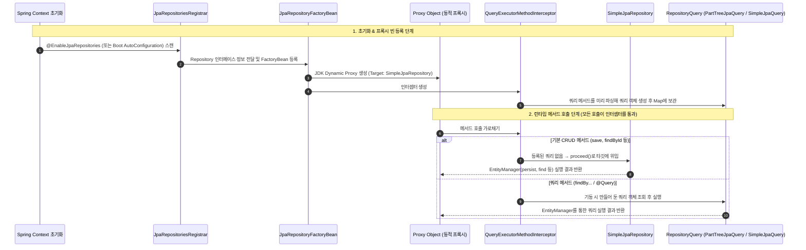

Spring Data JPA를 사용하는 경우, 개발자가 `JpaRepository<T, ID>` 인터페이스만 선언하고 구현 클래스를 별도로 작성하지 않아도 스프링이 런타임에 구현체를 동적으로 생성하고 메서드를 실행해 준다[^ref-core-concepts].

```java
public interface UserRepository extends JpaRepository<User, Long> {
    // 구현 클래스 없이 인터페이스와 메서드 선언만으로 동작
    List<User> findByUsername(String username);
}
```

위와 같이 `JpaRepository`를 상속하는 인터페이스를 선언만 해도 동작하는 이유는 [[jdk-dynamic-proxy|JDK Dynamic Proxy]], 공통 메서드 기본 구현체인 **`SimpleJpaRepository`**, 그리고 호출을 가로채 적절한 실행기로 분기하는 **`QueryExecutorMethodInterceptor`** 덕분이다.

---

## 핵심 3요소

1. **동적 프록시 ([[jdk-dynamic-proxy|JDK Dynamic Proxy]])** — `Java SE 표준 스펙 (JDK)`
   - **소속/스펙**: 자바 표준 리플렉션 API (`java.lang.reflect.Proxy`)
   - **프록시 생성**: 구현 클래스 파일(`.class`) 없이도, 런타임에 자바 리플렉션을 통해 인터페이스 규격을 구현한 프록시 객체 인스턴스를 동적으로 생성한다.
   - **스프링 빈 등록 순서**: 애플리케이션 기동 시 스프링이 인터페이스를 스캔 ➡️ `JpaRepositoryFactoryBean`이 동적 프록시 객체를 생성 ➡️ 생성된 프록시 객체를 스프링 IoC 컨테이너에 빈(Bean)으로 등록 ➡️ 서비스/컨트롤러에 주입하는 순서로 동작한다.
2. **표준 CRUD의 실제 실행자 (`SimpleJpaRepository`)** — `Spring Data JPA`
   - **소속/스펙**: Spring Data JPA 기본 구현체 (`org.springframework.data.jpa.repository.support`)
   - **필요성**: 프록시는 인터페이스 호출을 가로채는 대행자일 뿐이므로, `save()`, `findById()` 같은 표준 CRUD를 실제로 JPA `EntityManager`(`persist`, `find` 등)로 실행해 줄 진짜 구현 코드가 필요하다.
   - **역할**: Spring Data JPA가 미리 작성해 둔 기본 구현체로서, 프록시는 표준 CRUD 호출이 들어오면 내부에 보유한 `SimpleJpaRepository` 인스턴스로 실행을 그대로 위임(Delegation)한다.
3. **쿼리 파서 및 인터셉터 (`QueryExecutorMethodInterceptor` & `PartTreeJpaQuery`)** — `Spring Data Commons / JPA`
   - **소속/스펙**: Spring Data Commons (메서드 가로채기 및 라우팅) & Spring Data JPA (메서드명 JPQL 파싱)
   - **역할**: 개발자가 직접 정의한 `findByUsernameAndAge()` 같은 메서드는 **애플리케이션 기동 시점에** 미리 파싱되어 [[jpql|JPQL]] 쿼리 객체로 만들어진다. 런타임에는 인터셉터가 호출을 가로채 이미 만들어 둔 쿼리 객체를 찾아 `EntityManager`로 실행할 뿐이다.

---

## 전체 동작 흐름



---

## 단계별 상세 메커니즘

### 1. 빈 등록 및 프록시 생성 (Bootstrapping)

1. **인터페이스 스캔**: 
   - 스프링 부트 환경에서는 `JpaRepositoriesAutoConfiguration`이 `JpaRepositoriesRegistrar`를 Import하고, 이 레지스트라가 `@SpringBootApplication`이 선언된 메인 클래스 패키지 하위의 `Repository` 인터페이스들을 실제로 스캔한다. (스캔 패키지 경로를 직접 지정하는 등 수동 설정 시에는 [[enable-jpa-repositories|@EnableJpaRepositories]] 명시)
2. **팩토리 빈 등록**: 
   - 스캔된 각 리포지토리 인터페이스마다 `JpaRepositoryFactoryBean`이 등록된다.
3. **동적 프록시 인스턴스화**: 
   - `RepositoryFactorySupport.getRepository()`가 스프링의 `ProxyFactory`를 사용해 대상 인터페이스를 구현하는 **JDK Dynamic Proxy**(`java.lang.reflect.Proxy`) 인스턴스를 생성한다.
4. **의존성 주입**: 
   - 서비스나 컨트롤러 등 다른 스프링 빈에서 해당 리포지토리에 대해 [[spring-dependency-injection|의존성 주입(DI)]]을 받을 때, 스프링 컨테이너가 이 동적 프록시 객체를 주입한다.

### 2. 메서드 라우팅 및 실행 (Runtime Execution)

프록시 객체의 메서드 호출은 **모두** 어드바이스 체인의 **`QueryExecutorMethodInterceptor`**를 통과하며, 인터셉터가 메서드 유형에 따라 적절한 실행기로 분기한다.

#### A. 기본 CRUD 메서드 (공통 메서드)
- `JpaRepository` 및 상위 인터페이스(`CrudRepository` 등)[^ref-core-concepts]에 이미 정의된 메서드.
- 인터셉터에 등록된 쿼리가 없으므로 `proceed()`로 체인을 통과시켜, 내부 기본 타깃인 **`SimpleJpaRepository`**의 자바 구현 메서드로 위임(Delegation)한다.

| 분류 | 대표 메서드 | `SimpleJpaRepository` 내부 JPA 실행 메커니즘 |
| :--- | :--- | :--- |
| **저장/수정 (Save)** | `save()`, `saveAll()`, `saveAndFlush()` | 엔티티 신규 여부(`isNew()`)에 따라 `em.persist()` 또는 `em.merge()` 호출 |
| **단건 조회 (Find)** | `findById()`, `getReferenceById()` | `em.find()` (단건 조회) 또는 `em.getReference()` (지연 로딩 프록시 반환) |
| **다건/페이징 조회** | `findAll()`, `findAll(Pageable)` | `TypedQuery` 생성 및 Criteria/JPQL을 통한 페이징 및 정렬 처리 |
| **존재/집계 확인** | `existsById()`, `count()` | `SELECT COUNT(...)` 쿼리 실행 |
| **삭제 (Delete)** | `delete()`, `deleteById()`, `deleteAllInBatch()` | `em.remove()` (단건) 또는 벌크 `DELETE FROM` JPQL 쿼리 실행 |
| **상태 제어 (Flush)** | `flush()` | `em.flush()`를 호출하여 영속성 컨텍스트 쓰기 지연 SQL 즉시 전송 |

#### B. 쿼리 메서드 (Query Method)
- `findByEmailAndStatus(String email, Status status)` 같은 사용자 정의 메서드.
- **파싱은 매 호출이 아니라 애플리케이션 기동 시점에 한 번 일어난다.** `QueryExecutorMethodInterceptor`가 생성될 때 쿼리 메서드마다 쿼리 객체를 미리 만들어 `Method` 기준 Map에 담아 두고, 런타임에는 이 Map에서 조회해 실행만 한다.
- `PartTreeJpaQuery`가 메서드 이름을 토큰 단위로 파싱(`findBy` + `Email` + `And` + `Status`)하여 [[abstract-syntax-tree|추상 구문 트리(AST)]] 형태의 구문 구조(`PartTree`)를 구성한다[^ref-query-creation].
- 이를 바탕으로 [[jpql|JPQL]](`SELECT u FROM User u WHERE u.email = :email AND u.status = :status`)을 조합한 뒤, `EntityManager.createQuery()`로 실행한다.
- 파싱 시점이 기동 시점이므로, 엔티티에 없는 프로퍼티명으로 메서드를 선언하면 그 메서드를 호출할 때가 아니라 **애플리케이션 기동 자체가 실패**한다(`PropertyReferenceException`).

#### C. `@Query` 어노테이션 메서드
- 메서드에 `@Query`가 붙어 있으면 `QueryLookupStrategy`가 메서드명 파싱(`PartTreeJpaQuery`) 대신 이 경로를 선택한다.
- 어노테이션에 직접 작성된 [[jpql|JPQL]]은 `SimpleJpaQuery`가, `nativeQuery = true`로 지정한 네이티브 SQL은 `NativeJpaQuery`가 맡아 파싱과 파라미터 바인딩을 거쳐 실행한다.

---

## 핵심 클래스 및 역할

아래 클래스 이름과 소스 링크는 **Spring Boot 3.5.16 / Spring Data JPA · Commons 3.5.13** 기준이다. 링크는 해당 태그로 고정해 두었다.

| 클래스 / 인터페이스 | 소속 모듈 | 주요 역할 | 소스 코드 참조 |
| :--- | :--- | :--- | :--- |
| `JpaRepositoriesAutoConfiguration` | `spring-boot-autoconfigure` | 스프링 부트 구동 시 리포지토리 자동 구성을 활성화 | [GitHub](https://github.com/spring-projects/spring-boot/blob/v3.5.16/spring-boot-project/spring-boot-autoconfigure/src/main/java/org/springframework/boot/autoconfigure/data/jpa/JpaRepositoriesAutoConfiguration.java) |
| `JpaRepositoriesRegistrar` | `spring-boot-autoconfigure` | 자동 구성이 Import하여 실제 인터페이스 스캔과 빈 정의 등록을 수행 | [GitHub](https://github.com/spring-projects/spring-boot/blob/v3.5.16/spring-boot-project/spring-boot-autoconfigure/src/main/java/org/springframework/boot/autoconfigure/data/jpa/JpaRepositoriesRegistrar.java) |
| `JpaRepositoryFactoryBean` | `spring-data-jpa` | JPA 리포지토리 인터페이스에 대응하는 팩토리 빈 | [GitHub](https://github.com/spring-projects/spring-data-jpa/blob/3.5.13/spring-data-jpa/src/main/java/org/springframework/data/jpa/repository/support/JpaRepositoryFactoryBean.java) |
| `RepositoryFactorySupport` | `spring-data-commons` | `ProxyFactory`를 사용해 동적 프록시 객체 생성 및 빈 조립 | [GitHub](https://github.com/spring-projects/spring-data-commons/blob/3.5.13/src/main/java/org/springframework/data/repository/core/support/RepositoryFactorySupport.java) |
| `SimpleJpaRepository` | `spring-data-jpa` | 기본 CRUD 메서드의 실제 JPA 구현체 (`EntityManager` 보유) | [GitHub](https://github.com/spring-projects/spring-data-jpa/blob/3.5.13/spring-data-jpa/src/main/java/org/springframework/data/jpa/repository/support/SimpleJpaRepository.java) |
| `QueryExecutorMethodInterceptor` | `spring-data-commons` | 기동 시 쿼리 객체를 미리 만들어 두고, 런타임에 기본 메서드와 쿼리 메서드 호출을 분기하는 AOP 인터셉터 | [GitHub](https://github.com/spring-projects/spring-data-commons/blob/3.5.13/src/main/java/org/springframework/data/repository/core/support/QueryExecutorMethodInterceptor.java) |
| `PartTreeJpaQuery` | `spring-data-jpa` | 메서드 이름 규칙을 분석해 JPQL 쿼리 객체를 생성 및 실행 | [GitHub](https://github.com/spring-projects/spring-data-jpa/blob/3.5.13/spring-data-jpa/src/main/java/org/springframework/data/jpa/repository/query/PartTreeJpaQuery.java) |
| `SimpleJpaQuery` | `spring-data-jpa` | `@Query`에 선언된 JPQL을 파싱해 쿼리 객체를 생성 및 실행 | [GitHub](https://github.com/spring-projects/spring-data-jpa/blob/3.5.13/spring-data-jpa/src/main/java/org/springframework/data/jpa/repository/query/SimpleJpaQuery.java) |

> Spring Boot 4.0부터 부트 쪽 두 클래스는 `DataJpaRepositoriesAutoConfiguration` / `DataJpaRepositoriesRegistrar`로 이름이 바뀌고 패키지도 `org.springframework.boot.data.jpa.autoconfigure`로 옮겨졌다.

---

## 각주 및 출처 (References)

[^ref-core-concepts]: [Spring Data JPA Reference Documentation - Core concepts](https://docs.spring.io/spring-data/jpa/reference/repositories/core-concepts.html)
[^ref-query-creation]: [Spring Data JPA Reference Documentation - Query Creation](https://docs.spring.io/spring-data/jpa/reference/jpa/query-methods.html#jpa.query-methods.query-creation)
