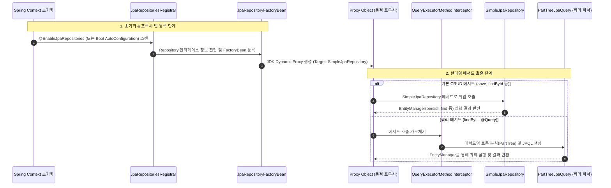

개발자가 `JpaRepository<T, ID>` 인터페이스만 선언하고 구현 클래스를 작성하지 않아도, 스프링이 런타임에 구현체를 동적으로 생성하고 메서드를 실행해 준다[^ref-core-concepts].

이 동작의 실체는 **JDK Dynamic Proxy**[^ref-jdk-proxy], 공통 메서드 기본 구현체인 **`SimpleJpaRepository`**[^ref-simple-jpa-repo], 그리고 메서드 이름을 파싱하는 **`QueryExecutorMethodInterceptor`**[^ref-method-interceptor]다.

---

## 핵심 3요소

1. **동적 프록시 (JDK Dynamic Proxy)**[^ref-jdk-proxy]
   - 자바 리플렉션(`java.lang.reflect.Proxy`)을 활용해 애플리케이션 기동 시점에 해당 인터페이스를 구현한 프록시 객체를 메모리상에 생성하고 스프링 빈(Bean)으로 등록한다[^ref-repo-factory].
2. **기본 CRUD 구현체 (`SimpleJpaRepository`)**[^ref-simple-jpa-repo]
   - `save()`, `findById()`, `findAll()` 같은 공통 메서드는 Spring Data JPA에 미리 구현된 `SimpleJpaRepository`로 호출을 위임(Delegation)한다.
3. **쿼리 파서 및 인터셉터 (`QueryExecutorMethodInterceptor` & `PartTreeJpaQuery`)**[^ref-method-interceptor][^ref-part-tree]
   - 개발자가 직접 정의한 `findByUsernameAndAge()` 같은 메서드는 호출을 가로채 메서드 이름을 구문 분석(Parsing)하고 JPQL을 자동 생성하여 `EntityManager`로 실행한다.

---

## 전체 동작 흐름

---

## 단계별 상세 메커니즘

### 1. 빈 등록 및 프록시 생성 (Bootstrapping)

1. **인터페이스 스캔**: 
   - 스프링 부트 환경에서는 `JpaRepositoriesAutoConfiguration`[^ref-boot-autoconfig]에 의해 `@SpringBootApplication`이 선언된 메인 클래스 패키지 하위의 `Repository` 인터페이스들을 자동 스캔한다. (수동 설정 시 [[enable-jpa-repositories|@EnableJpaRepositories]] 사용)
2. **팩토리 빈 등록**: 
   - 스캔된 각 리포지토리 인터페이스마다 `JpaRepositoryFactoryBean`[^ref-factory-bean]이 등록된다.
3. **동적 프록시 인스턴스화**: 
   - `RepositoryFactorySupport.getRepository()`[^ref-repo-factory]가 스프링의 `ProxyFactory`를 사용해 대상 인터페이스를 구현하는 **JDK Dynamic Proxy**(`java.lang.reflect.Proxy`)[^ref-jdk-proxy] 인스턴스를 생성한다.
4. **의존성 주입**: 
   - 서비스나 컨트롤러에서 `@Autowired` 또는 생성자 주입을 받을 때 이 동적 프록시 객체가 주입된다.

### 2. 메서드 라우팅 및 실행 (Runtime Execution)

프록시 객체의 메서드가 호출되면 등록된 **`QueryExecutorMethodInterceptor`**[^ref-method-interceptor]가 호출을 가로채서 메서드 유형에 따라 적절한 실행기로 분기한다.

#### A. 기본 CRUD 메서드
- `save()`, `delete()`, `findById()` 등 `JpaRepository` 기본 인터페이스에 정의된 메서드.
- 내부 기본 구현 타깃인 **`SimpleJpaRepository`**[^ref-simple-jpa-repo]의 메서드로 호출을 직접 위임한다.
- `SimpleJpaRepository`는 주입받은 `EntityManager`의 `persist()`, `merge()`, `find()`, `remove()` 등을 호출하여 DB 작업을 수행한다.

#### B. 쿼리 메서드 (Query Method)
- `findByEmailAndStatus(String email, Status status)` 같은 사용자 정의 메서드.
- `PartTreeJpaQuery`[^ref-part-tree]가 메서드 이름을 토큰 단위로 파싱(`findBy` + `Email` + `And` + `Status`)하여 AST(추상 구문 트리)를 구성한다[^ref-query-creation].
- 이를 바탕으로 JPQL(`SELECT u FROM User u WHERE u.email = :email AND u.status = :status`)을 조합한 뒤, `EntityManager.createQuery()`로 실행한다.

#### C. `@Query` 어노테이션 메서드
- 어노테이션에 직접 작성된 JPQL 또는 네이티브 SQL 문자열을 파싱하고 파라미터를 바인딩하여 실행한다.

---

## 핵심 클래스 및 역할

| 클래스 / 인터페이스 | 소속 모듈 | 주요 역할 | 소스 코드 참조 |
| :--- | :--- | :--- | :--- |
| `JpaRepositoriesAutoConfiguration` | `spring-boot-autoconfigure` | 스프링 부트 구동 시 리포지토리 자동 스캔 및 구성 | [GitHub][^ref-boot-autoconfig] |
| `JpaRepositoryFactoryBean` | `spring-data-jpa` | JPA 리포지토리 인터페이스에 대응하는 팩토리 빈 | [GitHub][^ref-factory-bean] |
| `RepositoryFactorySupport` | `spring-data-commons` | `ProxyFactory`를 사용해 동적 프록시 객체 생성 및 빈 조립 | [GitHub][^ref-repo-factory] |
| `SimpleJpaRepository` | `spring-data-jpa` | 기본 CRUD 메서드의 실제 JPA 구현체 (`EntityManager` 보유) | [GitHub][^ref-simple-jpa-repo] |
| `QueryExecutorMethodInterceptor` | `spring-data-commons` | 기본 메서드와 쿼리 메서드 호출을 분기하는 AOP 인터셉터 | [GitHub][^ref-method-interceptor] |
| `PartTreeJpaQuery` | `spring-data-jpa` | 메서드 이름 규칙을 분석해 JPQL 쿼리 객체를 생성 및 실행 | [GitHub][^ref-part-tree] |

---

## 왜 CGLIB가 아닌 JDK Dynamic Proxy인가?

- **CGLIB**는 대상 클래스를 상속(Subclassing)하여 바이트코드를 조작해 프록시를 생성한다.
- 반면 `JpaRepository`는 클래스가 아닌 **순수 인터페이스(Interface)** 로 선언되므로, 자바 표준 스펙인 `java.lang.reflect.Proxy` (JDK Dynamic Proxy)[^ref-jdk-proxy]를 사용하는 것이 가장 표준적이고 자연스럽다.

---

## 관련 문서

- [[enable-jpa-repositories|@EnableJpaRepositories]]

---

## 각주 및 출처 (References)

[^ref-core-concepts]: [Spring Data JPA Reference Documentation - 5. Core concepts](https://docs.spring.io/spring-data/jpa/reference/repositories/core-concepts.html)
[^ref-query-creation]: [Spring Data JPA Reference Documentation - 6.3.2. Query Creation](https://docs.spring.io/spring-data/jpa/reference/jpa/query-methods.html#jpa.query-methods.query-creation)
[^ref-jdk-proxy]: [Oracle Java SE 17 API Docs - java.lang.reflect.Proxy](https://docs.oracle.com/en/java/javase/17/docs/api/java.base/java/lang/reflect/Proxy.html)
[^ref-boot-autoconfig]: [Spring Boot GitHub - JpaRepositoriesAutoConfiguration.java](https://github.com/spring-projects/spring-boot/blob/main/spring-boot-project/spring-boot-autoconfigure/src/main/java/org/springframework/boot/autoconfigure/data/jpa/JpaRepositoriesAutoConfiguration.java)
[^ref-factory-bean]: [Spring Data JPA GitHub - JpaRepositoryFactoryBean.java](https://github.com/spring-projects/spring-data-jpa/blob/main/spring-data-jpa/src/main/java/org/springframework/data/jpa/repository/support/JpaRepositoryFactoryBean.java)
[^ref-repo-factory]: [Spring Data Commons GitHub - RepositoryFactorySupport.java (`getRepository` / `ProxyFactory`)](https://github.com/spring-projects/spring-data-commons/blob/main/src/main/java/org/springframework/data/repository/core/support/RepositoryFactorySupport.java)
[^ref-simple-jpa-repo]: [Spring Data JPA GitHub - SimpleJpaRepository.java](https://github.com/spring-projects/spring-data-jpa/blob/main/spring-data-jpa/src/main/java/org/springframework/data/jpa/repository/support/SimpleJpaRepository.java)
[^ref-method-interceptor]: [Spring Data Commons GitHub - QueryExecutorMethodInterceptor.java](https://github.com/spring-projects/spring-data-commons/blob/main/src/main/java/org/springframework/data/repository/core/support/QueryExecutorMethodInterceptor.java)
[^ref-part-tree]: [Spring Data JPA GitHub - PartTreeJpaQuery.java](https://github.com/spring-projects/spring-data-jpa/blob/main/spring-data-jpa/src/main/java/org/springframework/data/jpa/repository/query/PartTreeJpaQuery.java)
