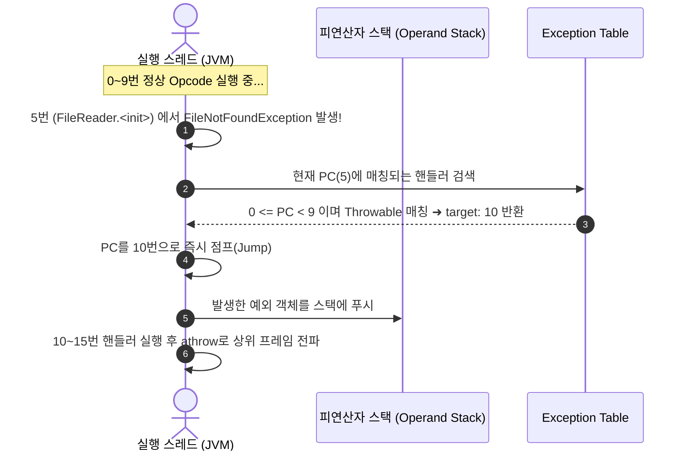

자바 소스 코드에서 예외 처리는 `try`, `catch`, `finally`, `throws` 같은 명시적인 문법 키워드로 이루어진다. 그러나 이를 컴파일하여 생성된 **JVM 바이트코드(`.class`)에는 `try`나 `catch`에 해당하는 Opcode(명령어)가 전혀 존재하지 않는다.**

대신 JVM은 메서드 메타데이터에 포함된 **예외 테이블(Exception Table)**과 **`athrow`** 명령어를 조합하여 예외 분기 흐름을 제어한다.

---

## 1. 컴파일러(javac) vs JVM의 예외 처리 관점 차이

| 구분 | 컴파일러 (`javac`) | JVM 런타임 (바이트코드 실행기) |
| :--- | :--- | :--- |
| **관심사** | 문법적 유효성, 타입 안전성 | 명령어의 순차적 실행 및 스택 조작 |
| **체크 예외 검사** | **엄격하게 강제** (`try-catch` 또는 `throws` 누락 시 컴파일 에러) | **구분 없음** (모든 `Throwable`을 동일하게 처리) |
| **제어 메커니즘** | AST(추상 구문 트리) 구문 분석 | **Exception Table** 및 **`athrow`** 명령어 |

> [!NOTE]
> JVM 런타임 입장에서는 체크 예외(Checked)와 언체크 예외(Unchecked)의 구분이 없다. 오직 자바 컴파일러(`javac`)가 소스 코드를 바이트코드로 번역할 때만 정적 규칙으로 검사할 뿐이다.

---

## 2. 예외 테이블 (Exception Table)의 구조

컴파일러는 `try-catch` 블록을 만나면, 정상 실행 바이트코드와 예외 처리 바이트코드를 분리하여 배치하고 메서드의 `Code` 속성에 아래와 같은 4가지 필드로 구성된 **예외 테이블**을 생성한다.

```text
Exception table:
   from    to  target type
      0     9    10   Class java/lang/Throwable
```

* **`from` (시작 오프셋)**: `try` 블록이 시작되는 바이트코드의 Program Counter(PC) 인덱스 (포함).
* **`to` (종료 오프셋)**: `try` 블록이 끝나는 바이트코드의 PC 인덱스 (미포함).
* **`target` (핸들러 오프셋)**: `from` ~ `to` 범위 내에서 예외가 발생했을 때 **점프(Jump)할 `catch` 블록의 바이트코드 시작 위치**.
* **`type` (처리할 예외 타입)**: 잡고자 하는 예외 클래스의 심볼릭 레퍼런스 (예: `java/lang/Throwable`, `java/io/IOException`).
  * `type`이 비어있거나 `0`인 경우: `finally` 블록처럼 모든 예외(Any)에 대해 점프함을 의미.

---

## 3. 바이트코드 디스어셈블 분석 (`javap -c -v`)

아래 자바 코드가 컴파일된 바이트코드를 분해해 보면 실제 동작 방식을 명확히 볼 수 있다.

### 자바 소스코드
```java
public void readFile(String path) {
    try {
        FileReader reader = new FileReader(path);
    } catch (Throwable t) {
        throw Lombok.sneakyThrow(t);
    }
}
```

### 디스어셈블된 바이트코드
```bytecode
public void readFile(java.lang.String);
  Code:
   // ── [1. 정상 실행 영역 (Try 블록)] ──
   0: new           #2    // class java/io/FileReader 객체 할당
   3: dup
   4: aload_1             // 파라미터(path) 로드
   5: invokespecial #3    // FileReader.<init> 생성자 호출
   8: astore_2
   9: return              // 정상 실행 완료 시 메서드 리턴

   // ── [2. 예외 핸들러 영역 (Catch 블록)] ──
  10: astore_2            // 스택 최상단에 있는 예외 객체를 로컬 변수에 저장
  11: aload_2             // 예외 객체를 피연산자 스택에 푸시
  12: invokestatic  #4    // Method Lombok.sneakyThrow:(Throwable)RuntimeException
  15: athrow              // JVM 예외 투척 명령어

  // ── [3. 예외 테이블 (Exception Table)] ──
  Exception table:
     from    to  target type
        0     9    10   Class java/lang/Throwable
```

---

## 4. 예외 발생 시 JVM의 실행 흐름



1. **정상 흐름**: `0`번부터 `9`번까지 차례대로 실행된 후 `9: return`을 만나 안전하게 종료된다. (10번 이후 코드는 실행되지 않음)
2. **비정상 흐름**: `0`~`9`번 사이에서 예외가 발생하면 JVM은 현재 실행 스택을 멈추고 **Exception Table**을 위에서부터 아래로 선형 탐색(Linear Search)한다.
3. **핸들러 매칭**: 현재 발생한 예외 객체가 `type`의 인스턴스인지(`instanceof`) 확인하고, 매칭되면 `target`인 `10`번으로 PC를 이동시킨 뒤 스택 최상단에 예외 객체를 올려둔다.
4. **`athrow` 실행**: 15번의 `athrow` 명령어를 만나면 현재 스택 프레임(Stack Frame)을 팝(Pop)하고 호출자(Caller) 메서드로 예외를 전파한다.

---

## 5. `athrow` 명령어의 동작 특성

* **피연산자 스택(Operand Stack)**의 최상단에서 `Throwable` 객체의 레퍼런스를 팝하여 예외를 발생시킨다.
* 객체가 `null`인 경우 `NullPointerException`을 대신 던진다.
* JVM은 이 명령어를 만났을 때 해당 메서드 내에 추가적인 핸들러가 없으면 즉시 현재 프레임을 종료하고 콜 스택을 거슬러 올라가며 상위 프레임의 Exception Table을 탐색한다.

---

## 관련 문서

- [[java-exception-hierarchy-and-mechanism|자바 예외 처리 메커니즘과 Throwable 계층 구조]]
- [[abstract-syntax-tree|추상 구문 트리 (AST)]]
- [[deep-dive-into-lombok-sneaky-throws|Lombok @SneakyThrows의 원리: AST 조작부터 제네릭 타입 소거 트릭까지]]
