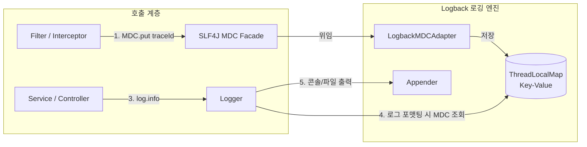

# Mapped Diagnostic Context (MDC)

**MDC(Mapped Diagnostic Context)**는 SLF4J, Logback, Log4j2 등 자바 로깅 프레임워크에서 제공하는 기능으로, **현재 요청을 처리 중인 스레드에 키-값(Key-Value) 형태의 컨텍스트 정보를 보관해 두고, 로그를 출력할 때마다 자동으로 해당 정보를 주입해 주는 메커니즘**이다.

1997년 닐 해리슨(Neil Harrison)의 논문에서 제안된 NDC(Nested Diagnostic Context)를 확장하여, Log4j와 Logback의 창시자인 세키 궬쥐(Ceki Gülcü)에 의해 완성되었다.

---

## 1. 왜 필요한가? (동시성 로깅의 한계)

수많은 사용자가 동시에 API를 호출하는 웹 서버 환경에서는 여러 스레드가 하나의 로그 파일에 순서 없이 로그를 교차 기록한다.

```log
// MDC가 없을 때: 어떤 로그가 누구의 요청인지 추적 불가능
17:00:01.100 [http-nio-1] INFO  OrderService - 주문 생성 시작
17:00:01.105 [http-nio-2] INFO  OrderService - 주문 생성 시작
17:00:01.120 [http-nio-1] ERROR PaymentService - 결제 승인 실패!
```

MDC에 요청별 고유 식별자(`traceId`)를 넣어두면, 개발자가 로그 메서드에 파라미터를 일일이 전달하지 않아도 모든 로그에 자동으로 식별자가 출력된다.

```log
// MDC 적용 후: grep "trace-aaa"로 단일 요청의 전체 흐름 즉시 추출 가능
17:00:01.100 [http-nio-1] [trace-aaa] INFO  OrderService - 주문 생성 시작 (상품: 맥북)
17:00:01.105 [http-nio-2] [trace-bbb] INFO  OrderService - 주문 생성 시작 (상품: 모니터)
17:00:01.120 [http-nio-1] [trace-aaa] ERROR PaymentService - 결제 승인 실패!
```

---

## 2. 내부 구조 및 동작 원리

MDC는 내부적으로 **[[threadlocal|ThreadLocal]]**을 기반으로 동작한다.



1. 클라이언트 요청 인입 시 필터에서 `MDC.put("traceId", UUID.randomUUID().toString())`를 호출한다.
2. SLF4J는 현재 바인딩된 로깅 구현체(Logback)의 `LogbackMDCAdapter`에 위임하여 **현재 스레드의 `ThreadLocal` 맵에 값을 저장**한다.
3. 비즈니스 로직 어디서든 `log.info("...")`를 실행하면, Logback의 `PatternLayout`이 현재 스레드의 MDC 맵에서 키를 조회하여 패턴에 맞게 치환한다.
4. 요청 완료 시 `MDC.clear()`를 호출하여 스레드를 정리한다.

### 2.1 정적 파사드(Static Facade)와 스레드 격리의 조화
많은 개발자가 *"MDC가 static이면 모든 스레드가 같은 값을 공유해서 엉키지 않는가?"*라는 의문을 품는다.
* **호출 인터페이스는 `static`**: Controller, Service, Repository, 예외 핸들러 어디서든 메서드 인자(파라미터)를 더럽히지 않고 `MDC.get()` 한 줄로 호출할 수 있다.
* **실제 저장소는 `ThreadLocal`**: 호출은 static이지만, JVM이 현재 실행 중인 스레드의 식별자를 기반으로 독립된 맵을 열어주기 때문에 수백 개의 동시 요청이 발생해도 스레드 간 데이터가 절대 섞이지 않는다.

---

## 3. Spring Boot 실무 구현 패턴

### 서블릿 필터 설정 (등록 및 해제)
```java
@Component
@Order(Ordered.HIGHEST_PRECEDENCE)
public class MdcLoggingFilter extends OncePerRequestFilter {
    @Override
    protected void doFilterInternal(HttpServletRequest req, HttpServletResponse res, FilterChain chain) 
            throws ServletException, IOException {
        String traceId = req.getHeader("X-Request-Id");
        if (traceId == null || traceId.isBlank()) {
            traceId = UUID.randomUUID().toString();
        }

        MDC.put("requestId", traceId);
        res.setHeader("X-Request-Id", traceId); // 응답 헤더에도 동일 값 반환

        try {
            chain.doFilter(req, res);
        } finally {
            MDC.remove("requestId"); // 스레드 풀 오염 방지 필수!
        }
    }
}
```

### 3.1 오류 응답(ErrorResponse) 및 클라이언트 단일 추적성 결합
MDC는 단순히 로그 파일에 글자를 찍는 용도에 그치지 않고, **클라이언트의 에러 응답 본문(`requestId`)과 직접 결합**될 때 강력한 관측성(Observability)을 발휘한다:

```java
@ExceptionHandler(Exception.class)
public ResponseEntity<ErrorResponse> handleException(Exception e) {
    // MDC에서 현재 요청의 requestId를 조회하여 에러 본문에 주입
    String requestId = MDC.get("requestId");
    return ResponseEntity.status(HttpStatus.BAD_REQUEST)
            .body(new ErrorResponse("INVALID_INPUT_VALUE", e.getMessage(), requestId));
}
```
* 클라이언트는 에러 화면에 `requestId: 4c848ddd...`를 노출한다.
* 고객 문의 접수 시 운영자는 로그 시스템(Kibana, CloudWatch 등)에서 해당 `requestId` 하나로 즉시 해당 요청의 전체 호출 스택과 장애 원인을 단번에 추출할 수 있다.

### 3.2 구조화 완료 로깅 (Structured Completion Logging)
단순히 `requestId`를 찍는 것을 넘어, 서블릿 필터에서 요청 처리가 끝나는 시점에 **처리 결과와 소요 시간(`duration`)을 단 한 줄의 구조화된 포맷으로 기록**하면 APM 없이도 강력한 성능 관측성을 확보할 수 있다.

```java
long start = System.currentTimeMillis();
try {
    chain.doFilter(req, res);
} finally {
    long duration = System.currentTimeMillis() - start;
    // 화이트리스트 메타데이터만 기록 (Body 및 인증 토큰 배제)
    log.info("HTTP {} {} status={} duration={}ms", 
            request.getMethod(), request.getRequestURI(), response.getStatus(), duration);
    MDC.remove("requestId");
}
```
* **로그 출력 예시**:
  ```text
  2026-09-10 22:20:30.329 [http-nio-8080-exec-1] INFO  RequestIdFilter [requestId=client-trace-777] - HTTP GET /users/1/todos status=200 duration=30ms
  ```
* **보안 안전장치**: 요청 본문(Body)이나 `Authorization` 헤더는 로깅 파라미터에서 원천 배제하여 민감정보 유출을 차단한다. (상세: [[application-security-logging-and-actuator-hardening]]).
* **검증 기법**: [[spring-boot-test-output-capture|`OutputCaptureExtension`]]을 통해 콘솔 로그의 포맷 및 `requestId`가 정상 출력되는지 회귀 테스트를 작성할 수 있다.

### Logback 패턴 설정 (`logback-spring.xml`)
패턴 내에 `%X{키이름}` 형식으로 지정한다.
```xml
<property name="LOG_PATTERN" 
          value="%d{yyyy-MM-dd HH:mm:ss.SSS} [%thread] [%X{traceId:-SYSTEM}] %-5level %logger{36} - %msg%n" />
```

---

## 4. 실무 주의사항 및 한계

1. **[[thread-pool|스레드 풀(Thread Pool)]] 오염 위험**:
   - 톰캣은 스레드를 재사용하므로, `finally { MDC.clear(); }`를 누락하면 이전 사용자의 `traceId`나 사용자 정보가 다음 사용자 로그에 그대로 찍히는 치명적인 데이터 오염이 발생한다.
2. **비동기 스레드(`@Async`) 전달 단절**:
   - `ThreadLocal` 기반이므로 새로운 스레드가 생성되면 부모 스레드의 MDC가 자동으로 상속되지 않는다. Spring의 `TaskDecorator`를 등록하여 `MDC.getCopyOfContextMap()`을 직접 복사해 주어야 한다.
3. **리액티브(Spring WebFlux) 미지원**:
   - 단일 스레드가 여러 요청을 번갈아 처리하는 논블로킹 환경에서는 `ThreadLocal`이 완전히 깨지므로 Reactor Context를 사용해야 한다.

---

## 5. 현대적 진화: Micrometer Tracing

Spring Boot 3부터는 개발자가 직접 Filter를 만들고 `MDC.put() / clear()`를 관리하는 대신, **[[distributed-tracing-context-propagation|Micrometer Tracing]]** 라이브러리를 채택하는 것이 표준이다. 
* 프레임워크가 W3C Trace Context 표준 규격을 기반으로 `traceId` 생성, 비동기 스레드 전파, 네트워크 HTTP 헤더 전파, 그리고 MDC 자동 주입 및 정리를 모두 대행해 준다.

---

## 관련 문서
* [[threadlocal]]
* [[servlet-filter-chain]]
* [[static-vs-singleton]]
* [[jvm-memory-model-stack-vs-heap]]
* [[thread-pool]]
* [[thread-per-request-model]]
* [[distributed-tracing-context-propagation]]
* [[centralized-logging-architecture]]
* [[application-security-logging-and-actuator-hardening]]
* [[google-sre-four-golden-signals]]
* [[spring-boot-test-output-capture]]
