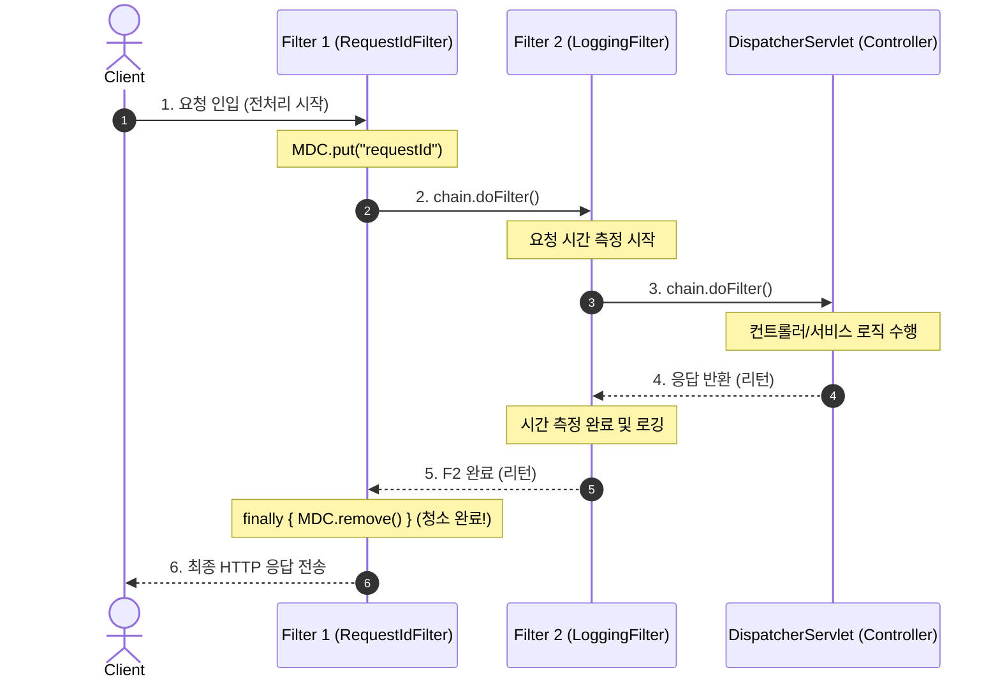

# 서블릿 필터 체인의 동작 원리와 중첩 라이프사이클

서블릿 필터(Servlet Filter)는 클라이언트의 요청이 서블릿(`DispatcherServlet`)에 도달하기 전과 후에 공통 기능(인증, 로깅, 인코딩 등)을 수행하는 서블릿 명세의 핵심 컴포넌트이다.

많은 개발자가 필터 체인이 등록된 필터들을 `for` 루프로 차례대로 실행할 것이라 생각하지만, 실제 서블릿 컨테이너(Tomcat)는 **재귀적 연쇄 호출(Chain of Responsibility)** 방식을 채택하고 있다.

---

## 1. 왜 `for` 루프가 아닐까?

만약 컨테이너가 필터 목록을 단순 `for` 루프로 순회한다면:

```java
// ❌ 만약 단순 for 루프로 동작한다면?
for (Filter filter : filters) {
    filter.doFilter(request, response, chain);
}
servlet.service(request, response); // 컨트롤러 실행
```

다음과 같은 치명적인 한계가 발생한다:
1. **전처리/후처리 감싸기(Wrapping) 불가**: 1번 필터가 끝나야 2번 필터로 넘어가므로, 컨트롤러 실행을 앞뒤로 감싸서 실행 시간을 측정하거나 MDC를 유지하는 것이 불가능하다.
2. **중간 차단(Short-circuit) 제어 불가**: 인증 실패 시 컨트롤러 호출을 막고 즉시 401 응답을 내려야 하지만, 루프가 강제로 다음 필터들을 계속 실행하게 된다.

---

## 2. 톰캣의 실제 구현: `ApplicationFilterChain`

톰캣의 실제 내부 코드(`ApplicationFilterChain.java`)를 열어보면 `for`문이 전혀 없으며, **현재 순번 포인터(`pos`)와 단일 `if`문**으로만 이루어져 있다:

```java
public final class ApplicationFilterChain implements FilterChain {
    private Filter[] filters; // 등록된 필터 배열
    private int pos = 0;      // 현재 실행 중인 필터 번호표
    private Servlet servlet;  // 최종 종착지 (DispatcherServlet)

    @Override
    public void doFilter(ServletRequest req, ServletResponse res) {
        // 🚨 for 루프 없이 if문으로 1개씩만 진행
        if (pos < filters.length) {
            Filter filter = filters[pos++]; // 번호표 +1
            
            // 필터에게 실행 권한을 넘기면서 자기 자신(this = chain)을 함께 전달!
            filter.doFilter(req, res, this); 
            return;
        }

        // 모든 필터가 온전히 통과했을 때만 마지막에 서블릿 실행
        servlet.service(req, res);
    }
}
```

필터가 자기 코드 중간에서 **`chain.doFilter(req, res)`를 직접 호출해야만 다음 필터로 배턴이 넘어가는 도미노 방식**이다.

---

## 3. 중첩(Nested) 실행과 거울 대칭 라이프사이클

이 도미노 구조 덕분에 필터들은 러시아 인형(마트료시카)처럼 서로를 감싸는 **'양파 구조(Onion Structure)'**로 동작한다.



### 전처리와 후처리의 완벽한 역순 관계 (LIFO)
* **시작(전처리) 순서**: `1번 필터 ➔ 2번 필터 ➔ 3번 필터 ➔ 컨트롤러`
* **완료(후처리) 순서**: `컨트롤러 ➔ 3번 필터 ➔ 2번 필터 ➔ 1번 필터`

가장 먼저 시작한 1번 필터(`RequestIdFilter`)는 다른 모든 필터와 서블릿 작업이 완전히 끝나고 클라이언트로 패킷이 나가기 직전인 **맨 마지막 순간에 `finally` 블록을 실행**하므로, 전체 요청 수명 동안 안전하게 식별자를 보장할 수 있다.

---

## 4. `OncePerRequestFilter`와 템플릿 메서드 패턴

스프링의 `OncePerRequestFilter`는 서블릿 표준 `Filter`의 중복 실행 문제를 해결하기 위한 추상 클래스이다:

* 서블릿 포워딩(`forward`), 인클루드(`include`), 비동기 디스패치(`ASYNC`) 환경에서는 1회의 HTTP 요청 안에서 동일한 필터가 2~3회 재실행되는 문제가 발생한다.
* `OncePerRequestFilter`의 부모 클래스가 `doFilter`를 `final`로 구현하여 **"이미 실행된 요청인가?"**를 요청 속성(`request.getAttribute`)으로 검사한다.
* 개발자는 중복 방지 걱정 없이 비즈니스 로직만 **`doFilterInternal`**에 오버라이딩하여 구현하면 된다(템플릿 메서드 패턴).

---

## 관련 문서
* [[mapped-diagnostic-context]]
* [[threadlocal]]
* [[jvm-memory-model-stack-vs-heap]]
