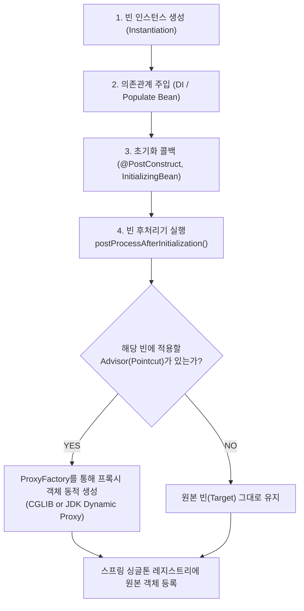

스프링 프레임워크에서 AOP 부가기능(트랜잭션 `@Transactional`, 캐싱 `@Cacheable`, 비동기 `@Async` 등)을 적용할 때 사용하는 **프록시(Proxy) 객체는 빈 생명주기(Bean Lifecycle) 중 '빈 후처리기(BeanPostProcessor)' 단계에서 판단되고 동적으로 생성**된다.

원본 빈(Target) 대신 프록시 객체가 스프링 컨테이너(ApplicationContext)의 싱글톤 레지스트리에 등록되는 구체적인 내부 메커니즘을 분석한다.

---

## 1. 프록시 생성 생명주기 (Bean Lifecycle)

스프링 컨테이너가 빈을 생성할 때, 원본 객체가 프록시 객체로 교체되는 전체 흐름은 다음과 같다.



> [!NOTE]
> 일반적인 빈 생명주기에서는 **초기화 메서드가 완전히 끝난 직후(`postProcessAfterInitialization`)**에 프록시가 생성된다. 단, 다른 빈과의 **순환 참조(Circular Reference)**가 발생하는 예외적인 경우에는 의존관계 주입 시점에 `getEarlyBeanReference()`를 통해 조기 프록시가 생성된다.

---

## 2. 핵심 구현체: `AbstractAutoProxyCreator`

스프링 AOP 자동 프록시 생성의 중추적인 역할을 담당하는 추상 클래스는 `org.springframework.aop.framework.autoproxy.AbstractAutoProxyCreator`이다. (실제 스프링 부트에서는 이를 상속한 `AnnotationAwareAspectJAutoProxyCreator` 등이 빈으로 등록되어 동작한다.)

### ① 빈 후처리 진입 (`postProcessAfterInitialization`)

```java
// AbstractAutoProxyCreator.java (스프링 소스코드 발췌 및 정제)
@Override
public Object postProcessAfterInitialization(@Nullable Object bean, String beanName) {
    if (bean != null) {
        Object cacheKey = getCacheKey(bean.getClass(), beanName);
        // 프록시 대상 여부를 판단하고 필요시 프록시로 감싼다
        return wrapIfNecessary(bean, beanName, cacheKey);
    }
    return bean;
}
```

### ② 프록시 대상 판단 및 위임 (`wrapIfNecessary`)

```java
protected Object wrapIfNecessary(Object bean, String beanName, Object cacheKey) {
    // 1. 이미 프록시 처리되었거나, 인프라 빈(Advisor, Pointcut 등)인 경우 건너뜀
    if (Boolean.FALSE.equals(this.advisedBeans.get(cacheKey))) {
        return bean;
    }

    // 2. [판단] 현재 빈에 적용 가능한 Advisor(Pointcut + Advice) 목록 조회
    Object[] specificInterceptors = getAdvicesAndAdvisorsForBean(bean.getClass(), beanName, null);

    // 3. 적용할 Advisor가 1개 이상 존재하면 프록시 생성!
    if (specificInterceptors != DO_NOT_PROXY) {
        this.advisedBeans.put(cacheKey, Boolean.TRUE);
        Object proxy = createProxy(
                bean.getClass(), beanName, specificInterceptors, new SingletonTargetSource(bean));
        this.proxyTypes.put(cacheKey, proxy.getClass());
        return proxy; // ★ 원본 객체 대신 생성된 프록시 객체를 반환
    }

    this.advisedBeans.put(cacheKey, Boolean.FALSE);
    return bean; // 적용 대상이 아니면 원본 빈 반환
}
```

---

## 3. "프록시 대상인가?"를 판단하는 원리 (`AopUtils.canApply`)

스프링 컨테이너에 등록된 수많은 Advisor 중 **"현재 빈에 적용할 부가기능이 있는가?"**를 검증할 때 내부적으로 `AopUtils.canApply`를 호출하여 Pointcut 매칭을 수행한다.

```java
// AopUtils.java (핵심 매칭 판별 로직)
public static boolean canApply(Pointcut pc, Class<?> targetClass) {
    // 1. 클래스 레벨 필터 검사 (ClassFilter)
    if (!pc.getClassFilter().matches(targetClass)) {
        return false;
    }

    // 2. 메서드 레벨 매처 검사 (MethodMatcher)
    MethodMatcher methodMatcher = pc.getMethodMatcher();
    
    // 대상 클래스의 모든 메서드를 순회하며 포인트컷 매칭 검사
    for (Method method : targetClass.getMethods()) {
        // @Transactional, @Aspect 등의 포인트컷 조건과 매칭되는지 확인
        if (methodMatcher.matches(method, targetClass)) {
            return true; // 하나라도 부합하는 메서드가 있다면 프록시 대상!
        }
    }
    return false;
}
```

* 트랜잭션의 경우, `@EnableTransactionManagement`에 의해 등록된 `BeanFactoryTransactionAttributeSourceAdvisor`가 빈 클래스 또는 메서드에 `@Transactional` 어노테이션이 붙어 있는지를 스캔하여 프록시 대상 여부를 판단한다.

---

## 4. 실제 프록시 바이트코드 생성 (`DefaultAopProxyFactory`)

프록시 생성 대상임이 확정되면 `ProxyFactory`를 거쳐 `DefaultAopProxyFactory`가 **CGLIB** 또는 **JDK Dynamic Proxy** 중 어떤 기술로 프록시 바이트코드를 생성할지 결정한다.

```java
// DefaultAopProxyFactory.java
public class DefaultAopProxyFactory implements AopProxyFactory {

    @Override
    public AopProxy createAopProxy(AdvisedSupport config) throws AopConfigException {
        // 1. proxyTargetClass=true (클래스 기반 프록시 강제 설정)
        // 2. 또는 타깃이 인터페이스를 전혀 구현하지 않은 클래스인 경우
        if (config.isProxyTargetClass() || !hasUserSuppliedInterfaces(config)) {
            return new ObjenesisCglibAopProxy(config); // CGLIB 프록시 생성
        } 
        // 인터페이스가 존재하고 클래스 프록시 강제가 아니면
        else {
            return new JdkDynamicAopProxy(config);      // JDK 동적 프록시 생성
        }
    }
}
```

> [!TIP]
> **스프링 부트(Spring Boot)의 기본값**:  
> 스프링 부트는 2.x부터 인터페이스 유무와 상관없이 `spring.aop.proxy-target-class=true`가 기본값으로 적용되어 있으므로, 대부분의 환경에서 **CGLIB 프록시(`ObjenesisCglibAopProxy`)**가 기본 생성된다.

---

## 5. 결론 및 요약

1. **판단 위치**: 빈 생성 및 초기화 콜백(`@PostConstruct`) 직후, `AbstractAutoProxyCreator.postProcessAfterInitialization()`에서 수행된다.
2. **판단 기준**: 등록된 모든 `Advisor`의 `Pointcut`을 대조하여, 해당 빈의 클래스나 메서드 중 1개라도 일치하는 포인트컷이 있는지 검사한다.
3. **결과 반영**: 매칭되는 Advisor가 있다면 원본 빈 대신 `ProxyFactory`가 생성한 프록시 객체를 스프링 싱글톤 레지스트리에 저장하여 주입 대상이 되도록 만든다.

---

## 관련 문서

- [[aop-weaving-mechanisms|AOP 위빙(Weaving)의 개념과 3가지 방식]]
- [[jdk-dynamic-proxy|JDK Dynamic Proxy 동작 원리]]
- [[transaction-rollback-checked-exception-history|스프링 트랜잭션의 체크 예외 롤백 정책과 언어 설계자들의 역사적 배경]]
