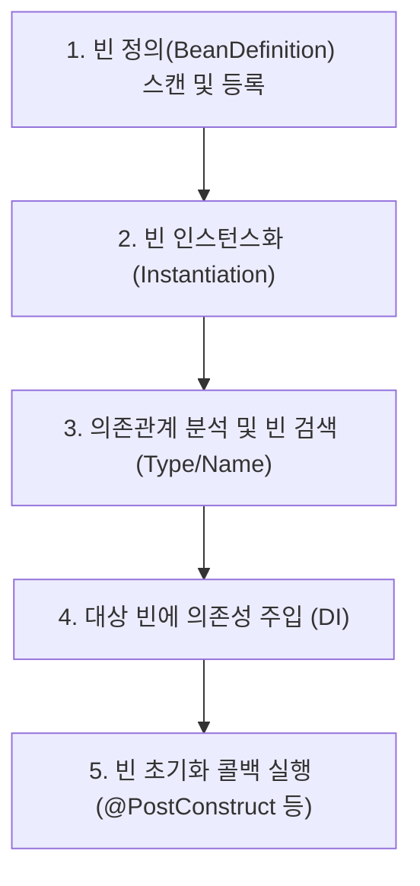

**의존성 주입(Dependency Injection, DI)**은 객체가 자신이 사용할 다른 객체(의존 대상)를 직접 `new`로 생성하지 않고, **외부(스프링 IoC 컨테이너)로부터 주입받도록 제어권을 역전(Inversion of Control, IoC)시키는 디자인 패턴**이다.

이를 통해 클래스 간의 결합도(Coupling)를 낮추고, 유연한 변경과 단위 테스트가 가능한 구조를 만든다.

---

## 1. 스프링 컨테이너의 DI 동작 흐름

스프링 부트 애플리케이션 기동 시 스프링 IoC 컨테이너(`ApplicationContext`)는 다음과 같은 단계로 의존성을 주입한다.



- **의존성 검색**: 주입받을 필드나 파라미터의 타입(Type)을 기준으로 컨테이너에서 적절한 빈을 탐색한다.
- **주입 처리자**: `@Autowired` 어노테이션은 스프링의 **`AutowiredAnnotationBeanPostProcessor`**에 의해 처리된다.

---

## 2. 3가지 의존성 주입 방식 비교

스프링에서는 크게 3가지 방식으로 의존성을 주입받을 수 있다.

### A. 생성자 주입 (Constructor Injection) — `권장 (Best Practice)`
생성자를 통해 의존성을 주입받는 방식이다.

```java
@Service
public class UserService {
    private final UserRepository userRepository; // final 키워드 사용 가능

    // 생성자가 1개일 경우 @Autowired 생략 가능 (스프링 4.3+)
    public UserService(UserRepository userRepository) {
        this.userRepository = userRepository;
    }
}
```

- **장점**:
  - **불변성(Immutability)** 보장: `final` 키워드를 사용할 수 있어 런타임에 의존성이 바뀔 위험이 없다.
  - **순환 참조 조기 감지**: 애플리케이션 기동(컴파일/부트스트랩) 시점에 순환 참조가 발생하면 컨테이너가 즉시 에러를 발생시켜 안전하다.
  - **테스트 용이성**: 순수 자바 단위 테스트 코드에서 스프링 컨테이너 없이 `new UserService(mockRepo)` 형태로 쉽게 목(Mock) 객체를 주입할 수 있다.
  - **NullPointerException 방지**: 객체 생성 시점에 모든 필수 의존성이 주입되지 않으면 컴파일 에러가 발생한다.

### B. 수정자(Setter) 주입 (Setter Injection)
Setter 메서드 위에 `@Autowired`를 붙여 주입받는 방식이다.

```java
@Service
public class UserService {
    private UserRepository userRepository;

    @Autowired
    public void setUserRepository(UserRepository userRepository) {
        this.userRepository = userRepository;
    }
}
```

- **특징**: 주입받는 의존성이 선택적이거나, 런타임에 의존 대상을 유연하게 변경해야 할 때 드물게 사용된다.
- **단점**: `final`을 사용할 수 없고, 객체 생성 후 주입되기 전까지 불완전한 상태(NPE 위험)에 놓일 수 있다.

### C. 필드 주입 (Field Injection) — `안티패턴 (비권장)`
클래스 필드에 직접 `@Autowired`를 선언하는 방식이다.

```java
@Service
public class UserService {
    @Autowired
    private UserRepository userRepository; // 비권장
}
```

- **단점**:
  - 스프링 컨테이너(IoC) 없이는 순수 자바 단위 테스트 환경에서 의존성을 주입할 방법이 없다 (리플렉션 필요).
  - `final` 선언이 불가능하여 불변성을 해친다.
  - DI 프레임워크와의 결합도가 지나치게 높아진다.

---

## 3. 주입 방식 비교 요약

| 비교 항목 | 생성자 주입 (권장) | 수정자(Setter) 주입 | 필드 주입 (비권장) |
| :--- | :--- | :--- | :--- |
| **`final` 키워드 지원** | **가능 (불변성 보장)** | 불가능 | 불가능 |
| **순환 참조 감지 시점** | **애플리케이션 기동 시점** | 실제 메서드 호출 시점 | 실제 메서드 호출 시점 |
| **순수 자바 테스트 용이성** | **매우 높음 (생성자 호출)** | 보통 (Setter 호출) | **매우 낮음 (리플렉션 강제)** |
| **NPE 안전성** | **완전 보장** | 미주입 시 NPE 위험 | 미주입 시 NPE 위험 |

---

## 4. 롬복(Lombok)과의 조합

실무에서는 생성자 코드를 줄이기 위해 Lombok의 `@RequiredArgsConstructor`를 함께 사용하는 것이 표준 관례다.

```java
@Service
@RequiredArgsConstructor // final이 붙은 필드를 모아 생성자를 자동 생성
public class UserService {
    private final UserRepository userRepository;
}
```

---

## 관련 문서

- [[spring-data-jpa-interface-mechanism|Spring Data JPA 인터페이스 동작 원리]]
- [[repository-factory-bean-lifecycle|일반 스프링 빈과 JPA 리포지토리 프록시 빈의 등록 메커니즘 비교]]
