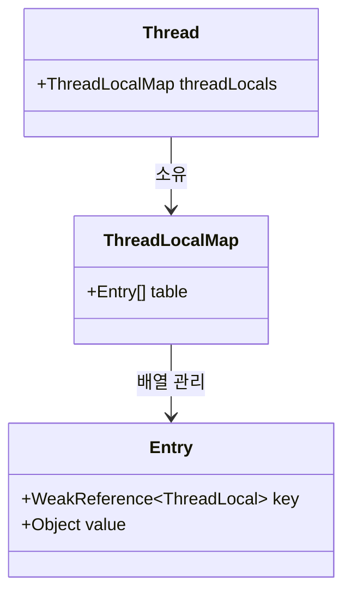

# ThreadLocal

`java.lang.ThreadLocal`은 Java 1.2부터 제공된 클래스로, **오직 특정 스레드 하나만 접근할 수 있는 독립적인 전용 변수 저장소**를 제공한다. 멀티스레드 환경에서 동기화 락(`synchronized`, `Lock`) 없이 스레드 안전성(Thread-Safety)을 보장할 수 있는 대표적인 기법이다.[^threadlocal-javadoc]

---

## 1. 동작 원리 및 내부 구조

일반적인 정적(`static`) 변수는 JVM 힙 영역에 존재하여 모든 스레드가 공유하므로 동시성 충돌(Race Condition)이 발생한다. 반면 `ThreadLocal`은 **데이터를 스레드 자체의 내부 필드**에 저장한다.



* 각 `Thread` 객체는 내부적으로 `threadLocals`라는 필드(`ThreadLocal.ThreadLocalMap`)를 가지고 있다.
* `threadLocal.set("A")`를 호출하면:
  1. 현재 실행 중인 스레드를 가져온다 (`Thread.currentThread()`).
  2. 그 스레드의 `ThreadLocalMap`을 조회한다.
  3. Map에 `(Key: ThreadLocal 인스턴스, Value: "A")` 형태로 저장한다.
* **메모리 물리적 관점 (스택 vs 힙)**:
  - 메서드가 실행되는 동안 생성되는 지역 변수는 스레드 전용 **스택(Stack)** 메모리에 머물다 메서드 종료 시 즉시 소멸한다.[^jvms-stack]
  - 반면 `Thread` 객체 자체와 그 내부 필드인 `threadLocals`는 **힙(Heap)** 메모리에 실체화되어 있다.[^jvms-heap]
  - 따라서 메서드가 끝나 스택이 완전히 비워지더라도, **힙에 살아있는 `Thread` 객체 몸통의 `threadLocals`는 스레드가 종료되지 않는 한 영원히 유지**된다. 이것이 스레드 풀 환경에서 수동 `remove()`가 필수적인 물리적 이유이다.

---

## 2. 왜 사용하는가?

1. **비침투성 (메서드 파라미터 오염 방지)**:
   - 비즈니스 로직과 무관한 인프라성 데이터(사용자 인증 정보, 트랜잭션 ID, 커넥션 객체)를 모든 계층(Controller ➔ Service ➔ Repository)의 파라미터로 넘길 필요가 없다.
2. **락(Lock) 경합 없는 극강의 성능**:
   - 스레드 간에 메모리를 공유하지 않으므로, 임계 구역(Critical Section) 동기화 오버헤드가 전혀 없다.
3. **대표적 프레임워크 활용처**:
   - **[[mapped-diagnostic-context|MDC]]**: 요청별 `traceId` 보관 및 로그 바인딩[^slf4j-mdc]
   - **Spring Security**: `SecurityContextHolder` (현재 로그인한 사용자 인증 객체 보관)[^spring-security-context]
   - **Spring 트랜잭션**: `TransactionSynchronizationManager` (현재 스레드가 사용하는 DB 커넥션 유지)[^spring-tx-manager]

---

## 3. 스레드 풀(Thread Pool) 환경에서의 치명적 위험

`ThreadLocal`은 일반적인 배치나 1회성 스레드에서는 스레드 종료 시 메모리가 함께 회수되어 안전하다. 하지만 **[[thread-pool|스레드 풀(Thread Pool)]]** 환경에서는 매우 심각한 두 가지 문제를 유발한다.

### ① 데이터 오염 및 보안 사고 (Context Leakage)
스레드 풀은 스레드를 파괴하지 않고 재사용한다. 
1. 1번 스레드가 손님 A의 요청을 처리하며 `ThreadLocal`에 손님 A의 개인정보를 저장했다.
2. 요청 처리가 끝난 후 1번 스레드는 풀로 반환된다.
3. 다음 손님 B의 요청에 1번 스레드가 다시 배정되었을 때, `ThreadLocal`을 비우지 않았다면 **손님 B가 손님 A의 데이터를 조회하거나 로그에 남기는 대형 보안 사고**가 발생한다.

### ② 메모리 누수 (Memory Leak & OOM)
`ThreadLocalMap`의 `Entry`는 `ThreadLocal` 키를 `WeakReference`(약한 참조)로 잡고 있지만, **값(Value)은 강한 참조(Strong Reference)**로 유지한다.
* `ThreadLocal` 변수 자체는 GC되어 Key는 `null`이 되더라도, 스레드 풀의 스레드가 살아있는 한 Value 객체는 영원히 GC되지 않고 힙에 남아 `OutOfMemoryError`를 일으킨다.[^tomcat-leak-protection]

```java
// 올바른 사용 패턴: 반드시 finally 블록에서 remove() 호출
try {
    threadLocal.set(data);
    businessLogic();
} finally {
    threadLocal.remove(); // 필수!
}
```

---

## 4. 현대 Java의 대안: Scoped Values (Java 21+)

이러한 `ThreadLocal`의 태생적 결함(무한한 수명, 가변성, 스레드 풀 오염)을 해결하기 위해 Java 21+에서 **Scoped Values (JEP 446 / 487)**가 도입되었다.[^jep-446][^jep-487]

| 구분 | ThreadLocal | ScopedValue (Java 21+) |
| :--- | :--- | :--- |
| **가변성** | 언제든 변경 가능 (`set`) | **불변(Immutable)** |
| **유효 수명** | 명시적 삭제 전까지 무한 유지 | **코드 블록 범위로 엄격히 제한** |
| **스레드 풀 안전성**| `remove()` 누락 시 오염 위험 | **블록 종료 시 자동 소멸 (누수 원천 차단)** |
| **가상 스레드 적합성**| 무거움 (메모리 낭비) | **수백만 개 가상 스레드에 최적화** |

---

## 5. 참고 자료 (공식 출처)

[^threadlocal-javadoc]: Oracle Java SE Documentation: [`java.lang.ThreadLocal` API Specification](https://docs.oracle.com/en/java/javase/21/docs/api/java.base/java/lang/ThreadLocal.html)
[^jvms-stack]: Oracle Java Virtual Machine Specification (Java SE 21): [Chapter 2.5.2 Java Virtual Machine Stacks](https://docs.oracle.com/javase/specs/jvms/se21/html/jvms-2.html#jvms-2.5.2)
[^jvms-heap]: Oracle Java Virtual Machine Specification (Java SE 21): [Chapter 2.5.3 Heap](https://docs.oracle.com/javase/specs/jvms/se21/html/jvms-2.html#jvms-2.5.3)
[^slf4j-mdc]: SLF4J Manual: [Mapped Diagnostic Context (MDC)](https://slf4j.org/manual.html#mdc)
[^spring-security-context]: Spring Security Reference: [SecurityContextHolder and Authentication Architecture](https://docs.spring.io/spring-security/reference/servlet/authentication/architecture.html#_securitycontextholder)
[^spring-tx-manager]: Spring Framework API: [`org.springframework.transaction.support.TransactionSynchronizationManager`](https://docs.spring.io/spring-framework/docs/current/javadoc-api/org/springframework/transaction/support/TransactionSynchronizationManager.html)
[^tomcat-leak-protection]: Apache Tomcat Wiki: [Memory Leak Protection - ThreadLocal Leaks](https://cwiki.apache.org/confluence/display/TOMCAT/MemoryLeakProtection#MemoryLeakProtection-ThreadLocalleaks)
[^jep-446]: OpenJDK: [JEP 446: Scoped Values (Preview, JDK 21)](https://openjdk.org/jeps/446)
[^jep-487]: OpenJDK: [JEP 487: Scoped Values (Fourth Preview, JDK 24)](https://openjdk.org/jeps/487)

---

## 관련 문서
* [[mapped-diagnostic-context]]
* [[jvm-memory-model-stack-vs-heap]]
* [[servlet-filter-chain]]
* [[static-vs-singleton]]
* [[thread-pool]]
* [[thread-per-request-model]]
